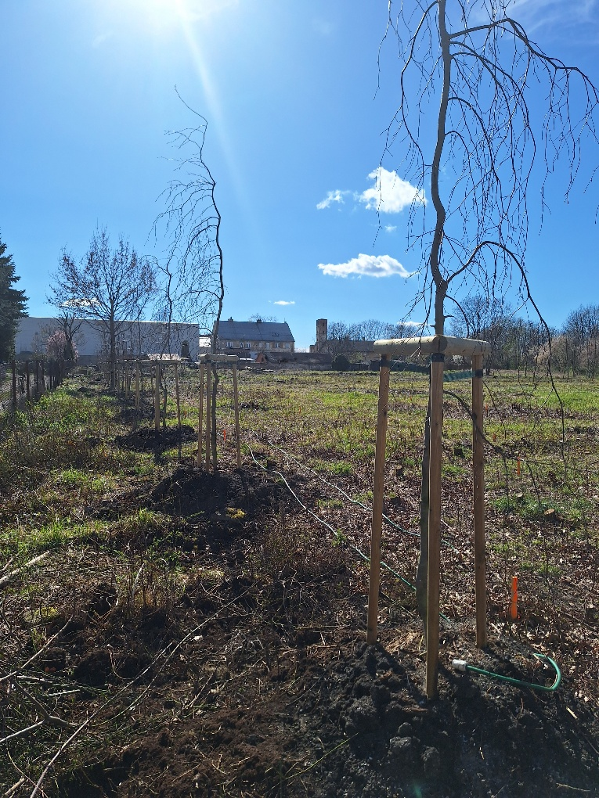
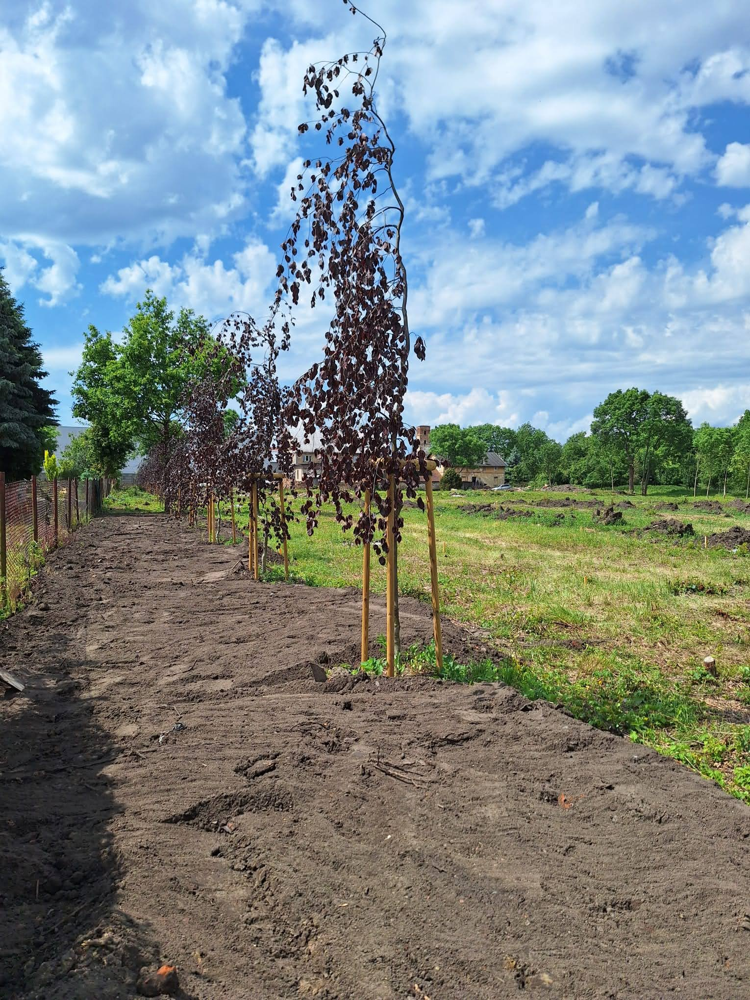
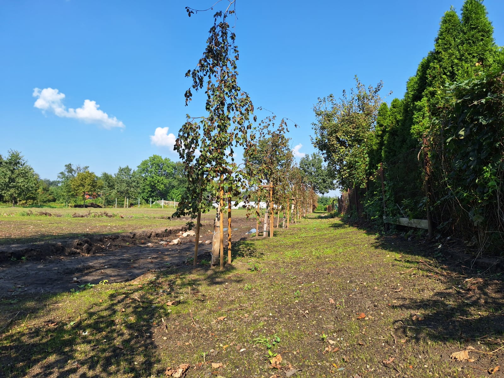
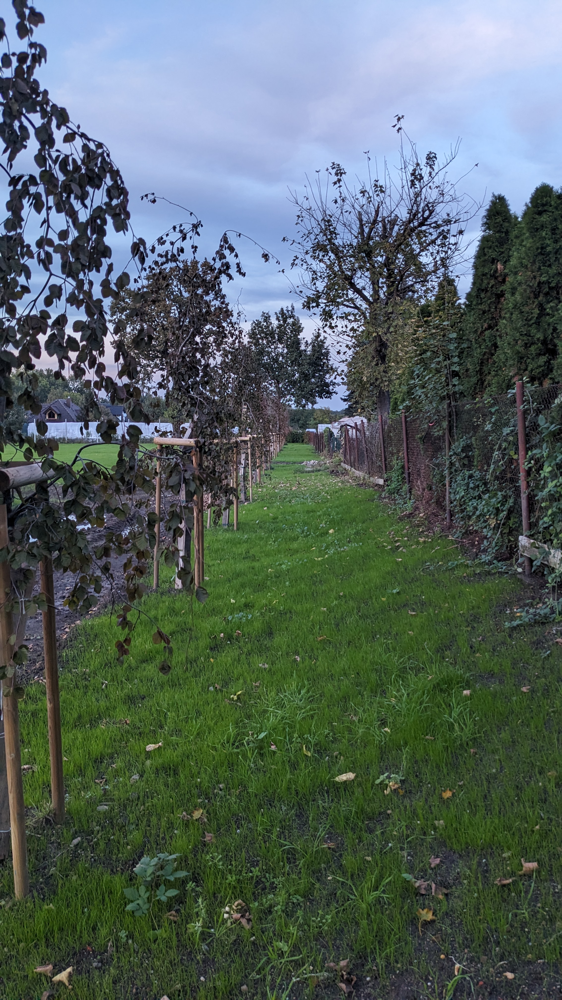
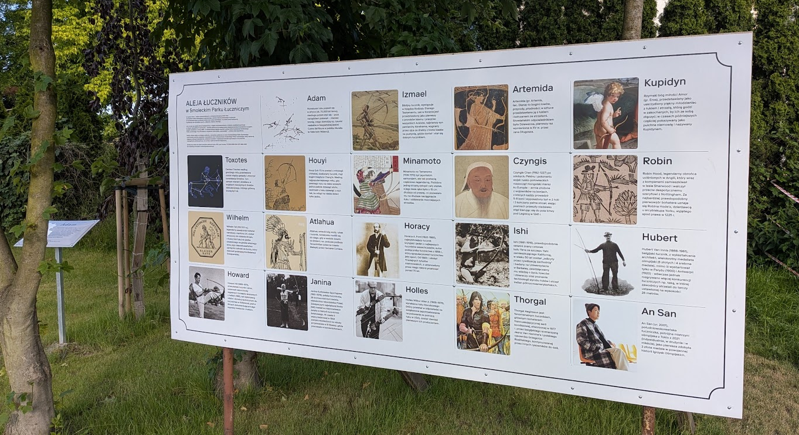

# Aleja

## Szpaler Drzew w Smoleckim Parku Łuczniczym
W marcu 2024 r. nasadziliśmy 18 buków czerwonolistnych w odmianie płaczącej w Smoleckim Parku Łuczniczym, które wraz z tablicami edukacyjnymi będą prezentować historię światowego łucznictwa od wynalezienia łuku na terenach Afryki aż po czasy teraźniejsze. To będzie podróż przez kontynenty i cywilizacje dla miłośników sportu, militariów, historii i mitologii. Łuk i strzały są częścią niemal każdej kultury, a dzięki rozpowszechnieniu w świecie rywalizacji sportowej w różnych dyscyplinach łuczniczych, również platformą do nawiązywania międzynarodowych kontaktów i przyjaźni.

Szpaler posadzonych drzew, w tym 12-letnich buków, będzie ozdobą torów łuczniczych. Poza 18 bukami, na pozycji 12. w szpalerze rośnie "samosiejka" – rodzimy dąb szypułkowy Horacy, którego patronem będzie ikona współczesnego łucznictwa sportowego.

<figure markdown="span">
  { width="300" }
  <figcaption>Aleja Łuczników - marzec 2024. 
     źródło: opracowanie własne</figcaption>
</figure>

<figure markdown="span">
  { width="300" }
  <figcaption>Aleja Łuczników - maj 2024. 
     źródło: opracowanie własne</figcaption>
</figure>

<figure markdown="span">
  { width="300" }
  <figcaption>Aleja Łuczników - wrzesień 2024. 
     źródło: opracowanie własne</figcaption>
</figure>

<figure markdown="span">
  { width="300" }
  <figcaption>Aleja Łuczników - października 2024. 
     źródło: opracowanie własne</figcaption>
</figure>

## Historia i Patroni Drzew
Każde z drzew otrzyma imię postaci ważnej dla [światowego łucznictwa](archers.md). Przy każdym drzewie umieścimy tablicę informacyjną, która będzie edukować odwiedzających o historii i znaczeniu łucznictwa. Każde z drzew czeka na swojego opiekuna, a darowizny wpłacone na rzecz Uczniowskiego Klubu Sportowego Luks Smolec posłużą realizacji tego zamierzenia, jak również urządzeniu i wyposażeniu oraz funkcjonowaniu Smoleckiego Parku Łuczniczego.

<figure markdown="span">
  { width="300" }
  <figcaption>Aleja Łuczników - czerwiec 2026. 
     źródło: opracowanie własne</figcaption>
</figure>

## Cel i Potrzeby
Smolecki Park Łuczniczy stanie się miejscem rekreacji mieszkańców, szkolenia łuczników oraz organizacji zawodów sportowych w łucznictwie i dyscyplinach pokrewnych, takich jak run-archery (łucznictwo biegowe). Nasze potrzeby są ogromne – poza wykonaniem strzałochwytu i osłon bocznych, uzupełnieniem ogrodzenia terenu, wyposażeniem w zestaw stojaków i mat, budową ścieżek na liniach strzelań – musimy również przeprowadzić gruntowny remont dwóch budynków gospodarczych na działce przekazanej przez Gminę Kąty Wrocławskie klubowi w użyczenie (na razie do końca 2028 r.). Te budynki mogą w przyszłości stanowić poza zapleczem sanitarnym i magazynowym pierwszy w Polsce zimowy pawilon do uprawiania łucznictwa na torach otwartych.

Jak Możesz Pomóc?
Zachęcamy do wpłat darowizn na konto klubu w Nest Banku:
Nr konta: 73 2530 0008 2041 1071 4663 0001

Zapraszamy do "wykupienia swojego drzewa" za kwotę minimum 10.000 zł. Razem możemy stworzyć wyjątkowe miejsce, które będzie służyć społeczności i miłośnikom łucznictwa przez wiele lat.

