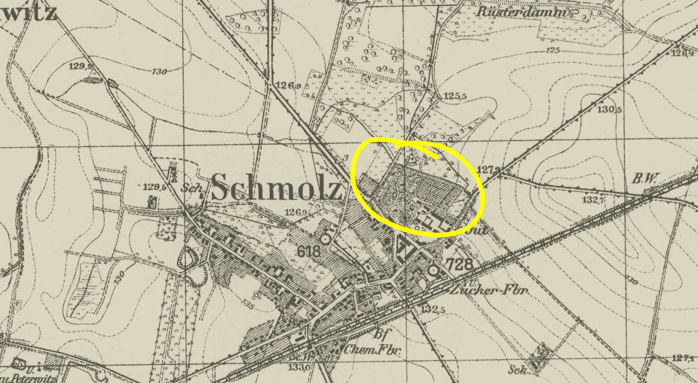
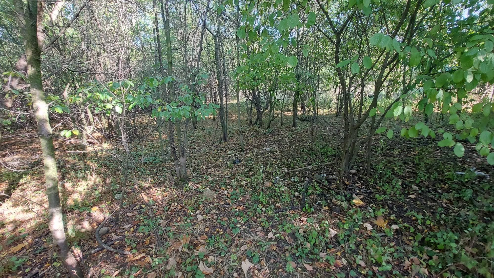

# Wieści z parku (odc. 1)

A zatem – dokonało się!

Po trzech latach starań UKS Luks wszedł w posiadanie terenu, który ma szansę stać się sercem działalności klubu. Został on nam użyczony do końca 2028 roku i jest to dla nas czas próby – czy podołamy jego urządzeniu? Czy będzie dobrze (i bezpiecznie) służył nam i mieszkańcom Smolca? Czy wyraźnie przyczyni się do podniesienia naszego poziomu sportowego? Czy wreszcie – po 5 latach uzyskamy przedłużenie czasu użyczenia na kolejne lata?

<!-- more -->

Korzystając z faktu, że zarząd klubu podjął się wydawania klubowego newslettera, postanowiłem na jego łamach dokumentować bieżące działania podejmowane przez nas w smoleckim parku. Dzięki temu łatwiej będzie nam potem sprawozdawać się władzom gminy, przygotowywać wnioski o dofinansowania, a członkowie klubu będą na bieżąco informowani o podejmowanych działaniach. Na początek więc nieco historii, a potem opiszę, co wydarzyło się w ostatnim miesiącu. Jak zobaczycie – jest o czym pisać, zwłaszcza w części historycznej, bo nic nie powstaje z niczego...

## Każda historia ma swój początek

Gdy w lutym 2020 r. odbyły się pierwsze treningi pokazowe w smoleckiej Omedze, obecni na nich trenerzy Kasper i (już nie trenujący w klubie) Rafał zaledwie od roku rozwijali projekt klubu łuczniczego i poszukiwali terenu, na którym można byłoby prowadzić letnie treningi. Było kilka pomysłów na miejsca we Wrocławiu i poza nim, treningi odbywały się w Centrum Łucznictwa Tradycyjnego na Osobowicach oraz w Kotowicach w gminie Siechnice, ale przez ostatnie trzy lata nic konkretnego się nie zmaterializowało. Klub nadal podejmuje starania o teren we Wrocławiu, tymczasem niezależnie od tych działań konsekwentnie przygotowywaliśmy się do przejęcia opieki nad gminnym terenem w Smolcu.

Wiosną 2020 r. rozszalała się pandemia, a klub rozpoczął treningi na trawniku przy naszym (członkowie klubu: Basia, Przemek i Witek) domu na ul. Zielonej 1. Niektórzy mogą jeszcze pamiętać z tego okresu poszukiwanie strzał w lesie, w sadzie, w ogródku warzywnym, czy też – podczas deszczu – przesiadywanie w stercie gruzu pod daszkiem na znajdującym się wówczas w remoncie tarasie. Już jesienią przenieśliśmy się na działkę naszych sąsiadów na prawo od wjazdu na ul. Zieloną (kiedyś powstanie tam dom o numerze 2). Wymagało to przygotowania terenu – został obsiany koniczyną (w pierwotnym założeniu miał służyć wyłącznie pasiece) i trafiły na niego składane stojaki do mat oraz klubowe maty piankowe. Niedługo po rozpoczęciu treningów, z zaprzyjaźnionego [wrocławskiego Talentu](https://ukstalent.pl/) przywieźliśmy resztki drewna po wycofanych z użytku stojakach oraz zużyte formatki z płyt pilśniowych. Na początek udało się zmontować z nich cztery maty, na drzewach rozwiesiliśmy linę i strzałochwyt, wynajęliśmy też toaletę przenośną i do końca 2021 r. funkcjonowaliśmy z takim sprzętem. Dodatkowo z klubu [Strzelec z Legnicy](http://www.strzelec.legnica.pl) otrzymaliśmy siedem zdekompletowanych lekkich stojaków do mat piankowych, które częściowo wykorzystujemy.

Jesienią 2021 r. w klubie dokonała się mała rewolucja. Z zarządu został odwołany Rafał Świątek, po czym zrezygnował z trenowania naszych klubowiczów. Do składu zarządu dokooptowana została Izabela Piasecka, a Michał Ochrombel (z zaprzyjaźnionego wówczas z nami [wrocławskiego UKS 95](https://www.facebook.com/uks95/)) pomagał w prowadzeniu treningów. Zmieniona sytuacja wewnętrzna w klubie umożliwiła nam powołanie rzutem na taśmę w grudniu tego roku __Oddziału UKS Luks Smolec__, co w perspektywie czasu miało nam umożliwić działalność na tereni Gminy Kąty Wrocławskie. Pierwszy kolektywny zarząd oddziału utworzyły Joanna Dereń-Maciejewska i Barbara Jastrząb.

W roku 2022 dokonał się skok jakościowy związany z ukonstytuowaniem się oddziału klubu – otrzymaliśmy pierwszą dotację od Gminy Kąty Wrocławskie, zakupiliśmy formatki pilśniowe do ośmiu mat, oszlifowaliśmy, pomalowaliśmy impregnatem i ponownie zmontowaliśmy stojaki do mat pilśniowych. Z „talentowego materiału” wyszło ich w sumie jedenaście – w czynie społecznym wykonaliśmy to ja, trener Kasper i Miłosz Maciejewski. Tymczasowym ogrodzeniem z działki leśnej rozdzieliliśmy na torach krótki i długi dystans, a jesienią rozpoczęliśmy treningi nie tylko w świetlicy wiejskiej w Smolcu, lecz także w sali gimnastycznej szkoły podstawowej w Jaszkotlu, gdzie w grudniu zorganizowaliśmy pierwsze halowe zawody łucznicze w Gminie Kąty Wrocławskie.

W bieżącym roku 2023 dokupiliśmy formatki pilśniowe do kolejnych czterech mat (niestety, formatki ulegają zużyciu w około jednej trzeciej swej objętości rocznie) i materiał na dwa kolejne stojaki do nich. W czynie społecznym oszlifowali i pomalowali je Marta Urban i Mariusz Kazior. Na południowej granicy działki postawiliśmy dwa słupy betonowe do montażu lin do strzałochwytu, dzięki czemu udało się ochronić już całą linię mat. Tomasz Płóciennik częściowo zabezpieczył ją dodatkowo workami z piaskiem i trocinami.

W obu tych latach byliśmy obecni podczas dożynek gminnych w Kątach Wrocławskich, organizując atrakcje łucznicze dla mieszkańców. W ubiegłym roku dzięki temu wydarzeniu dołączył do nas Kamil Ściana, obecny członek zarządu oddziału, który w tym roku już samodzielnie poprowadził łuczniczy event w czasie dożynek. W ubiegłym roku współpracowaliśmy z Bankiem Spółdzielczym w Kątach Wrocławskich przy organizacji halowych zawodów łuczniczych, a w tym zorganizowaliśmy dwa turnusy łuczniczych letnich półkolonii z dotacji AZS (w Smolcu i Pieszycach, skąd pochodzi nasz nowy trener Łukasz).

Oddział koordynował również niedawne jesienne starty łucznictwa biegowego w Mistrzostwach Niemiec i Pucharze Europy w Czechach oraz zajmuje się koordynacją treningów, które niedawno rozpoczęły się w Pieszycach w powiecie dzierżoniowskim. Warto również wspomnieć o wsparciu, na jakie mogliśmy liczyć w minionych dwóch latach ze strony sołtysów – Smolca-Centrum Edwarda Wiśniewskiego oraz Smolca-Osiedle Piotra Sobki. Dzięki nim korzystamy ze świetlicy wiejskiej w Smolcu, a z funduszu sołeckiego zakupione zostały maty piankowe.

Przez cały ten czas prowadziliśmy rozmowy z Gminą o przekazaniu którejś z gminnych działek na aranżację torów łuczniczych. Rozważany był teren boiska treningowego Sokoła przy ul. Kościelnej oraz zarośnięta niecka dawnej piaskowni przy stacji Mokronos Górny, jednak najlepszą lokalizacją od początku wydawał się smolecki park, a zwłaszcza dawne przypałacowe ogrody (po wojnie ogródki działkowe pracowników Spółdzielni Produkcji Rolnej w Smolcu przy ul. Lipowej).

<figure markdown="span">
  
  <figcaption>Smolec na mapie z okresu 1870 - 1945, zaznaczony obszar pałacu i parku, 
  źródło: <a href="http://igrek.amzp.pl/details.php?id=11821931">http://igrek.amzp.pl</a></figcaption>
</figure>
<!-- http://maps.mapywig.org/m/German_maps/series/025K_TK25/4967_(2891)_Schmolz_Planblatt_A_1931_uniberk_C056980641.jpg -->

Nie bez przyczyny zamęczyłem Was nieco powyższym opisem działań z ostatnich trzech lat – to były właśnie nasze argumenty do rozmów z Gminą, których w ostatnich latach odbyliśmy naprawdę wiele. Składane regularnie pisma, wykonywane telefony, wizyty w urzędzie w wydziałach i u burmistrza, wizytacja treningu przez wiceburmistrza – poświęcony czas i upór się opłaciły. W końcu okazało się, że jest możliwość przekazania nam w użytkowanie terenu, który pierwotnie jako inwestycyjny przekwalifikowany został na rekreacyjny i w przyszłości stać się powinien częścią odrestaurowanego smoleckiego parku przypałacowego.

## Umowa użyczenia terenu

W dniach 18 i 25 października podpisałem protokoły zdawczo-odbiorcze do datowanych na początek miesiąca umów użyczenia Oddziałowi Klubu w Smolcu terenu o łącznej powierzchni 8665 m² z przeznaczeniem na realizację obiektu sportowo-rekreacyjnego o nazwie Smolecki Park Łuczniczy. 7000 m² to część działki nr 481 o łącznej powierzchni 7400 m², znajdująca się w bezpośrednim zarządzie gminy, gdzie dawniej funkcjonowały ogródki działkowe (trzeba przyznać, że jeszcze 10 lat temu teren rzeczywiście je przypominał). Dodatkowe 1665 m² to działka nr 480/4, będąca w zarządzie Zakładu Gospodarki Mieszkaniowej w Kątach Wrocławskich, która umożliwia dostęp do „ogródków działkowych” z drogi gminnej. Na niej znajdują się zdekapitalizowane murowane komórki i różne inne „cuda”, o których za chwilę.

Niezwłocznie po podpisaniu umów użyczenia wykupiliśmy jako oddział klubu polisę OC, która zabezpieczy nas od ryzyk związanych z użytkowaniem tego terenu. Wspólnie z sołtysem Smolca-Centrum odwiedziłem również mieszkańców przylegających do naszego terenu działek. Tym spotkaniom należy się kilka słów.

Duża działka (7400 m²) graniczy od zachodu z pałacowym parkiem, od południa z mniejszą użyczoną nam działką, zaś od północy i wschodu z terenami należącymi do rodziny prowadzącej duży biznes ogrodniczy w Smolcu. Od lat mają problem z dzikami, które upatrzyły sobie naszą działkę nr 481 na swoje legowisko, są więc zainteresowani współpracą przy uporządkowaniu tego terenu i przegonieniem stąd dzików. Pani Renata, użytkowniczka ostatniego funkcjonującego jeszcze ogródka działkowego (nieprzekazanych nam 400 m² z działki nr 481) oraz jednej z komórek na działce nr 480/4, również od lat walczy z dzikami i cieszy się, że jest szansa zniechęcić je do wypasu na jej podwórku.

<figure markdown="span">
  
  <figcaption>Duża działka  w dniu przekazania strona wschodnia, 
  źródło: opracowanie własne</figcaption>
</figure>

<figure markdown="span">
  
  <figcaption>Duża działka  w dniu przekazania strona wschodnia, 
  źródło: opracowanie własne</figcaption>
</figure>

<figure markdown="span">
  
  <figcaption>Ogródek Pani Renaty, 
  źródło: opracowanie własne</figcaption>
</figure>

Do działek można dojechać z ul. Lipowej, przy pętli autobusowej, wjeżdżając w boczną, dziurawą drogę i przejeżdżając pomiędzy komunalnym domem przy ul. Lipowej 2 a prywatną halą produkcyjną. Spośród mieszkańców siedmiu mieszkań w gminnym budynku rozmawiałem z panią Agatą. Miała pretensje do Gminy, że nie chce zająć się drogą dojazdową, oraz wyraziła swoje obawy, że urządzimy im „autostradę po dziurach” pod oknami. Po chwili rozmowy doszliśmy wspólnie do wniosku, że nasze działania mogą przyczynić się do poprawy ich dojazdu. Zwróciła jednak uwagę, że do tej pory mieli spokój, a teraz pewnie się to zmieni.

<figure markdown="span">
  
  <figcaption>Droga dojadowa miedzy domem przy ul. Lipowej 2 a prywatną halą produkcyjną, 
  źródło: opracowanie własne</figcaption>
</figure>

Pan Wiesław, który kiedyś mieszkał w tym budynku ze swoimi rodzicami, a potem zaanektował część drugiej z komórek oraz południowo-zachodni narożnik działki 480/4, stwierdził, że w ogródku i kurniku, którymi się zajmuje, „kiedyś to były tłumy znajomych i dzieciaków, a teraz to już tylko on sam”. A same kury doczekały się uznanie na Yourube na kanale [Ignacy z Japonii - Japończyk zwiedza Smolec](https://youtu.be/6VjuuutTqI8?si=_ehNCHrghHazj3EF&t=309)

<figure markdown="span">
  
  <figcaption>Mała działka, po lewej kurnik, na wprost dom przy ul Lipiwej 2A, 
  źródło: opracowanie własne</figcaption>
</figure>

A więc na naszym terenie nie będziemy sami. Musimy od początku ułożyć sobie tak koegzystencję z sąsiadami, by nie nadepnąć komuś na odcisk i nie wywołać jakiejś małej wojenki. O wszelkich podejmowanych pracach będę informował sąsiadów, liczę też na to, że oni będą czuwać i poinformują nas, gdy coś niepokojącego zadzieje się na naszym terenie. Tak jak obecnie niezmiennie uczulam naszych klubowiczów, by na ul. Zielonej parkowali tak, by nie zdenerwować moich sąsiadów, na podobną ostrożność w zachowaniu się liczę na ul. Lipowej.
Kończąc już pierwszy odcinek „Wieści z parku” poinformuję Was jeszcze o działaniach z ostatnich dni. Teren obu działek wymaga odchwaszczenia, wycinki samosiejek i wywozu śmieci. Fakt rozpoczęcia takich prac zgłosiłem oficjalnym pismem do Gminy Kąty Wrocławskie. Odbyłem również spotkanie z właścicielem jednej z firm świadczących usługi ziemne. Obejrzał gruzowisko na działce 480/4 i ocenił, iż wymaga dwóch dni pracy spychaczem na gąsienicach, by rozrównać teren i przygotować go do utwardzenia pod parking. Szykujemy się również do rozpoczęcia odchwaszczania, o czym mam nadzieję napisać Wam już w kolejnym odcinku cyklu.

A więc na naszym terenie nie będziemy sami. Musimy od początku ułożyć sobie współistnienie z sąsiadami, aby nie nadepnąć nikomu na odcisk i nie wywołać niepotrzebnych konfliktów. O wszelkich podejmowanych pracach będę informował sąsiadów, licząc na to, że oni będą czujni i poinformują nas, gdy coś niepokojącego zadzieje się na naszym terenie. Tak jak obecnie uczulam naszych klubowiczów, aby na ul. Zielonej parkowali tak, aby nie denerwować moich sąsiadów, na podobną ostrożność w zachowaniu się liczę na ul. Lipowej.

Kończąc już pierwszy odcinek „Wieści z parku”, poinformuję Was jeszcze o działaniach z ostatnich dni. Teren obu działek wymaga odchwaszczenia, wycinki samosiejek i wywozu śmieci. Fakt rozpoczęcia takich prac zgłosiłem oficjalnym pismem do Gminy Kąty Wrocławskie. Odbyłem również spotkanie z właścicielem jednej z firm świadczących usługi ziemne. Obejrzał gruzowisko na działce 480/4 i ocenił, iż wymaga dwóch dni pracy spychaczem na gąsienicach, by rozrównać teren i przygotować go do utwardzenia pod parking. Szykujemy się również do rozpoczęcia odchwaszczania, o czym mam nadzieję napisać Wam już w kolejnym odcinku cyklu.

<figure markdown="span">
  
  <figcaption>Duża działka w dniu przekazania, 
  źródło: opracowanie własne</figcaption>
</figure>

<figure markdown="span">
  
  <figcaption>Duża działka w dniu przekazania, 
  źródło: opracowanie własne</figcaption>
</figure>

<figure markdown="span">
  
  <figcaption>Duża działka w dniu przekazania, 
  źródło: opracowanie własne</figcaption>
</figure>

<figure markdown="span">
  
  <figcaption>Duża działka w dniu przekazania, 
  źródło: opracowanie własne</figcaption>
</figure>