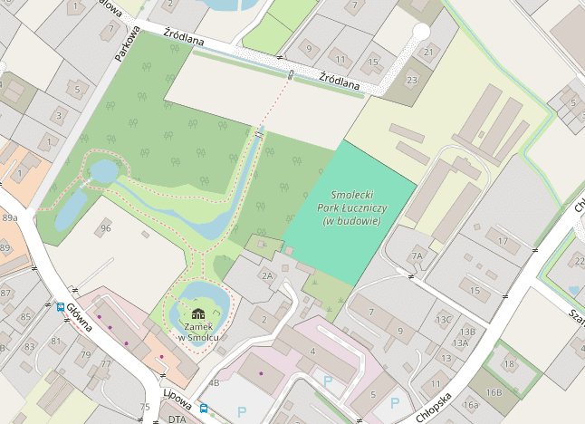
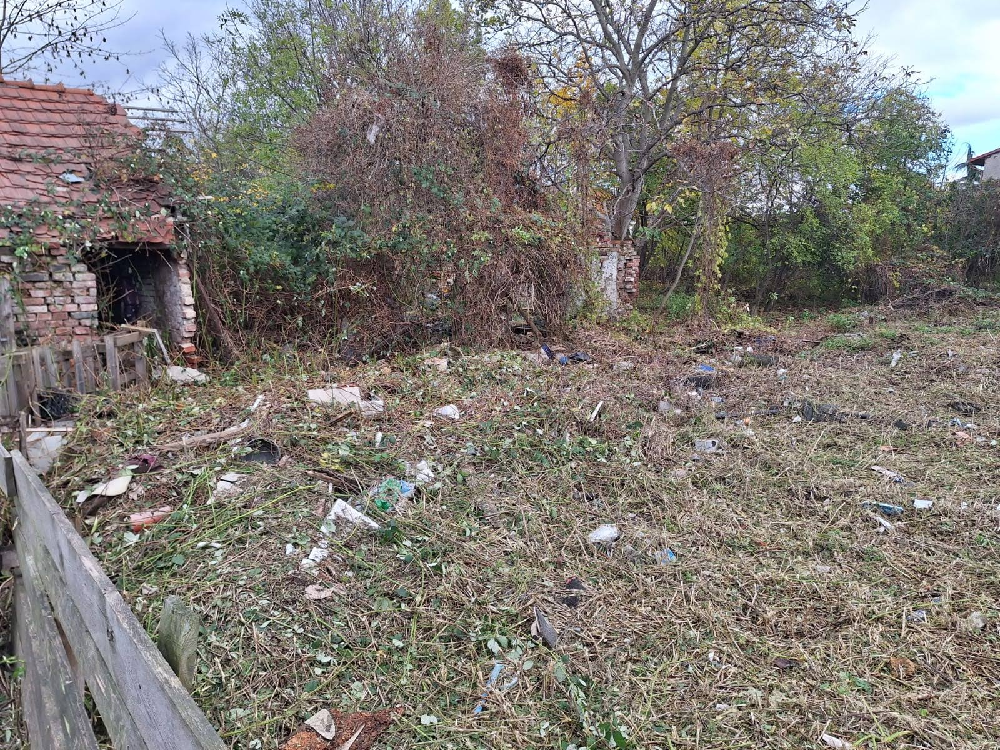
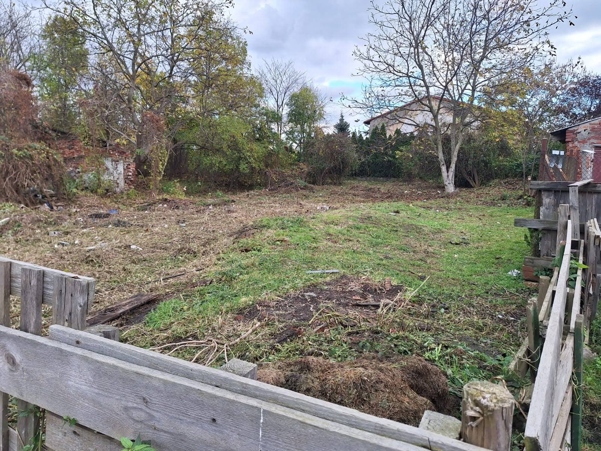
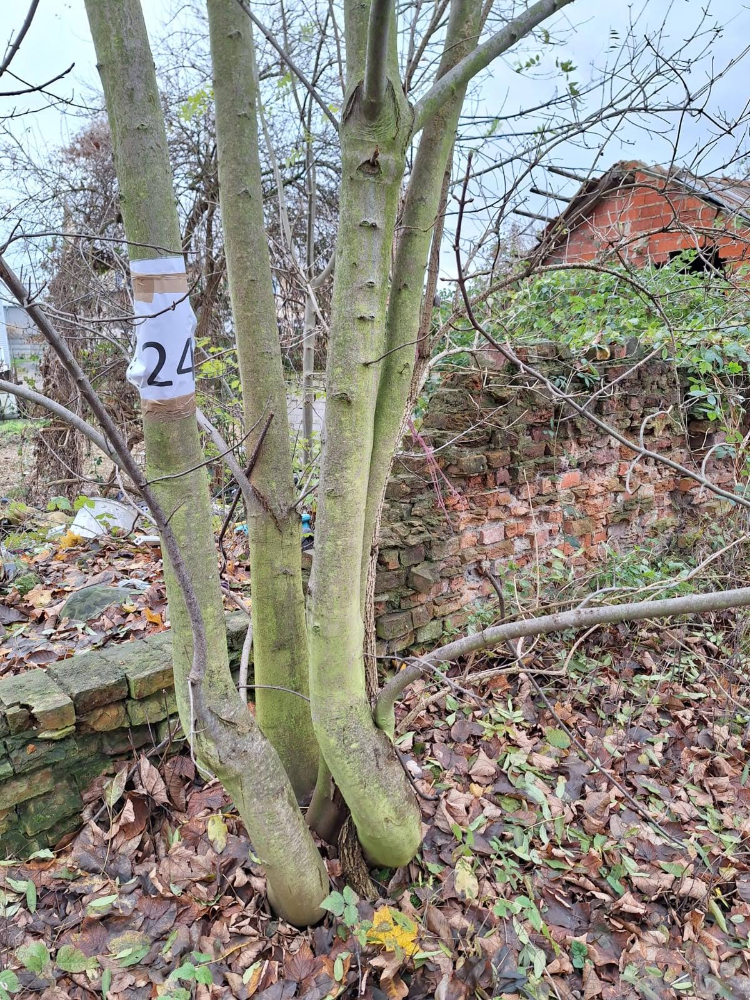
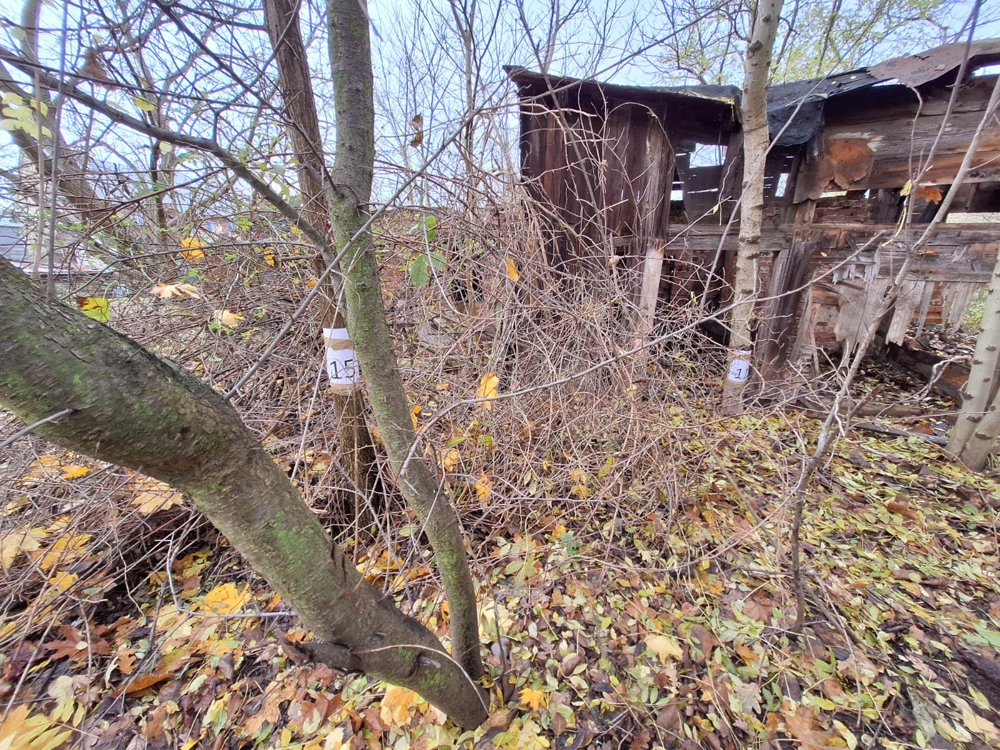
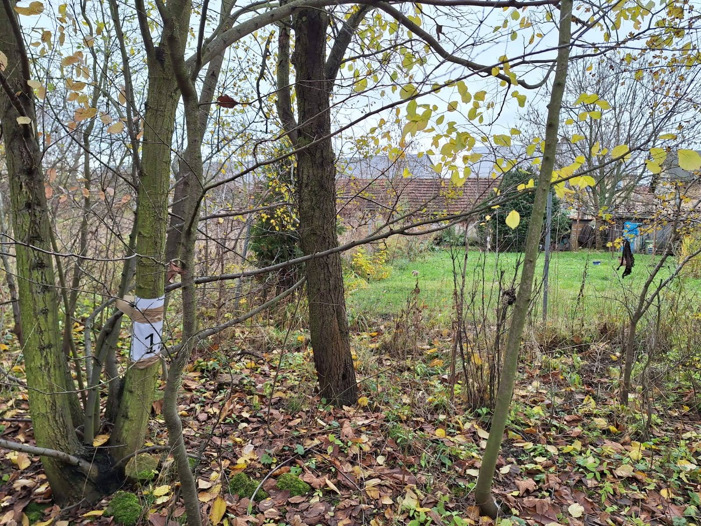
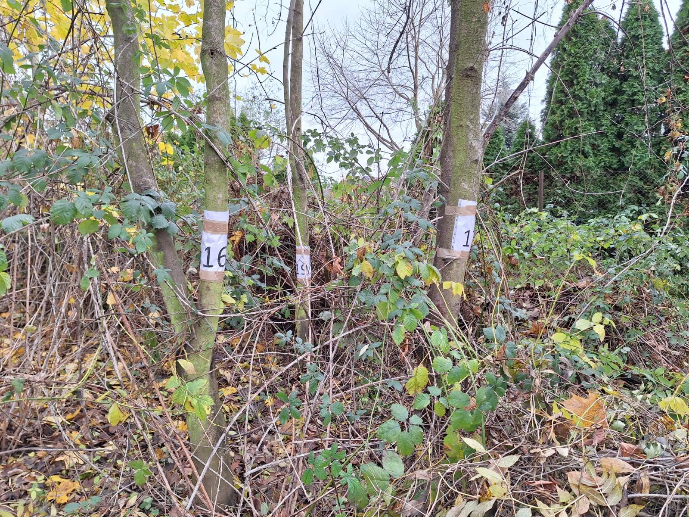

# Wieści z parku (odc. 2)

Od ostatnich wieści z parku minęło ledwie kilka tygodni, a w tym czasie wydarzyło się kilka istotnych rzeczy. Przede wszystkim pojawiliśmy się na mapach OpenStreetMap, gdzie *Smolecki Park Łuczniczy (w budowie)* jest już zaznaczony. Bardzo nas to cieszy i zobowiązuje do szybkiego usunięcia dopisku *w budowie*, zgodnie z założonym harmonogramem. Przy okazji – jeśli ktoś wie, jak poprawić literówkę w słowie „Park”, prosimy o pomoc.

<figure markdown="span">
  
  <figcaption>Open Street Map,  źródło: https://www.openstreetmap.org/way/1215314615#map=19/51.07632/16.88603</figcaption>
</figure>

<!-- more -->

8 listopada odbyliśmy spotkanie z Burmistrzem Kątów Wrocławskich, panem Julianem Żygadłą, w towarzystwie Oli – naszej smoleckiej srebrnej medalistki Pucharu Europy Run-Archery. Oprócz kurtuazyjnych rozmów, zdjęć i wymiany uśmiechów, spotkanie miało charakter roboczy i dotyczyło spraw związanych z parkiem. Burmistrz wyraził zadowolenie, że zakończyliśmy wszystkie formalności związane z przekazaniem terenu i zapoznał się z naszymi oczekiwaniami dotyczącymi wsparcia ze strony gminy. Zaznaczył jednak, że – jak co roku – gminny budżet jest bardzo napięty, co oznacza, że trudno będzie uzyskać większą pomoc w przyszłym roku budżetowym.

<figure markdown="span">
  
  <figcaption>Spotkanie z Burmistrzem Kątów Wrocławskich, źródło: <a href="https://www.facebook.com/uksluks/posts/pfbid0CEAUNPzjpjmj8ZBazAHAc9Wf6ABNwyDhB2arp5uqnsgkK1jXUuoYrNunVXXChMrUl">https://facebook.com/uksluks</a></figcaption>
</figure>

W spotkaniu uczestniczył również kierownik Wydziału Dróg, dzięki czemu mogliśmy przedstawić nasze oczekiwania dotyczące dostarczenia do parku tłucznia na utwardzenie wjazdu i parkingu. Czy to się uda? Zobaczymy...

W połowie listopada, po łagodnej jesieni, w parku zaczęły spadać liście z drzew. Nasza „dżungla” się przerzedziła, a na działce (dzięki uprzejmości kąteckiego [ZGM-u](https://zgmkwr.pl/)) pojawiła się grupa specjalistów z kosami spalinowymi. Panowie wykosili wjazd na teren dawnych ogródków działkowych, co pozwoliło nam zobaczyć, ile śmieci i gruzu będziemy musieli pozbierać i wywieźć.

<figure markdown="span">
  
  <figcaption>Stan prac pod koniec listopada 2023,
  źródło: opracowanie własne</figcaption>
</figure>

<figure markdown="span">
  
  <figcaption>Stan prac pod koniec listopada 2023,
  źródło: opracowanie własne</figcaption>
</figure>

Następnie, wraz z zaprzyjaźnionym leśniczym z Leśnictwa Kąty Wrocławskie, przeprowadziliśmy wizję lokalną drzewostanu. Okazało się, że na naszych działkach rośnie ponad 50 drzew o obwodzie powyżej 50 cm (mierzonego na wysokości 5 cm od gruntu), które nie są drzewami owocowymi – głównie dęby, jesiony i wiązy. Drzewa takie wymagają uzyskania zgody na wycinkę. Na szczęście większość z nich rośnie wzdłuż granic, więc nie zależy nam na ich usuwaniu, ponieważ potrzebujemy przestronnej polany na środku działki. Wzdłuż granic chcemy raczej być osłonięci od sąsiadów. Kilka drzew może jednak kolidować z planami zagospodarowania torów łuczniczych, dlatego pewnie wystąpimy o zgodę na ich usunięcie w odpowiednim czasie.

Na razie musimy usunąć samosiejki, na które nie jest wymagana zgoda. Specjalnie oznaczyliśmy 24 drzewa, aby przez pomyłkę ich nie wyciąć bez stosownego zezwolenia. Pozostałe grubsze drzewa rosną w dwóch rzędach na północnej granicy działki – pierwszy wzdłuż ogrodzenia, a drugi w odległości około 12 metrów od niego. Drugi rząd może posłużyć do umocowania liny strzałochwytu, a między oboma rzędami powstanie ściana z worków z piaskiem, dodatkowo zabezpieczająca sąsiadów przed strzałami chybiającymi celu.

<figure markdown="span">
  
  <figcaption>Stan prac pod koniec listopada 2023,
  źródło: opracowanie własne</figcaption>
</figure>

<figure markdown="span">
  
  <figcaption>Stan prac pod koniec listopada 2023,
  źródło: opracowanie własne</figcaption>
</figure>

<figure markdown="span">
  
  <figcaption>Stan prac pod koniec listopada 2023,
  źródło: opracowanie własne</figcaption>
</figure>

<figure markdown="span">
  
  <figcaption>Stan prac pod koniec listopada 2023,
  źródło: opracowanie własne</figcaption>
</figure>