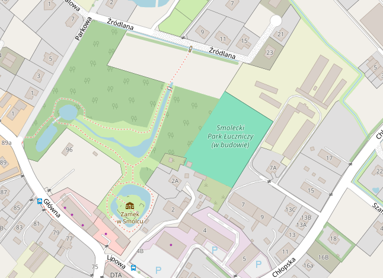

# Wieści z parku (odc. 2)

Od ostatnich Wieści z parku minęło ledwie kilka tygodni, a miało w tym czasie kilka istotnych zdarzeń. Przede wszystkim pojawiliśmy się na mapach OpenStreetMap, Smolecki Park Łuczniczy (w budowie) jest już tam obecny. To nas oczywiście bardzo cieszy i zobowiązuje, by zgodnie z założonym harmonogramem dopisek „w budowie” jak najszybciej zniknął z opisu naszego terenu. Przy okazji – jeśli ktoś wie, jak usunąć literówkę w słowie Park, uprzejmie proszę o pomoc.

<figure markdown="span">
  
  <figcaption>Open Street Map,  źródło: https://www.openstreetmap.org/way/1215314615#map=19/51.07632/16.88603</figcaption>
</figure>

<!-- more -->

8 listopada odbyliśmy wraz z Olą Kosik – naszą smolecką srebrną medalistką Pucharu Europy Run-Archery – spotkanie z Burmistrzem Kątów Wrocławskich p. Julianem Żygadłą. Poza kurtuazją, fotkami i wymianą uśmiechów było to oczywiście robocze spotkanie ws. parku. Burmistrz ucieszył się, że dopięliśmy już wszelkich formalności związanych z przekazaniem nam terenu i przyjął do wiadomości, na jakim wsparciu od gminy nam zależy. Zaznaczył jednak, że – jak co roku – gminny budżet „trzeszczy w szwach” i trudno będzie nam uzyskać większą pomoc gminy w przyszłym roku budżetowym. W spotkaniu uczestniczył kierownik Wydziału Dróg w urzędzie, dzięki czemu mogliśmy w obecności burmistrza wyartykułować nasze oczekiwanie dotyczące zaplanowania w pracach wydziału dostarczenia nam do parku pewnej ilości tłucznia, który posłuży na utwardzenie wjazdu na tory i parkingu przy nich. Czy to się uda? – zobaczymy…
W połowie listopada w końcu, po łagodnej jesieni, w parku zaczęły spadać z drzew liście. Nasza dżungla przerzedziła się, a na działce (dzięki uprzejmości kąteckiego ZGMu) pojawiła się spec-grupa z kosami spalinowymi. Panowie wykosili wjazd na teren dawnych ogródków działkowych, dzięki czemu dowiedzieliśmy, ile śmieci i gruzu przyjdzie nam z czasem pozbierać i wywieźć.
Następnie z zaprzyjaźnionym leśniczym z Leśnictwa Kąty Wrocławskie dokonaliśmy wizji lokalnej drzewostanu. Okazało się, że na naszych działkach rośnie w sumie ponad 50 drzew o obwodzie powyżej 50 cm (mierzonym na wysokości 5 cm od gruntu), które jednocześnie nie są drzewami owocowymi – są to głównie dęby, jesiony i wiązy. Drzewa takie podlegają obligatoryjnie uzyskaniu zgody na wycinkę. Na szczęście większość z nich rośnie wzdłuż granic, więc na ich usuwaniu nam nie zależy, bo potrzebujemy przestronnej polany na środku działki, a wzdłuż granic powinniśmy raczej być osłonięci od sąsiadów niż się na nich otwierać. Kilka drzew może jednak kolidować z koncepcją zagospodarowania torów łuczniczych i pewnie o zgodę na ich usunięcie wystąpimy w stosownym czasie. Póki co czeka nas usunięcie tych samosiejek, na których usunięcie nie jest wymagana zgoda i właśnie dlatego oznaczyliśmy specjalnie w sumie 24 drzewa, aby przez pomyłkę nie wyciąć ich bez stosownego zezwolenia. Wszystkie pozostałe grubsze drzewa rosną w dwóch rzędach na północnej granicy działki – pierwszy wzdłuż ogrodzenia i drugi w odległości ok. 12 metrów od niego. Najpewniej ten drugi będzie mógł nam posłużyć do umocowania liny strzałochwytu, zaś pomiędzy oboma pasami powstanie ściana z worków z piaskiem dodatkowo zabezpieczająca sąsiadów przed strzałami chybiającymi celu.
