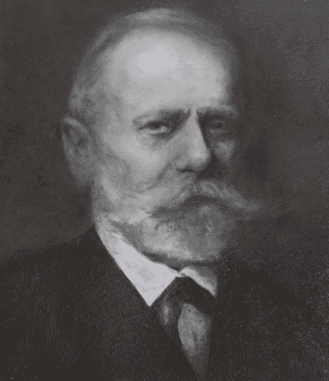

# Wieści z parku (odc. 3)

Sezon halowy w pełni, a w parku wciąż coś się dzieje… Przez kilka najbliższych numerów klubowego newslettera oraz Wieści z parku tak właśnie mam zamiar rozpoczynać nasze odcinki!
Na wstępie odnotowuję, że nazwa Smolecki Park Łuczniczy w OpenStreetMap pojawia się już bez
błędu literowego. Kto w tym pomógł – niech się ujawni! Pasieka Zielona może dla niego ufundować
miód za tę pomoc.

<!-- more -->

Prace w parku w grudniu rozpoczęliśmy od rozebrania części tymczasowego ogrodzenia zrobionego przez mieszkańców podwórka z ul. Lipowej i postawienie w tym miejscu równie tymczasowej, ale za to bardziej funkcjonalnej, dwuskrzydłowej bramy. Był to wstęp do dalszych prac, o których poniżej, jednocześnie utrzymana została funkcja ogrodzenia, które powstrzymuje dziki przed swobodnymi spacerami po podwórku.
Od połowy miesiąca prace znacząco przyspieszyły. Najpierw na działce (dzięki uprzejmości kąteckich ZGM i ZGK) pojawił się kontener na śmieci, największy z dostępnych. W zorganizowanym czynie społecznym wzięli udział członkowie zarządu – trenerzy Łukasz i Kasper, Agnieszka i ja oraz zaprzyjaźniony z klubem Michał Ochrombel. Podczas kilku godzin udało się bez większych problemów wypełnić kontener po brzegi. Czego tam nie było… - śmieci po remontach, stare zabawki, talerze, tapczany… Śmiałkowie odważyli się nawet na wrzucenie do kontenera sedesu z zawartością!
Następnie na dwa dni działkę opanowali pilarze z firmy Alpin-Drzew. Rozpoczęli usuwanie możliwych do usunięcia samosiejek z działki wjazdowej oraz tej części przyszłych torów, która zasypana jest gruzem, w większości przywiezionym z zewnątrz. Dzięki ich pracy odsłoniła się w końcu panorama od strony wjazdu na przyszłe tory łucznicze, aktualne gruzowisko. Podczas pracy pilarzy wspólnie z Michałem Ochromblem (któremu pomagał również jego młodszy brat) usuwaliśmy na jedną stertę gałęzie (w niedalekiej przyszłości je zezrębkujemy) oraz wyjątkowo agresywne kolczaste jeżyny, dochodzące do 10 metrów długości!
Na tak przygotowany teren (bardzo nam przychylny) ZGM przysłał nam na 3 dni koparkę. Rozpoczęła ona prace od wstępnych porządków na działce wjazdowej, która w swej części ma w przyszłości pełnić funkcję placu parkingowego dla uczestników treningów. Okazało się, że pod placem jest nie naniesiona na aktualnych mapach stara poniemiecka kanalizacja burzowa. Dzięki czujności p. Wiesława Nocenia (właściciela kurnika, który częściowo obejmuje naszą działkę) udało się nie zniszczyć komory kanalizacyjnej. Zabezpieczyliśmy włazy, w których miejscu może w przyszłości zostać uformowany naturalny odpływ z placyku. Gruz porozsypywany w kupkach na tej działce został zebrany w jednym miejscu od wjazdu oraz przysypany tłuczniem i w ten sposób powstał zaczątek przyszłego parkingu. Poprawie wjazdu na działkę towarzyszyło też zasypanie tłuczniem większych dziur na uliczce dojazdowej od strony ul. Lipowej. Musimy żyć dobrze z mieszkańcami, którzy mają słuszne pretensje do gminy, że nie interesuje się dojazdem do ich domów oraz równie słuszne obawy, że nasza obecność na torach jeszcze pogorszy jej obecny stan. Mam nadzieję, że ten drobny gest ociepli nasze stosunki z mieszkańcami.

Na finiszu prac w terenie wspólnie z trenerem Kasprem dokonaliśmy wstępnych pomiarów torów i stwierdziliśmy, że przy pomyślnych wiatrach uda nam się zrealizować koncepcję pełnowymiarowego obiektu, na którym będzie można strzelać na odległość 90 metrów! (bo na 70 będzie można bez problemu). Możliwe, że na szerokości działki udałoby się wcisnąć nawet 40 mat łuczniczych, natomiast bardziej możliwe jest 36-38, co i tak daje nam ponad 3-krotny wzrost naszych możliwości w stosunku do tymczasowych torów na ul. Zielonej w Smolcu.
Na powyższych działaniach terenowych zakończyliśmy grudzień, co nie oznacza jednak, że wokół
torów nie działo nic poza tym. Udałem się np. do Powiatowego Zakładu Katastralnego i pobrałem
wypis z ewidencji gruntów i budynków oraz mapę do celów opiniodawczych dla obu naszych działek. Dokumenty te przydadzą się do stworzenia koncepcji zagospodarowania całego terenu oraz rozmaitych uzgodnień, które czekają nas w najbliższej przyszłości, a już w grudniu przydały się jako ważne załączniki do składanych pism.

Podczas niedawnych wyborów sołeckich w Smolcu burmistrz pochwalił się, że Gmina rozpoczyna
rewitalizację parku. Niestety projekt rewitalizacji został przygotowany w urzędzie bez konsultacji z
mieszkańcami i – przede wszystkim – nami. Po złożeniu prośby o wgląd do projektu udostępniono go nam i okazało się, że pomiędzy naszymi działkami a resztą parku zaplanowano ciągłe ogrodzenie z siatki o wysokości 150cm. Z jednej strony to dobrze, bo odpada nam w ten sposób koszt grodzenia ok. 100-metrowej granicy. Z drugiej jednak – źle, bo na całym tym odcinku nie przewidziano żadnego przejścia! Dzięki sprawnej akcji udało się zmobilizować lokalne siły społeczne i pod przygotowanym obszernym pismem do gminy podpisali się poza nami – dwóch radnych gminnych pochodzący ze Smolca (Piotr Sobko, już ex-sołtys Osiedla, oraz Sebastian Kotlarz), Towarzystwo Przyjaciół Smolca oraz trzech obecnych smoleckich sołtysów, a właściwie sołtyski, bo z męskiej obsady w poprzedniej kadencji aktualnie zrobiła nam się całkowicie żeńska. Zmiana projektu rewitalizacji jest dla nas bardzo istotna, zwłaszcza w kontekście organizacji treningów i – w przyszłości – zawodów run-archery. Ponieważ teren ma również służyć mieszkańcom komunikacja między torami łuczniczymi (jako terenem rekreacyjnym dostępnym dla sołectw) a parkiem jest bardzo ważna. Miejmy nadzieję, że mobilizacja społeczna nie pójdzie na marne i gmina uwzględni naszą prośbę.

Bezpośrednio przed świętami złożyłem do Wydziału Geodezji w gminie wniosek o nadanie numeru porządkowego dla większego budynku na działce wjazdowej. Numer ten – nie wiemy jeszcze jaki będzie – stanie się naszym adresem, co jest bardzo ważne przy organizacji w przyszłości treningów i zawodów. Może pod nim mieścić się będzie siedziba Oddziału, który aktualnie korzysta z mojego prywatnego adresu?

W przeddzień Wigilii działkę odwiedził wspomniany już wyżej Sebastian Kotlarz – radny, historyk i
smolecki społecznik. Jako jedyny mieszkaniec wsi utrzymuje kontakt z ostatnimi właścicielami
smoleckiego pałacu – rodziną von Wallenberg-Pachaly. Poprosiłem go o udostępnienie materiałów, które udało mu się uzyskać od tej rodziny. Niestety aktualnie nie posiada on – poza lotniczym przedwojennym zdjęciem – żadnego innego, na którym byłoby widać nasze budynki. Zadeklarował się jednak poprosić jeszcze raz rodzinę o przeszukanie ich archiwów. Materiały takie z pewnością mogłyby być dla nas wskazówką dla odtworzenia tych budynków. Szanse są niewielkie, bo ich gospodarczy charakter raczej nie zachęcał niemieckiej szlachty do fotografowania się na ich tle… Podczas spotkania zrodziła się jednak koncepcja, by przy uroczystym otwarciu torów łuczniczych (które mamy nadzieję otworzyć jesienią 2024 r.) nadać im imię zasłużonego seniora rodu __Carla Gideona Gotthardta von Wallenberg-Pachaly__,  współfundatora smoleckiego kościoła i szkoły.

<figure markdown="span">
  
  <figcaption>Carl Gideona Gotthardta von Wallenberg-Pachaly, źródło: https://archiwum.survival.art.pl/en/portret-wallenbergow/</figcaption>
</figure>

Do tego pomysłu zachęcam Was gorąco, a stosowną uchwałę podjąć musiałaby Rada Miejska Kątów Wrocławskich (bo korzystamy z gminnego terenu). Można założyć jednak, że dzięki pomocy p. Kotlarza byłaby to formalność. Sądzę, że taki patron umiędzynarodowiłby nasze zamierzenie i otworzył nam szeroko drzwi do środków np. z Fundacji Współpracy Polsko-Niemieckiej. Dzięki dobrym kontaktom z niemieckimi run-archerystami możemy myśleć o wielu wspólnych projektach, które pozwolą nam doposażać nasz obiekt sportowy. Będę Was informował o postępach we współpracy z p. radnym, poproszę go również o przybliżenie Wam postaci potencjalnego patrona w jednym z najbliższych newsletterów.
