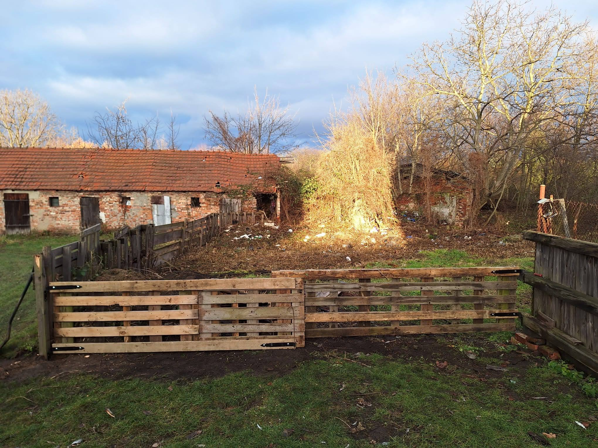
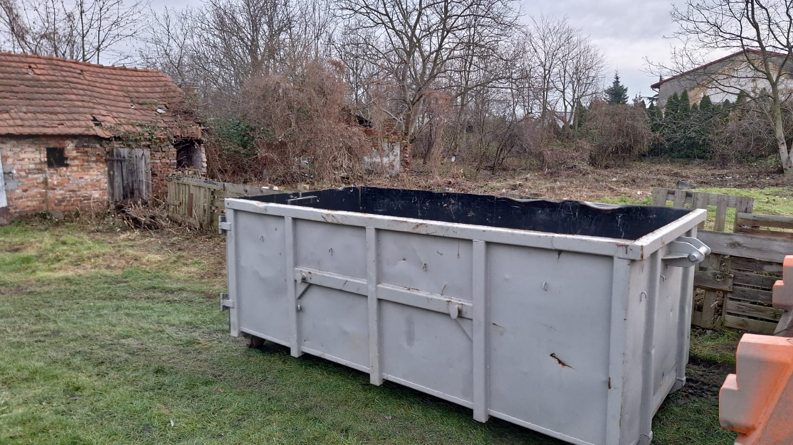
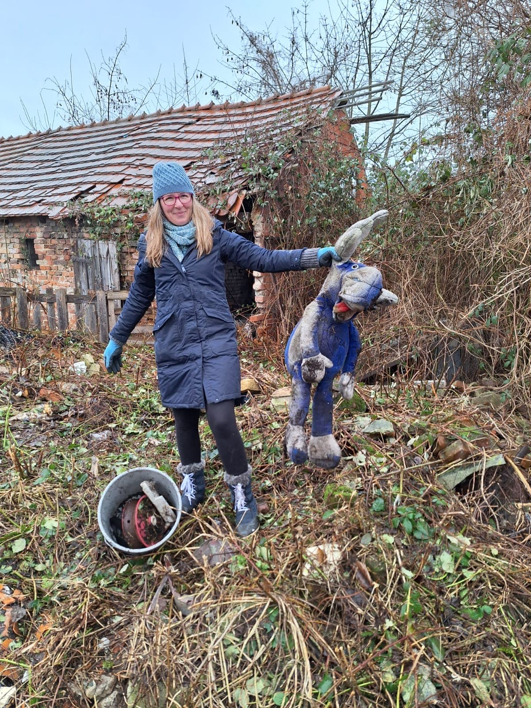
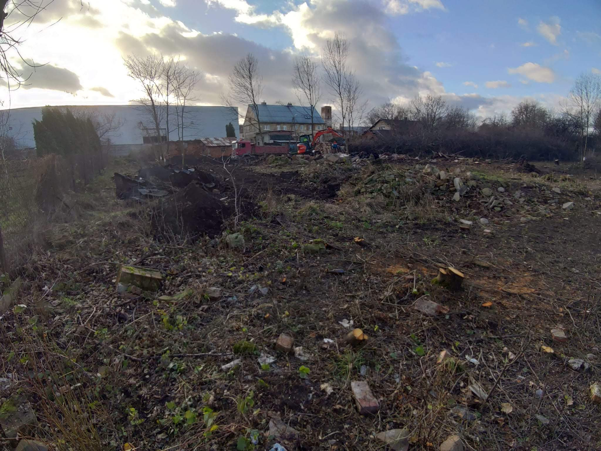

# Wieści z parku (odc. 3)

Sezon halowy w pełni, a w parku wciąż dużo się dzieje... Przez kilka najbliższych numerów klubowego newslettera oraz Wieści z parku zamierzam właśnie tak zaczynać nasze odcinki!

## Prace porządkowe

Prace w parku w grudniu rozpoczęliśmy od rozebrania części tymczasowego ogrodzenia, które mieszkańcy z ul. Lipowej postawili wokół podwórka. Zastąpiliśmy je równie tymczasową, ale bardziej funkcjonalną dwuskrzydłową bramą. Był to wstęp do dalszych prac, które opisuję poniżej. Nowe ogrodzenie nadal skutecznie powstrzymuje dziki przed wchodzeniem na podwórko.

<figure markdown="span">
  
  <figcaption>Nowa brama dwuskrzydłowa,
  źródło: opracowanie własne</figcaption>
</figure>

<!-- more -->

Od połowy miesiąca prace znacząco przyspieszyły. Dzięki uprzejmości kąteckich [ZGM](https://zgmkwr.pl/) i [ZGK](https://www.zgk-katy.pl/), na działce pojawił się największy dostępny kontener na śmieci. W zorganizowanej akcji społecznej wzięli udział członkowie zarządu – trenerzy Łukasz i Kasper, Agnieszka, ja (Przemek) oraz zaprzyjaźniony z klubem Michał. W ciągu kilku godzin udało nam się wypełnić kontener po brzegi. Było tam wszystko – śmieci po remontach, stare zabawki, talerze, tapczany… Śmiałkowie wrzucili nawet sedes z zawartością!

<figure markdown="span">
  
  <figcaption>Kontener, ten największy z największych 😉,
  źródło: opracowanie własne</figcaption>
</figure>

<figure markdown="span">
  
  <figcaption>Agnieszka i "Kłapouchy",
  źródło: opracowanie własne</figcaption>
</figure>

Następnie na dwa dni działkę opanowali pilarze z firmy Alpin-Drzew. Zajęli się usuwaniem samosiejek z działki wjazdowej oraz z części przyszłych torów, które były zasypane gruzem, w większości przywiezionym z zewnątrz. Dzięki ich pracy odsłoniła się w końcu panorama od strony wjazdu na przyszłe tory łucznicze, obecnie gruzowisko.

Podczas pracy pilarzy, wspólnie z Michałem i jego młodszym bratem, usuwaliśmy gałęzie na jedną stertę (planujemy je wkrótce zrębkować) oraz wyjątkowo agresywne kolczaste jeżyny, które miały nawet do 10 metrów długości!

Na przygotowany teren ZGM przysłał nam na trzy dni koparkę. Zaczęła ona prace od wstępnych porządków na działce wjazdowej, która w przyszłości ma pełnić funkcję parkingu dla uczestników treningów. Okazało się, że pod placem znajduje się stara poniemiecka kanalizacja burzowa, nie zaznaczona na aktualnych mapach. Dzięki czujności pana Wiesława (właściciela kurnika, który częściowo obejmuje naszą działkę), udało się nie uszkodzić komory kanalizacyjnej. Zabezpieczyliśmy włazy, gdzie w przyszłości może powstać naturalny odpływ z placu.

<figure markdown="span">
  
  <figcaption>Koparka w akcji,
  źródło: opracowanie własne</figcaption>
</figure>

<figure markdown="span">
  
  <figcaption>Tutaj będzie parking,
  źródło: opracowanie własne</figcaption>
</figure>

Gruz rozsypany na działce został zebrany w jednym miejscu przy wjeździe i przysypany tłuczniem, tworząc zaczątek przyszłego parkingu. Przy poprawie wjazdu na działkę zasypaliśmy też tłuczniem większe dziury na uliczce dojazdowej od strony ul. Lipowej. Chcemy żyć w zgodzie z mieszkańcami, którzy mają słuszne pretensje do gminy za brak zainteresowania dojazdem do ich domów, oraz obawy, że nasza obecność jeszcze pogorszy jej stan. Mam nadzieję, że ten drobny gest ociepli nasze stosunki z mieszkańcami.

Na finiszu prac w terenie, wspólnie z trenerem Kasprem, dokonaliśmy wstępnych pomiarów torów i stwierdziliśmy, że przy sprzyjających warunkach uda nam się zrealizować koncepcję pełnowymiarowego obiektu, na którym będzie można strzelać na odległość 90 metrów! Na pewno będzie można strzelać na 70 metrów bez problemu. Możliwe, że na szerokości działki uda się umieścić nawet 40 mat łuczniczych, choć bardziej realistycznie będzie to 36-38, co i tak daje nam ponad trzykrotny wzrost możliwości w porównaniu do tymczasowych torów na ul. Zielonej w Smolcu.

## Działania wokół torów 

Na powyższych działaniach terenowych zakończyliśmy grudzień, co nie oznacza, że nic więcej się nie działo wokół torów. Udałem się do Powiatowego Zakładu Katastralnego, skąd pobrałem wypis z ewidencji gruntów i budynków oraz mapę do celów opiniodawczych dla obu naszych działek. Dokumenty te będą niezbędne do stworzenia koncepcji zagospodarowania całego terenu oraz do różnych uzgodnień, które czekają nas w najbliższej przyszłości. Już w grudniu przydały się jako ważne załączniki do składanych pism.

Podczas niedawnych wyborów sołeckich w Smolcu burmistrz pochwalił się, że gmina rozpoczyna rewitalizację parku. Niestety projekt rewitalizacji został przygotowany bez konsultacji z mieszkańcami, a przede wszystkim bez uwzględnienia naszych uwag. Po złożeniu prośby o wgląd do projektu, udostępniono nam go i okazało się, że pomiędzy naszymi działkami a resztą parku zaplanowano ciągłe ogrodzenie z siatki o wysokości 150 cm. Z jednej strony to dobrze, bo nie musimy ponosić kosztów grodzenia około 100-metrowej granicy. Z drugiej jednak strony, źle, bo na całym tym odcinku nie przewidziano żadnego przejścia!

Dzięki sprawnej akcji udało się zmobilizować lokalne siły społeczne. Pod przygotowanym obszernym pismem do gminy, poza nami, podpisali się także dwaj radni gminni ze Smolca (Piotr Sobko, już były sołtys Osiedla, oraz Sebastian Kotlarz), Towarzystwo Przyjaciół Smolca oraz trzej obecni smoleccy sołtysi, a właściwie sołtyski, bo męska obsada z poprzedniej kadencji zmieniła się na żeńską. Zmiana projektu rewitalizacji jest dla nas bardzo istotna, zwłaszcza w kontekście organizacji treningów i – w przyszłości – zawodów run-archery. Ponieważ teren ma również służyć mieszkańcom, komunikacja między torami łuczniczymi (jako terenem rekreacyjnym dostępnym dla sołectw) a parkiem jest bardzo ważna. Miejmy nadzieję, że mobilizacja społeczna nie pójdzie na marne i gmina uwzględni naszą prośbę.

Bezpośrednio przed świętami złożyłem do Wydziału Geodezji w gminie wniosek o nadanie numeru porządkowego dla większego budynku na działce wjazdowej. Numer ten – nie wiemy jeszcze, jaki będzie – stanie się naszym adresem, co jest bardzo ważne przy organizacji przyszłych treningów i zawodów. Może pod nim będzie się mieścić siedziba Oddziału, który aktualnie korzysta z mojego prywatnego adresu?

## Historia pałacu w Smolcu

W przeddzień Wigilii na działkę odwiedził wspomniany już Sebastian Kotlarz – radny, historyk i zaangażowany mieszkaniec Smolca. Jako jedyny utrzymuje kontakt z ostatnimi właścicielami smoleckiego pałacu – rodziną von Wallenberg-Pachaly. Poprosiłem go o udostępnienie materiałów, które udało mu się uzyskać od tej rodziny. Niestety, aktualnie poza lotniczym przedwojennym zdjęciem nie ma żadnych innych, na których widać były nasze budynki. Zadeklarował się jednak poprosić rodzinę o ponowne przeszukanie ich archiwów. Takie materiały mogłyby być dla nas cenną wskazówką do odtworzenia tych historycznych budynków. Szanse są niewielkie, ponieważ ich charakter gospodarczy raczej nie zachęcał niemieckiej szlachty do fotografowania się na ich tle...

Podczas spotkania narodziła się jednak koncepcja, aby przy uroczystym otwarciu torów łuczniczych (planowanym na jesień 2024 roku) nadać imię zasłużonego seniora rodu – __Carla Gideona Gotthardta von Wallenberg-Pachaly__, współfundatora smoleckiego kościoła i szkoły.

<figure markdown="span">
  
  <figcaption>Carl Gideona Gotthardta von Wallenberg-Pachaly, źródło: https://archiwum.survival.art.pl/en/portret-wallenbergow/</figcaption>
</figure>

Do tego pomysłu gorąco Was zachęcam, a stosowną uchwałę musiałaby podjąć Rada Miejska Kątów Wrocławskich, ponieważ korzystamy z gminnego terenu. Możemy założyć, że dzięki pomocy pana Kotlarza byłaby to formalność. Sądzę, że taki patron umiędzynarodowiłby nasze zamierzenie i otworzył szerokie możliwości uzyskania środków, na przykład z Fundacji Współpracy Polsko-Niemieckiej. Dzięki dobrym kontaktom z niemieckimi run-archerystami możemy planować wiele wspólnych projektów, które pozwolą nam rozwijać nasz obiekt sportowy. Będę Was informował o postępach we współpracy z panem radnym i poproszę go o przedstawienie postaci potencjalnego patrona w jednym z najbliższych newsletterów.