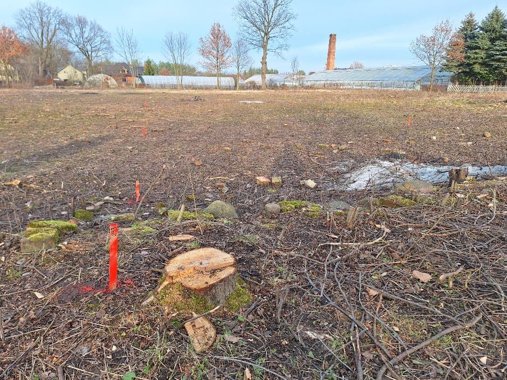
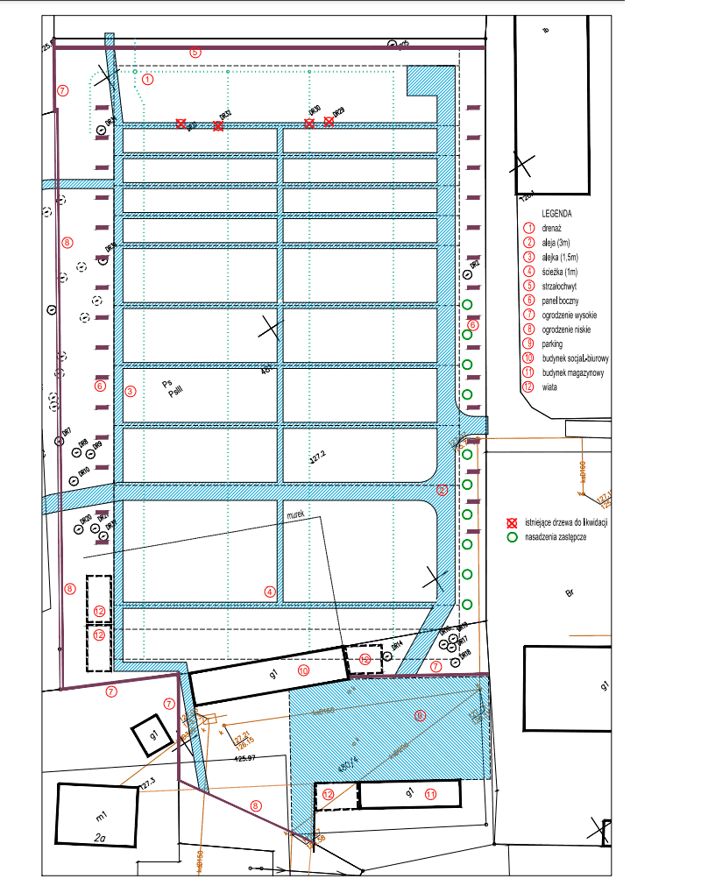
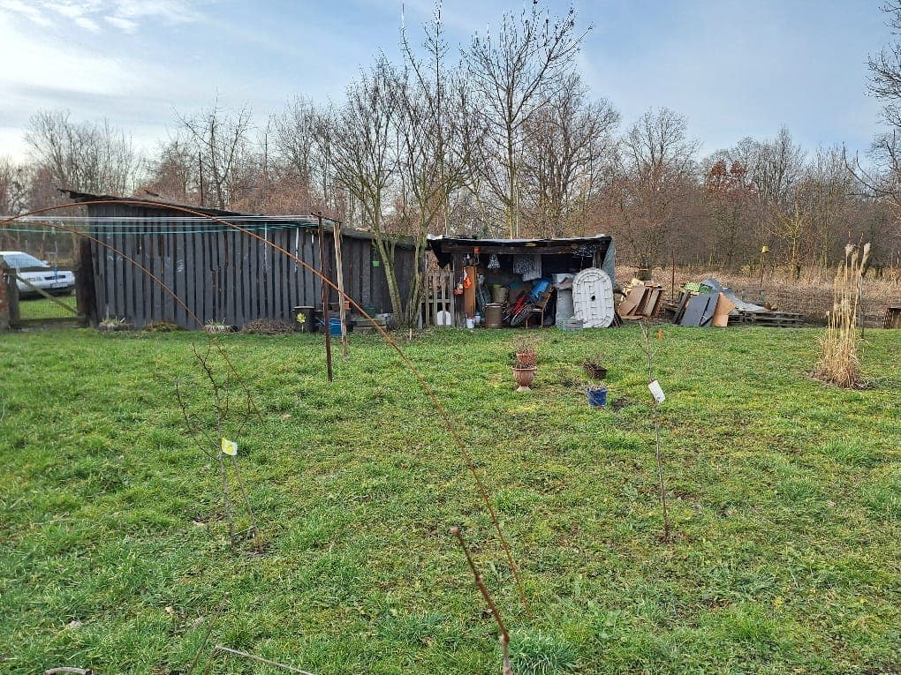
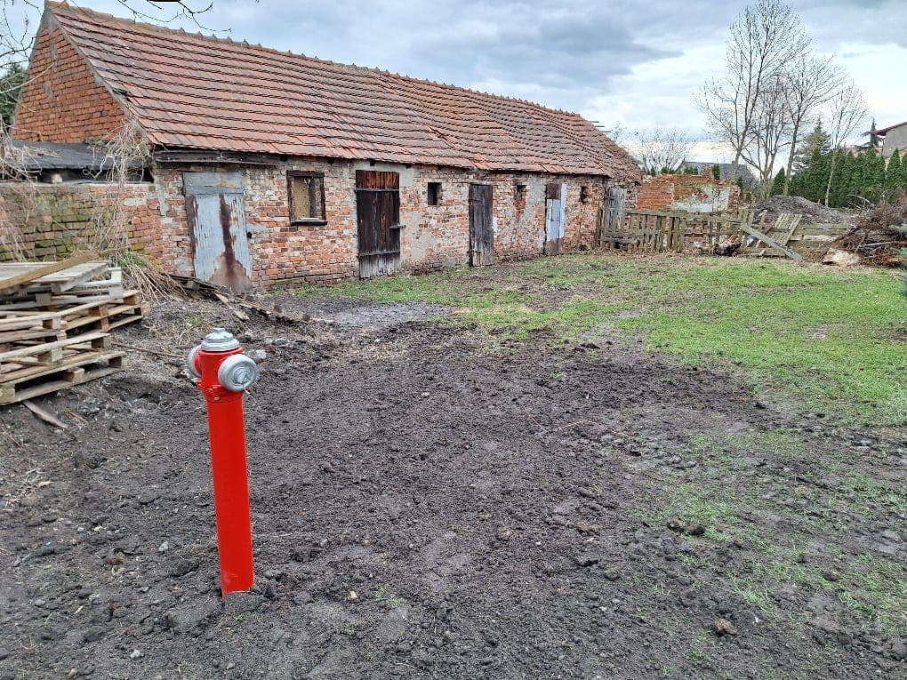

# Wieści z parku (odc. 5)

W lutym bardzo aktywnie działał nasz PARKOWY DREAM-TEAM – udało się dokończyć usuwanie gałęzi z obszaru całej działki. Dziesiątki poświęconych godzin w zimnie, wietrze i czasem deszczu oraz podobna ilość kolców nabitych w dłoniach Krzyśka i trenera Michała to ogromne poświęcenie, z którego ciężko jest zdać sobie sprawę tym, którzy nie spędzili ani minuty pracując w parku. Wielkie podziękowania i chwała im za to, że zdecydowali się podjąć ten wysiłek!

<figure markdown="span">
  {width="600px", loading=lazy}
  <figcaption>Działka nr 481 po oczyszczeniu z samosiejek i śmieci. 
     źródło: opracowanie własne</figcaption>
</figure>

<!-- more -->

Dzięki ich poświęceniu uzyskaliśmy czystą od roślinności powierzchnię terenu, co było konieczne do określenia zakresu dalszych prac, jak również podjęcia starań o fundusze na ten cel. Mogąc obfotografować wyczyszczony już teren, złożony został wniosek do Urzędu Marszałkowskiego Województwa Dolnośląskiego w ramach programu Poprawy bazy sportowej – rozstrzygnięcie konkursu powinno nastąpić już w marcu.

Ponadto znów odwiedził nas geodeta, z którym wspólnie obmierzyliśmy około 200 punktów w obrębie obu działek i nabiliśmy około 150 palików geodezyjnych. Wszystko po to, by stworzyć model terenu i dokonać obliczeń, jak wyrównywać działkę, by uzyskać równą powierzchnię torów.

17 lutego odbył się również mały czyn społeczny, w którym uczestniczyli klubowicze Grażyna Zatoka, Tomek Płóciennik i Kamil Ściana. Dzięki ich pracy udało się pozbierać kilkanaście worków śmieci – plastików, butelek, szkła i złomu. Teraz działka wygląda zdecydowanie lepiej – można byłoby już przeprowadzać na niej treningi! (Choć z pewnością potykalibyście się jeszcze o kamienie i wystające pieńki...)

Prace w parku mają jednak wymiar nie tylko fizyczny. W efekcie wcześniejszych konsultacji z konserwatorem zabytków, w dniu 1 lutego złożyłem do Wydziału Ochrony Środowiska w Gminie Kąty Wrocławskie prośbę o pozytywne zaopiniowanie wniosku o wyrażenie zgody na usunięcie czterech wielopniowych drzew o obwodzie przekraczającym 50 cm. Drzewa te rosną w newralgicznych miejscach działki, uniemożliwiając zagospodarowanie jej zgodnie z przeznaczeniem użyczenia, czyli wytyczeniem torów łuczniczych.

Ponieważ nasza działka należy do Gminy Kąty Wrocławskie, gmina sama sobie takiej zgody wydać nie może i nasz wniosek musiał być złożony do Starostwa Powiatowego. Gmina przychyliła się do naszej prośby i 14 lutego złożyłem wniosek do Starostwa z licznymi załącznikami, m.in. planem obiektu sportowego, propozycją nasadzeń zastępczych, zgodą gminy, kopią umowy użyczenia terenu oraz kopią naszego wpisu do ewidencji.

Urzędniczki Starostwa nie utrudniały procesu i już 22 lutego odebrałem decyzję pozytywną. W zamian za usunięcie wspomnianych czterech drzew (o sumie 14 pni) musimy w niedługim czasie, do końca kwietnia br., dokonać tzw. nasadzeń kompensacyjnych – 10 sztuk drzew o obwodzie min. 10-12 cm, mierzonym na wysokości 100 cm. Na klub została również nałożona opłata w wysokości 20.675 zł (słownie: dwadzieścia tysięcy sześćset siedemdziesiąt pięć złotych!).

Co to w praktyce dla nas oznacza? Musimy zakupić drzewa ze szkółki w gatunku uzgodnionym z urzędem – wybraliśmy buk czerwonolistny Red Fontaine w odmianie płaczącej. Dlaczego taki – o tym za chwilę. Po posadzeniu drzew w ciągu 14 dni musimy dokonać zgłoszenia nasadzeń, a następnie po 3 latach (tj. około 30 kwietnia 2027 roku) urzędnicy ze starostwa przyjadą, żeby sprawdzić, czy drzewa nadal rosną i mają się dobrze. Jeśli któreś nie przeżyje 3 lat, za każdą sztukę będziemy musieli zapłacić proporcjonalną część ww. opłaty, a więc po 2067,50 zł za każde drzewo. Opłaty możemy uniknąć, jeśli wskażemy inne drzewa, które również nasadziliśmy i dobrze się rozwijają. Na razie jednak wisi nad nami widmo zapłaty ww. opłaty, chyba że w ciągu najbliższych dwóch miesięcy (czyli w terminie, kiedy powinno się to zrobić) dokonamy nasadzeń.

Pomysłem na rozwiązanie powyższego problemu jest __Aleja Łuczników__ – nasadzenie szpaleru drzew wzdłuż drogi technicznej, którą planujemy urządzić wzdłuż wschodniej granicy działki. Żeby nie zepsuć sobie relacji dobrosąsiedzkich z rodziną Lewandowskich, zaproponowaliśmy w ramach nasadzeń zastępczych drzewa w odmianie płaczącej, które będą niższe i nie zasłonią upraw szklarniowych będących źródłem dochodów sąsiadów. Buki czerwonolistne *Red Fontaine* – ozdobna odmiana buków zwyczajnych o czerwonych liściach, są dostępne w poleconej i sprawdzonej szkółce ogrodniczej w cenie 700 zł za sztukę (musi to być drzewo określonej wielkości, a te tanie nie są). W sumie wzdłuż wschodniej granicy jesteśmy w stanie posadzić 18 drzew w 5-metrowych odstępach, co dałoby nam zapas 8 drzew na wypadek nieprzyjęcia się niektórych posadzonych. Koszt sadzonek to 12.600 zł. Do tego dojdzie jeszcze koszt ich transportu, wykopania dołów do ich posadzenia (będą to drzewa z dużą bryłą korzeniową, a więc raczej skorzystamy z koparki), wysokich palików, listewek do osłonięcia pni, taśm mocujących.

Sadzeniem zajmie się oczywiście PARKOWY DREAM-TEAM, jednak potrzebujemy jeszcze funduszy. Chcemy, by każde drzewo miało swojego patrona – otrzymało imię słynnego historycznego lub legendarnego łucznika, a jego posadzenie zostało sfinansowane przez jednego lub grupę darczyńców. W wolnych chwilach (których niestety prawie nie mam...) przygotowuję listę wielkich łuczniczych postaci, tak byście w następnym newsletterze mogli się już z nią zapoznać, zweryfikować, zaakceptować i byśmy mogli rozpocząć akcję pozyskiwania darczyńców. Jeśli jednak jest wśród Was ktoś, kto ma zacięcie pisarskie i historyczne, zachęcam do pomocy w wyszukiwaniu informacji i redagowaniu opisów. Będą one niezbędne do promocji pomysłu, a potem do wykonania tablic, którymi zostaną oznaczone poszczególne drzewa.

Wspomniałem wyżej o planie obiektu sportowego. Wraz z odkrywaniem tajemnic użyczonych nam działek, dokonywaniem dokładnych pomiarów, licznymi rozmowami koncepcyjnymi urodził się nam wstępny projekt zagospodarowania terenu, którego technicznym wykonaniem zajęło się dwoje architektów – Joanna i Wojciech, moi sąsiedzi, obecnie już klubowicze. Załączamy tu przygotowany przez nich [plan](20240229-mapa.pdf), byście mogli się z nim zapoznać.

<figure markdown="span">
  {width="600px", loading=lazy}
  <figcaption>Projekt Smoleckiego Parku Łuczniczego 
     źródło: opracowanie Joanny i Wojciecha</figcaption>
</figure>

W lutym prowadziłem również bardzo intensywne rozmowy z panią Renatą Banaś – dzierżawcą ogródka działkowego o powierzchni 400 m² na działce nr 481 – tej, na której zakładamy tory łucznicze. Rozmawialiśmy o wcześniejszym wypowiedzeniu przez nią umowy (aktualna obowiązuje do czerwca br.), tak abyśmy jak najszybciej mogli przystąpić do porządkowania również tej części terenu i możliwe było wytyczenie linii strzelań na 90 metrów na całej szerokości działki. 

Szybki postęp prac DREAM-TEAMU przekonał panią Renatę. Obiecałem również, że pomożemy jej w przesadzeniu roślin na nowe miejsce (na szczęście znalazł się bezpański niezagospodarowany fragment działki przy jej domu). Wypowiedzenie umowy dzierżawy zostało złożone do końca lutego, co oznacza, że z końcem marca umowa wygaśnie i w kwietniu powinniśmy być w stanie aneksować umowę z gminą na użyczenie brakującej nam części działki.

<figure markdown="span">
  {width="600px", loading=lazy}
  <figcaption>[Część działki nr 481 z ogródkiem i szopą do rozbiórki. 
     źródło: opracowanie własne</figcaption>
</figure>

Ostatnim sukcesem miesiąca lutego w parku było wykonanie przez Zarząd Gospodarki Komunalnej w Kątach Wrocławskich na własny koszt hydrantu w obrębie działki 480/4. Był on dla nas bardzo ważny w kontekście organizacji imprez na torach łuczniczych w przyszłości, ale także bezpieczeństwa pożarowego naszego obiektu i okolicznych mieszkańców. Prawda, że prezentuje się pięknie?

Nadal aktualne jest ogłoszenie o zbiórce materiałów budowlanych, które pozwoliłem sobie zamieścić w grudniowym newsletterze. Niezmiennie zachęcam Was do pomocy w pracach oddziału i akcji Smolecki Park Łuczniczy.

<figure markdown="span">
  {width="600px", loading=lazy}
  <figcaption>Hydrant w obrębie działki 480/4 
     źródło: opracowanie własne</figcaption>
</figure>