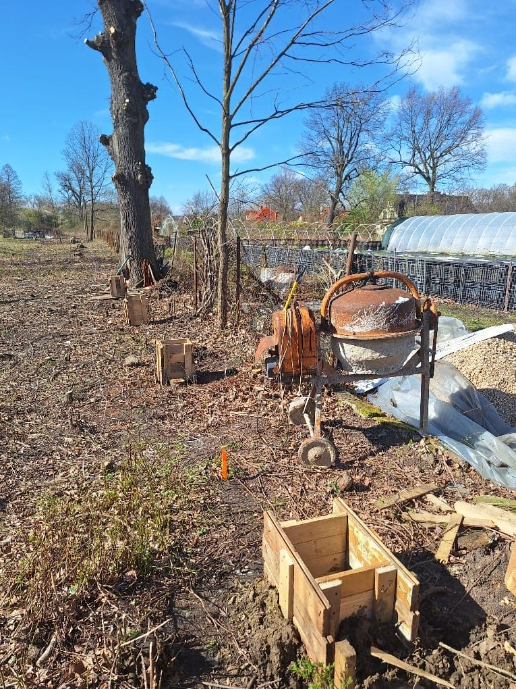
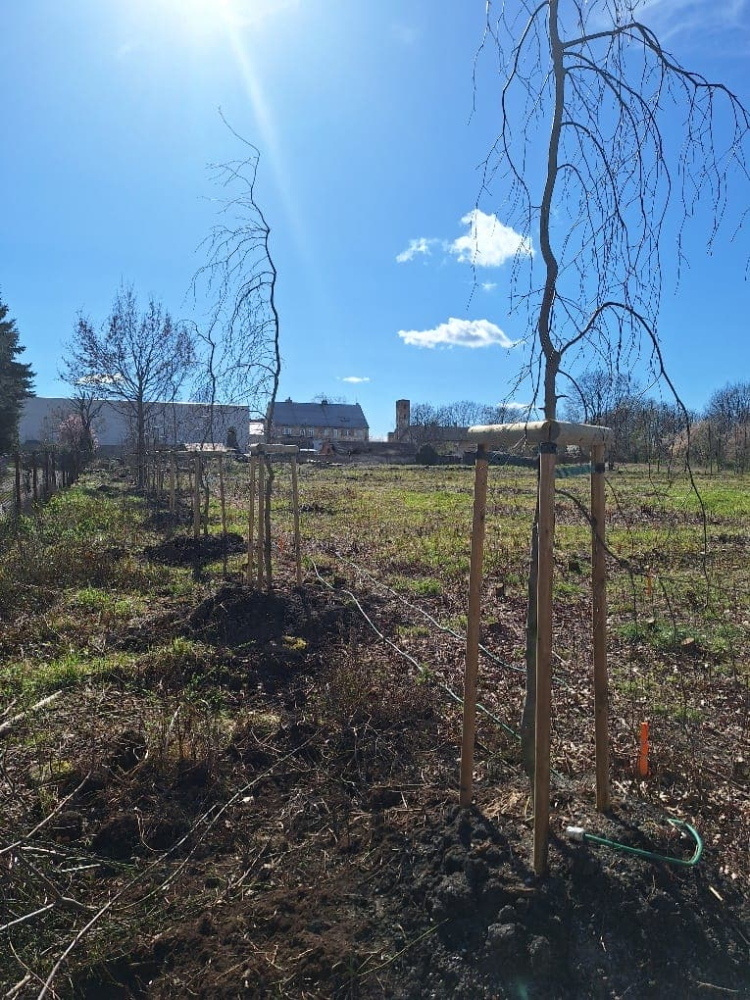

# Wieści z parku (odc. 6)

Na początek bardzo dobra wiadomość! Wniosek o dofinansowanie złożony do Urzędu Marszałkowskiego Województwa Dolnośląskiego pod nazwą "Smolecki Park Łuczniczy, etap 2A" w ramach otwartego konkursu ofert "Poprawa bazy sportowej" zyskał przychylność komisji oceniającej, i uzyskaliśmy dotację w wysokości 40.000 zł.

<!-- more -->

W ramach tego projektu mamy zamiar wykonać drenaż torów łuczniczych, ścianę strzałochwytu, boczne osłony oraz naprawić istniejące ogrodzenia i uzupełnić takowe na tych częściach granicy, gdzie ich w tej chwili brak. Do realizacji tego zadania, aby rozliczyć powyższą dotację, musimy wnieść wkład własny w wysokości 94.700 zł i zakończyć wszystkie działania projektu do połowy grudnia br.

W marcu rozpoczęliśmy zatem przygotowania do ułożenia drenażu oraz montażu słupów ściany strzałochwytu. Zakupione zostały słupy betonowe, piasek, żwir i cement do wykonania zaprawy betonowej oraz stal zbrojeniowa do ich osadzenia. Powstały pierwsze wykopy pod fundamenty słupów. Sami zobaczcie!

<figure markdown="span">
  {width="600px", loading=lazy}
  <figcaption>Pierwsze wykopy i szalunki pod fundamenty słupów ściany strzałochwytu. 
     źródło: opracowanie własne</figcaption>
</figure>

<figure markdown="span">
  {width="600px", loading=lazy}
  <figcaption>Aleja Łuczników - widok w kierunku południowym. 
     źródło: opracowanie własne</figcaption>
</figure>

Niezależnie od powyższych działań spieszę Wam donieść, że nasza [Aleja Łuczników](../../../../avenue/avenue.md) zaczyna nabierać realnych kształtów. Zakupiliśmy 18 buków czerwonolistnych Red Fontaine w odmianie płaczącej (kosztowały nas 11.700 zł). Nasz PARKOWY DREAM-TEAM dokonał posadzenia drzewek i je opalikował (specjalne paliki i taśma to dodatkowy koszt 1.136,98 zł), tym samym dopełniając obowiązku dokonania nasadzeń zastępczych za 4 wielopniowe drzewa, które usuniemy do końca kwietnia. Teraz nadszedł czas na "objęcie opieką" poszczególnych drzew. Każdemu chcemy nadać imię słynnego łucznika.

Przygotowaną mamy propozycję [19 patronów](../../../../avenue/archers.md) (poza 18 bukami mamy też w rzędzie 1 dąb na pozycji 12., którego odległość od ogrodzenia wyznaczyła linię naszego szpaleru). Po jej akceptacji w klubie przystąpimy do opracowania graficznego pomysłu, a następnie uruchomienia zbiórek dla chętnych do objęcia opieką poszczególnych drzew, jak również do rozsyłania propozycji do firm, instytucji i fundacji.

Oczywiście możecie też zadziałać w najprostszy z możliwych sposobów – wpłacić na konto UKS Luks Smolec nr 73 2530 0008 2041 1071 4663 0001 darowiznę z imieniem drzewa-łucznika.

Rozsyłajcie też te informacje do swoich znajomych. Może są wśród nich chętni darczyńcy? Całość uzyskanej w ten sposób kwoty włożymy w aranżację torów łuczniczych w parku. Zapraszamy również do "wykupienia swojego drzewa" za kwotę minimum 10.000 zł.

W marcu również pomogliśmy w "przeprowadzce" ogródka działkowego z południowo-zachodniego narożnika naszej działki nr 481. Teraz czekamy na formalne przekazanie nam brakującej części terenu, żeby móc go posprzątać i przygotować do dalszych prac – niestety procedura urzędowa jest zawiła i długotrwała (mam nadzieję, że nie będziemy czekać 3 lata, jak to miało miejsce z przekazaniem nam tego, co już mamy 😉).

Jednocześnie pracujemy nad naszymi "ruinkami" – rzutem na taśmę złożyłem do Zarządu Gospodarki Komunalnej projekt przyłączy sanitarnych (woda i ścieki). Bardziej skomplikowana sytuacja jest z przyłączem energetycznym, bo w tym wypadku potrzebujemy aneksu do umów użyczenia na obie działki, by wszcząć procedurę w Tauronie. Niestety podpisanie czegokolwiek w Gminie trwa...