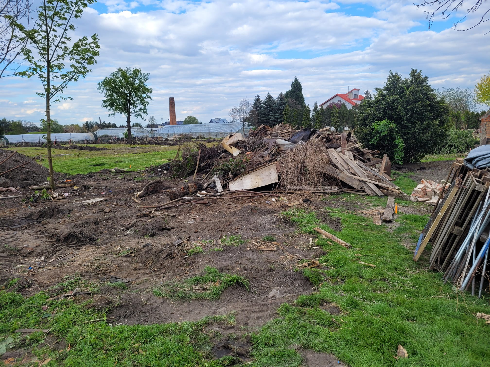

# Wieści z parku (odc. 7)

W kwietniu projekt „Smolecki Park Łuczniczy, etap 2A” przyspieszył w swojej realizacji. Umowa dotacji z Urzędem Marszałkowskim została podpisana, a sama dotacja już znalazła się na naszym koncie. Trwa wykonanie drenażu, który jest niezbędny, abyśmy nie utopili się jak Amerykanie na wietnamskim polu ryżowym. Wprawdzie działka była zdrenowana przez Niemców, ale prawie 100 lat temu, więc musimy wykonać nowy drenaż, który powinien wystarczyć na kolejne kilkadziesiąt lat. Operacja jest żmudna, gdyż wymaga korytowania z odpowiednimi spadkami, następnie wyłożenia geowłókniną dna i boków koryta, zasypania warstwą żwiru, ułożenia rur drenażowych, ponownego dosypania żwiru, owinięcia od góry geowłókniną i przysypania ziemią. W północnej części działki cztery nitki drenażu zostaną zebrane w poprzeczny kolektor ze studzienkami rewizyjnymi i całość będzie wpięta do istniejącego odpływu. Drenaż wykonujemy etapami, aby nie utrudniać komunikacji w obrębie działki przy prowadzeniu innych prac.

<!-- more -->

Pierwotnie planowane wykonanie ściany w technologii słupów stalowych i grubych desek drewnianych – ze względu na przyznanie niższej kwoty dotacji – musieliśmy zastąpić rozwiązaniem bardziej ekonomicznym, ale sprawdzonym, podpatrzonym przez trenera Kaspra podczas zgrupowania kadry na Cyprze (wielkoformatowe, cieńsze płyty ze sklejki). Użyliśmy również prefabrykowanych słupów betonowych, takich jak stosuje się w uprawach sadowniczych, do których w dalszym etapie dokręcimy drewniany stelaż i płyty ze sklejki. Słupy o wysokości 3,5 m zostały osadzone na dodatkowych półmetrowych stopach fundamentowych, a cała konstrukcja spokojnie "dojrzewała" w kwietniu, by osiągnąć stabilność i zamierzoną wytrzymałość.

<figure markdown="span">
  {width="600px", loading=lazy}
  <figcaption>Słupy strzałochwytu. 
     źródło: opracowanie własne</figcaption>
</figure>

Wspomniane prace, w przerwach technologicznych, były przeplatane innymi działaniami, m.in. naprawą ogrodzenia od strony północnej i wschodniej (co zostało już częściowo wykonane), podkaszaniem terenu przyszłych torów (pod tym względem natura nam nie odpuści, więc trzeba reagować szybko i zdecydowanie) oraz pracami porządkowymi w obrębie obu działek. Z jednej z szopek, prezentowanych w lutowym odcinku, została już tylko sterta śmieci i desek. Część odzyskanego w ten sposób materiału z pewnością dostanie jeszcze drugie „budowlane” życie, a reszta będzie musiała zostać zutylizowana.

<figure markdown="span">
  {width="600px", loading=lazy}
  <figcaption>Tyle zostało z szopki. 
     źródło: opracowanie własne</figcaption>
</figure>

W kwietniu nastąpiła uzgodniona w Starostwie wycinka czterech drzew wielopniowych. W ten sposób cały teren przyszłych torów został już oczyszczony z nasadzeń, które kolidowały z projektem zagospodarowania terenu. Aleja Łuczników, regularnie podlewana przez trenera Michała, czeka na swoich pierwszych darczyńców, a nasza członkini Marysia, zawodowo graficzka, pomaga w opracowaniu grafik ilustrujących patronów poszczególnych drzew. Poniżej przykład.

<figure markdown="span">
  {width="600px", loading=lazy}
  <figcaption><a href="https://smoleckiparkluczniczy.pl/archers/#an-san">An San</a>. 
     źródło: opracowanie własne</figcaption>
</figure>

Z końcem marca wygasła umowa dzierżawy ogródka działkowego na działce nr 481 o powierzchni 400 metrów kwadratowych. Natychmiast poprosiliśmy Gminę o formalne przekazanie nam tej brakującej części terenu i w kwietniu rozpoczęły się niezbędne urzędowe formalności. Z końcem maja mamy nadzieję podpisać stosowny aneks do umowy, dzięki czemu nasze smoleckie włości powiększą się do prawie hektara (dokładnie 9065 m²). Jednocześnie pracowaliśmy nad formalnościami związanymi z naszymi „ruinkami” – uzgodnienie przyłączy sanitarnych (woda i ścieki) stało się faktem. Nie czekając, zakupiliśmy potrzebny materiał do wykonania przyłącza wody i we współpracy z kąteckim ZGK szybko je wykonaliśmy. Jest ono bardzo ważne, aby w przyszłości mogła powstać toaleta lub kuchnia, w której będziemy mogli zaparzyć herbatę.

Wykonanie przyłącza kanalizacyjnego mogłoby odbyć się w tym samym czasie, jednak zostaliśmy zmyleni błędami w przebiegu rur kanalizacyjnych na mapach geodezyjnych. Podczas prac porządkowych interesujące nas rury zostały „odkryte” i teraz możemy zająć się wykonaniem projektu zamiennego do uzgodnienia.

<figure markdown="span">
  {width="600px", loading=lazy}
  <figcaption>Przyłącze wody. 
     źródło: opracowanie własne</figcaption>
</figure>