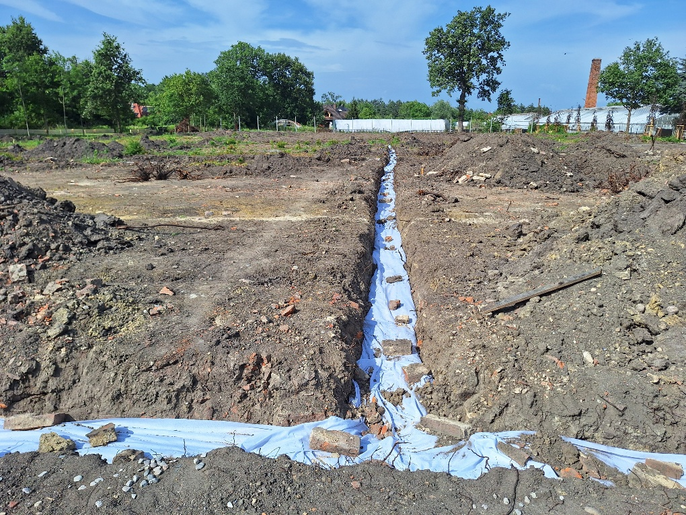
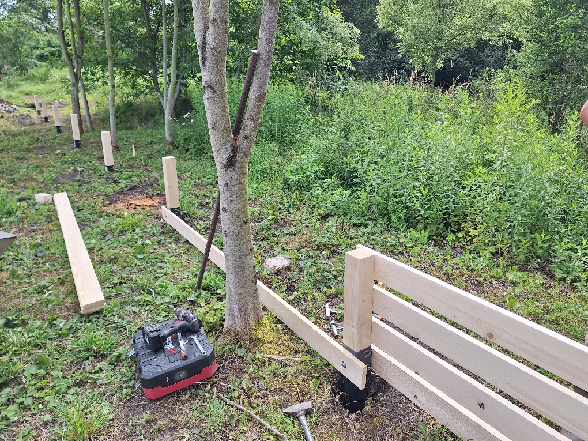
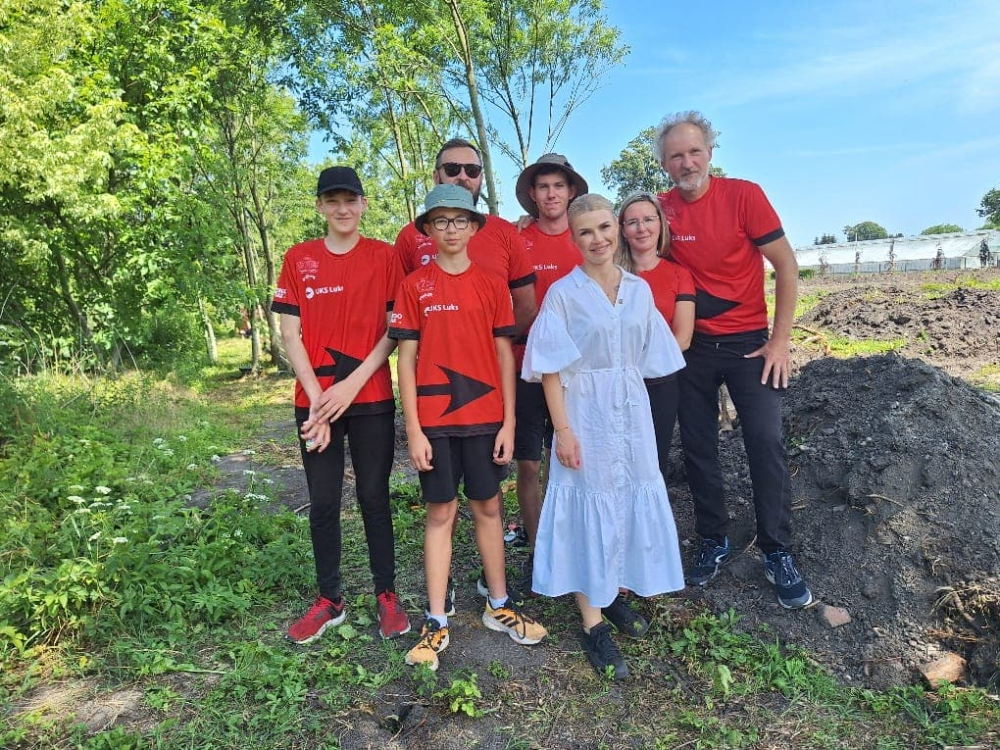
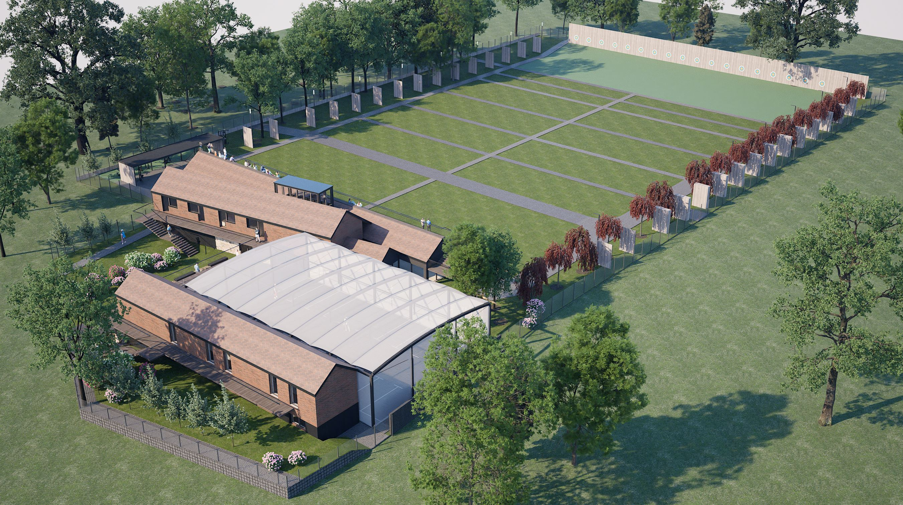
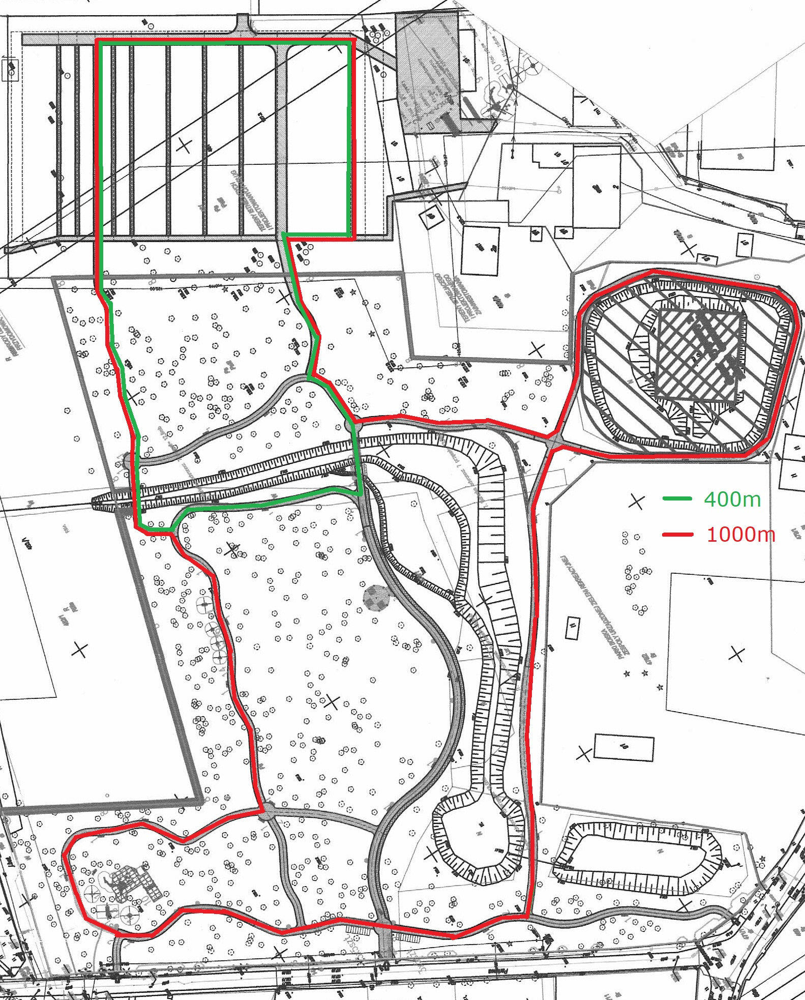

# Wieści z parku (odc. 9)

Prace przy wykonaniu drenażu zostały zakończone. Łącznie ułożono około 500 metrów rur w otoczeniu pola żwirowego zabezpieczonego specjalistyczną geowłókniną. Drenaż został już częściowo zasypany, reszta zostanie zasypana przy okazji przygotowywania gruntu pod wysiew trawy na torach łuczniczych. Pierwsza zrzutka [opublikowana w czerwcu](https://zrzutka.pl/2rgav8), przeznaczona na dokończenie drenażu, przyniosła nam przychód w kwocie 3000 zł, a wpłaty nadal wpływają na konto zrzutki (ponieważ sporo jeszcze brakuje, podsyłajcie informacje o niej swoim znajomym, każda, nawet najniższa, wpłata jest bardzo potrzebna i zostanie dobrze spożytkowana!).

__Link do zrzutki etap "drenaż terenu": [https://zrzutka.pl/2rgav8](https://zrzutka.pl/2rgav8)__

<figure markdown="span">
  {width="600px", loading=lazy}
  <figcaption>Drenaż części południowej działki jeszcze przed zasypaniem. 
     źródło: opracowanie własne</figcaption>
</figure>

<!-- more -->

Ponieważ prace w parku postępują, ruszamy z drugą zrzutką na wykonanie ogrodzeń terenu, zabezpieczających przed wtargnięciem na tory osób postronnych w czasie treningów.

__Link do zrzutki etap "ogrodzenie terenu": [https://zrzutka.pl/2rw8cp](https://zrzutka.pl/2rw8cp)__

Częściowo teren jest już ogrodzony od strony północnej i wschodniej starym ogrodzeniem z siatki, które wymaga naprawy (wyprostowanie słupów, uzupełnienie brakujących fragmentów siatki, naprawa podmurówki, zabezpieczenie ogrodzenia farbą antykorozyjną). Ponadto, przy naszych budynkach w ogrodzeniu jest również kilkanaście metrów przechylonego muru, który musimy odbudować. Od strony zachodniej, w ramach rewitalizacji parku, ma powstać nowe ogrodzenie z siatki. Po swojej stronie równolegle wykonamy niskie, mocne ogrodzenie z desek, zabezpieczające teren przed dzikami. Szkoda byłoby bowiem, gdyby niedługo po wysianiu trawy zaczęły poszukiwać u nas w ziemi smakołyków… Prace już zostały rozpoczęte. Na koniec będzie nas jeszcze czekać wykonanie ogrodzenia od strony południowej (wjazdu i wejścia).

<figure markdown="span">
  {width="600px", loading=lazy}
  <figcaption>Rozpoczęcie prac przy ogrodzeniu od strony parku. 
     źródło: opracowanie własne</figcaption>
</figure>

W czerwcu miała miejsce w parku bardzo ważna wizyta. Odwiedziła nas nowa burmistrzyni Kątów
Wrocławskich, [Katarzyna Sebzda-Sztul](https://www.facebook.com/permalink.php?story_fbid=pfbid02LhcT14XCmYjDHkfbDF9KZHH5J7rrHVRPNZCwGm8KYE5S1kQZyjRz7MQXho3MbQWRl&id=100063620824364) reprezentująca właściciela terenu – gminę. Zaprezentowaliśmy postęp prac i dalsze plany, obeszliśmy cały teren, były też strzały do tarczy na 10 metrów (Pani
Burmistrzyni!), 20 metrów (Tomek Szarek z mamą Agnieszką) oraz 70 i 90 metrów (trener Michał!).

Grupa klubowiczów w naszych reprezentacyjnych koszulkach prezentowała się znakomicie!

<figure markdown="span">
  {width="600px", loading=lazy}
  <figcaption>Wizyta burmistrzyni w Smoleckim Parku Łuczniczym. 
     źródło: opracowanie własne</figcaption>
</figure>

Podczas wizyty przekazaliśmy burmistrzyni dokument obejmujący wstępną koncepcję architektoniczną kompleksu Smoleckiego Parku Łuczniczego. Piękne wizualizacje do niej opracował zaprzyjaźniony z nami zespół architektów – nasi członkowie Joanna Smoczyńska-Bazan i Wojciech Bazan oraz współpracujący z nimi Dominik Gomółka. Dokument będzie w następnych miesiącach przedmiotem dalszych uzgodnień – z Działem Inwestycji w gminie, z konserwatorem zabytków, w Wydziale Architektury w Starostwie Powiatowym. Trudno powiedzieć, jaki ostatecznie kształt w przyszłości przybierze Smolecki Park Łuczniczy, niewątpliwie jednak będzie nas już niedługo czekać wiele dyskusji na ten temat, byśmy nie pominęli jakiegoś ważnego aspektu zagospodarowania terenu i infrastruktury, która będzie potrzebna w przyszłości. Oczywiście musimy myśleć również o potrzebach mieszkańców Smolca, by obiekt był wielofunkcyjny oraz zapraszał ich do rekreacji i uprawiania sportu, a także był miejscem ich spotkań i integracji.

<figure markdown="span">
  {width="600px", loading=lazy}
  <figcaption>Smolecki Park Łuczniczy z lotu ptaka – wizja przyszłości. 
     opracowane przez zespół architektów (w tekście powyżej)</figcaption>
</figure>

Znakiem szczególnym i rozpoznawczym oddziału klubu w Smolcu jest powstała i aktywnie działająca sekcja łucznictwa biegowego (ang. run-archery). Z zakończonego właśnie *German-Czech Run-Archery Cup 2024* reprezentanci klubu wrócili z 7 medalami i 2 miejscami na podium klasyfikacji łącznej. Przygotowujemy się do jesiennego Pucharu Europy oraz myślimy o organizacji pierwszych w Polsce zawodów run-archery. Docelowo zawody takie będą mogły odbywać się w Smoleckim Parku, a zaprojektowane przez projektantów ścieżki w obu częściach parku idealnie wyznaczają dwie pętle biegowe o długości 400 i 1000 metrów – do sprintów, sztafet i mikstów oraz biegu długiego w tej konkurencji.

<figure markdown="span">
  {width="600px", loading=lazy}
  <figcaption>Planowane pętle biegowe run-archery w smoleckim parku. 
     opracowane przez zespół architektów (w tekście powyżej)</figcaption>
</figure>

Rozpoczęcie prac przy ogrodzeniu w czerwcu związane było z zakupem słupków i desek w pobliskim tartaku w Skałce. Dokończenie drenażu wymagało zakupu geowłókniny, żwiru i rur drenażowych. Z kolei dalsze prace przy strzałochwycie i osłonach bocznych to czekające nas kolejne duże zakupy – stal z ocynkowaniem, deski konstrukcyjne, płyty wodoodporne ze sklejki. Poszukujemy zatem sponsorów instytucjonalnych, którzy mogliby wesprzeć nas przy tych dużych zakupach. Każdy, kto mógłby w tym pomóc, niech zgłosi się do dowolnej osoby z zarządu klubu, które koordynują akcję.

Niezmiennie zachęcam Was do pomocy w pracach oddziału i akcji Smolecki Park Łuczniczy.
Kontaktujcie się ze mną bezpośredniego na treningach poprzez [smolec@uksluks.pl](mailto:smolec@uksluks.pl)