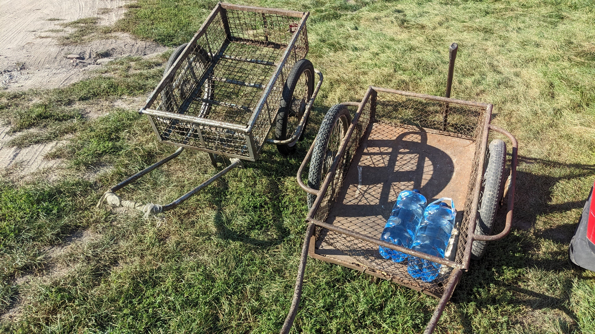
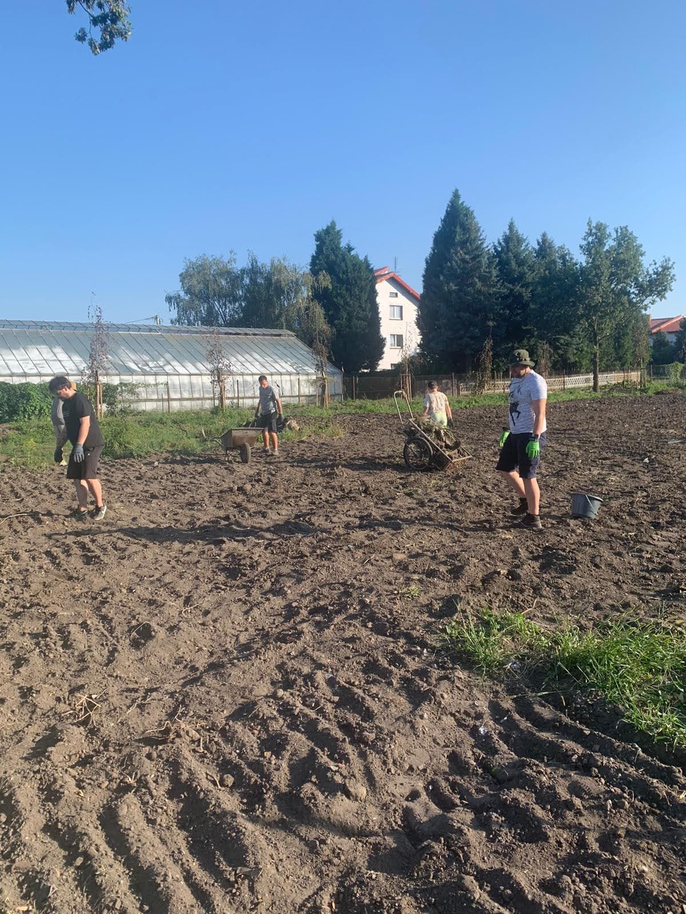
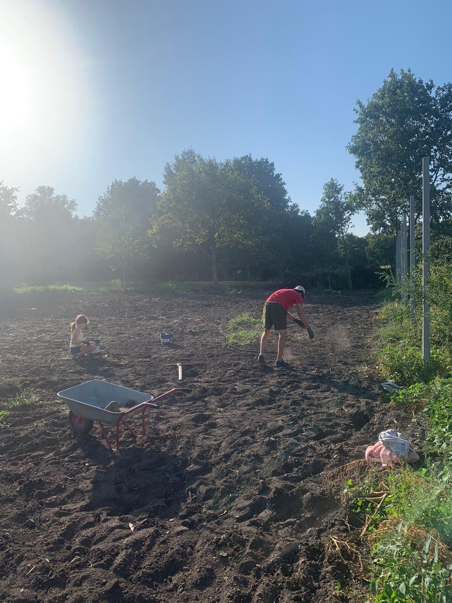
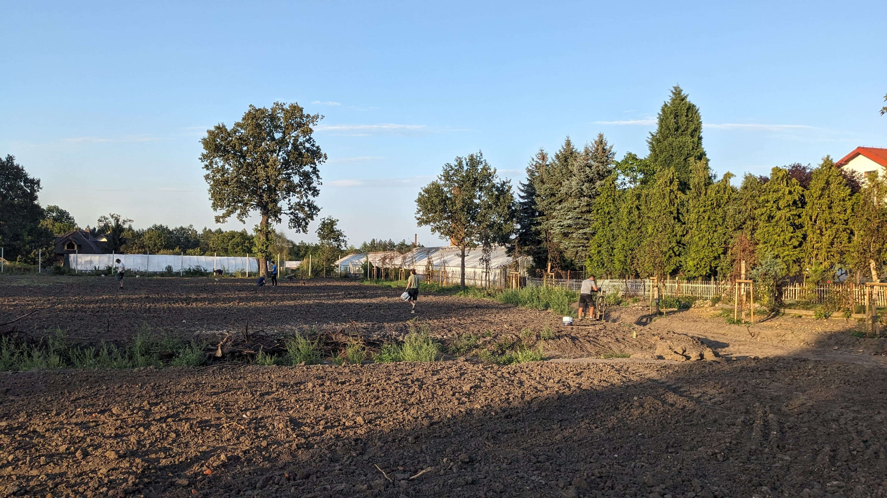
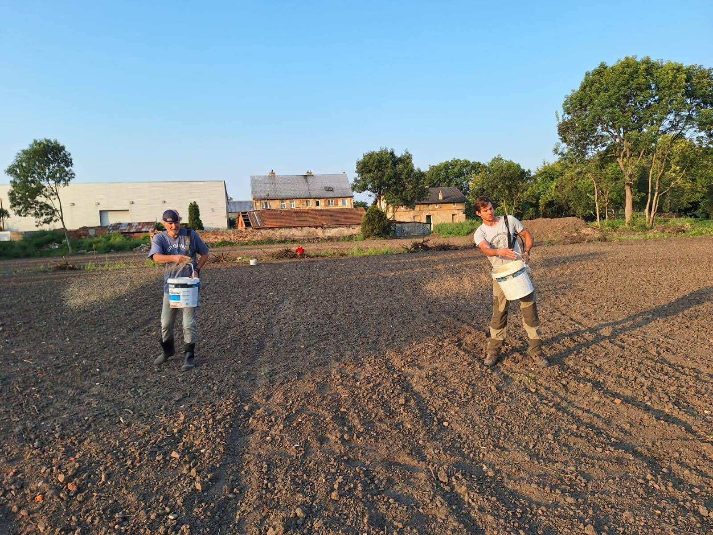
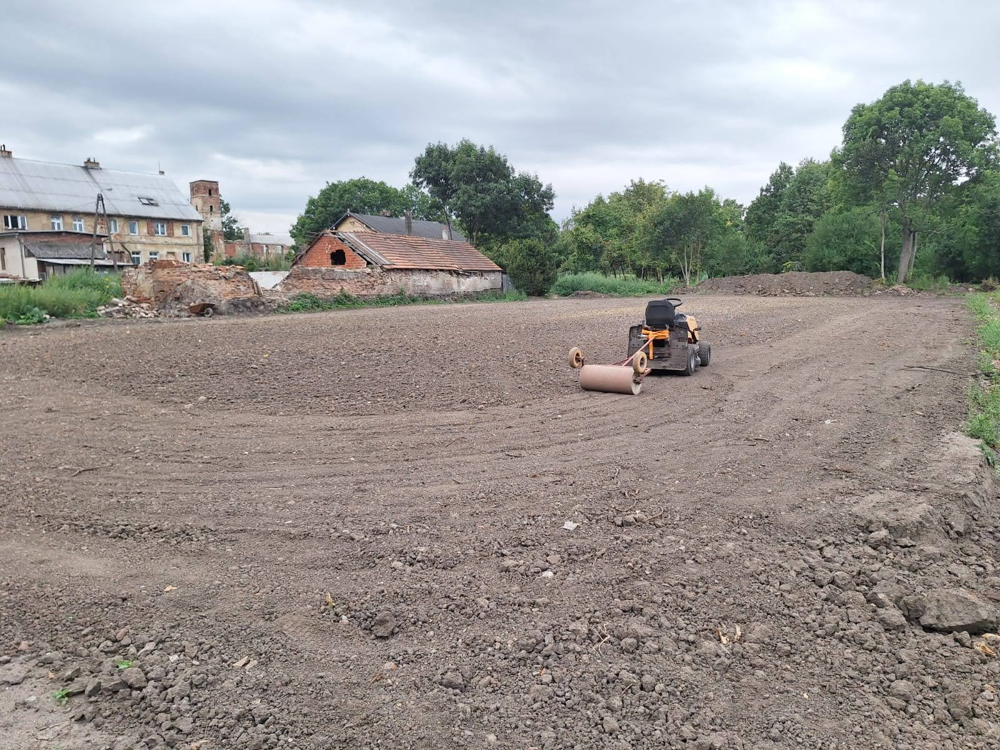

# Wieści z parku (odc. 10)

Bardzo dziękujemy za czwartkowy czyn społeczny! Udało się wybrać kamienie, cegły i korzenie przed siewem trawy. 

<figure markdown="span">
  {width="600px", loading=lazy}
  <figcaption>Zbieranie kamieni 
     źródło: opracowanie własne</figcaption>
</figure>

<!-- more -->

<figure markdown="span">
  {width="600px", loading=lazy}
  <figcaption>Zbieranie kamieni 
     źródło: opracowanie własne</figcaption>
</figure>

<figure markdown="span">
  {width="600px", loading=lazy}
  <figcaption>Zbieranie kamieni 
     źródło: opracowanie własne</figcaption>
</figure>

<figure markdown="span">
  {width="600px", loading=lazy}
  <figcaption>Zbieranie kamieni 
     źródło: opracowanie własne</figcaption>
</figure>

Pamagali nam:
Stanislaw,  Sławomir i Aleksander, Michał,  Filip, Tomek ,Ala  i Agnieszka, Wojciech i Józef Piotr, Tomasz,  Marek z synem, Kamil, Zuzanna, Wit,  Michał, Piotr i Piotr junior,  Joanna, trener Michał.

W sobotę z trenerem Michałem i niezbędną pomocą Witka wysialiśmy trawę na naszych przyszłych torach w Smolcu. W niedzielę rolnik zabronował, by przykryć nasiona.

<figure markdown="span">
  {width="600px", loading=lazy}
  <figcaption>Wysiew trawy 
     źródło: opracowanie własne</figcaption>
</figure>

Dziś, tj. 09.09.2024 odbyło się wałowanie. Deszcz nieco nam utrudnił zadanie, za to teraz już może i powinien padać przez co najmniej tydzień, by nasiona szybko zaczęły kiełkować. Gdy wzejdzie trawa i zrobimy pierwsze podkoszenie, zaprosimy Was na jeszcze jeden czyn społeczny. Na wierzchniej warstwie gleby po bronowaniu znów pojawiło się dużo kamieni i cegieł, które jeszcze musimy wyzbierać. Akcję będę ogłaszał na przełomie września i października.

<figure markdown="span">
  {width="600px", loading=lazy}
  <figcaption>Wałowanie po siewie 
     źródło: opracowanie własne</figcaption>
</figure>