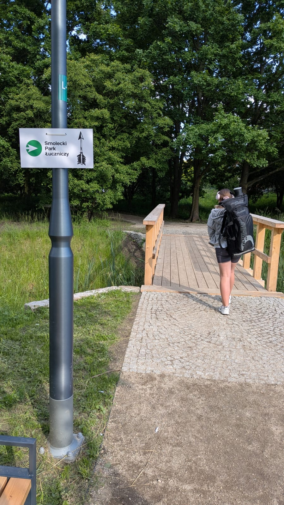

# Standort und Anfahrt

Wir haben derzeit noch keinen eigenen Parkplatz. Bitte nutzen Sie die verfügbaren
kostenlosen öffentlichen Parkplätze und erreichen Sie den Smolec Bogensport Park durch den Smolec Park zu Fuß
(oder mit dem Fahrrad) den Pfeilen folgend.

<figure markdown="span">
  {width="400px"}
  <figcaption>Der Weg zu uns ist so markiert.
    </figcaption>
</figure>

Haupteingang zum Park: <a href='https://maps.app.goo.gl/wwSaAzDFzV9dbLfX7'>51°04'35.3"N 16°52'57.2"E (51.076483, 16.882554)</a>

Parkplätze (Entfernung vom Haupteingang zum Park):

- Wierzbowa Straße - 200 Meter/3 Minuten [Karte](https://maps.app.goo.gl/JDBaXuuxYoitEi2U7)
- Kościelna Straße (Kirche) - 500 Meter/7 Minuten [Karte](https://maps.app.goo.gl/CpBQXUWpqHvMsCcb7)
- P+R am Bahnhof Smolec - 700 Meter/10 Minuten [Karte](https://maps.app.goo.gl/sPFy1LZ8RKDg1nyy7)

<iframe src="https://www.google.com/maps/embed?pb=!1m18!1m12!1m3!1d2985.573977145107!2d16.88348878552787!3d51.07649489890036!2m3!1f0!2f0!3f0!3m2!1i1024!2i768!4f13.1!3m3!1m2!1s0x470fc1003c8c3d37%3A0xd18599e12ab32d9e!2sSmolecki%20Park%20%C5%81uczniczy%20(w%20budowie)!5e0!3m2!1spl!2spl!4v1719954405368!5m2!1spl!2spl" width="800" height="450" style="border:0;" allowfullscreen="" loading="lazy" referrerpolicy="no-referrer-when-downgrade"></iframe>

Translated by :material-robot:
