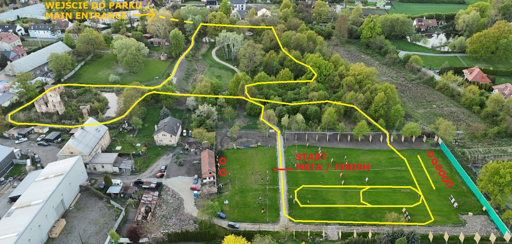
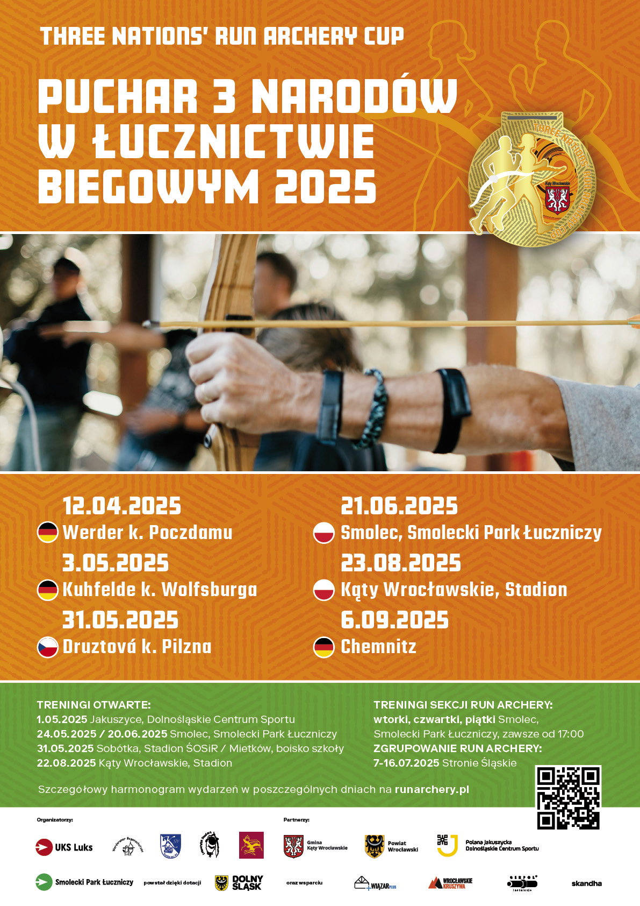

---
hide:
  - navigation
  - toc
  - title
---
# Home

Nach drei Jahren der Bemühungen erhielt der [Uczniowski Klub Sportowy Luks Smolec](https://uksluks.pl) im Oktober 2023 das Nutzungsrecht für das Gelände, das das Potenzial hat, zum Herzstück der Vereinsaktivitäten zu werden. Es wurde bis Ende 2028 von der [Gminę Kąty Wrocławskie](https://www.katywroclawskie.pl) verliehen, um sowohl uns als auch den Bewohnern von Smolec zu dienen!

Das Gelände mit einer Gesamtfläche von 9.065 m² wurde für den Bau einer Sport- und Freizeitanlage namens ***Smolec Bogensport Park*** bestimmt. Es besteht aus einem größeren Grundstück *Nr. 481*, auf dem wir Bogenschießplätze einrichten, und einem kleineren Grundstück *Nr. 480/4*, das mit ehemaligen Hofgebäuden bebaut ist, die das Potenzial haben, in Zukunft zum Vereinshauptquartier zu werden. Das Gelände grenzt direkt an den Smolec Schlosspark an, dessen geplante Revitalisierung durch die Gemeinde Kąty Wrocławskie im Jahr 2024 die Schaffung der weltweit ersten Arena ermöglichte, die dem Bogenlaufen (Run-Archery) gewidmet ist. Die Geschichte der Arbeiten können Sie im [Blog](blog/posts/2023/09/park-0.md) nachlesen.

<figure markdown="span">
  {width="600px"}
  <figcaption>Plan für die 4. Runde des Bogenlaufs.
    Quelle: eigene Bearbeitung</figcaption>
</figure>

Regelmäßiges Bogenschieß- und Lauftraining begann Anfang April 2025. Gruppentraining findet dienstags, donnerstags und freitags von 17:00 bis 20:00 Uhr statt (weitere Informationen zum Training auf der [UKS Luks](https://uksluks.pl/treningi/) Website). Jeder kann Bogenschießen ausprobieren, denn es ist ein Sport für Menschen jeden Alters und fast jeden Gesundheitszustands ohne teure "Einstiegshürde" – wir laden Sie ein, den Koordinationstrainer der [jeweiligen Sektion](https://uksluks.pl/kontakt/) zu kontaktieren und sich mit den Antworten auf [häufig gestellte Fragen](https://uksluks.pl/faq-czyli-najczesciej-zadawane-pytania/) vertraut zu machen. An anderen Wochentagen trainieren die Athleten individuell, wir organisieren auch Bogenschießtraining für kleinere und größere organisierte Gruppen. Wir sind auch offen für alle Initiativen der Smolec-Bewohner – wir arbeiten mit Dörfern, Nichtregierungsorganisationen und informellen Gruppen zusammen. Kontaktieren Sie uns einfach, um Datum und Umfang der Anlagennutzung zu vereinbaren!

Der erste Sportwettkampf im Smolec Bogensport Park ist die 4. Runde des Drei-Nationen-Pokals im Bogenlaufen am 21. Juni 2025. Mehr über Wettkämpfe und die Bogenlauf-Sektion finden Sie auf unserer speziellen [Bogenlauf](https://runarchery.pl/) Website. Mit der Ausstattung der Anlage werden hier auch Zielscheiben-Bogenschießwettkämpfe von immer höherem Rang stattfinden.

<figure markdown="span">
  {width="600px"}
  <figcaption>Drei-Nationen-Pokal im Bogenlaufen 2025.</figcaption>
</figure>

Translated by :material-robot:
