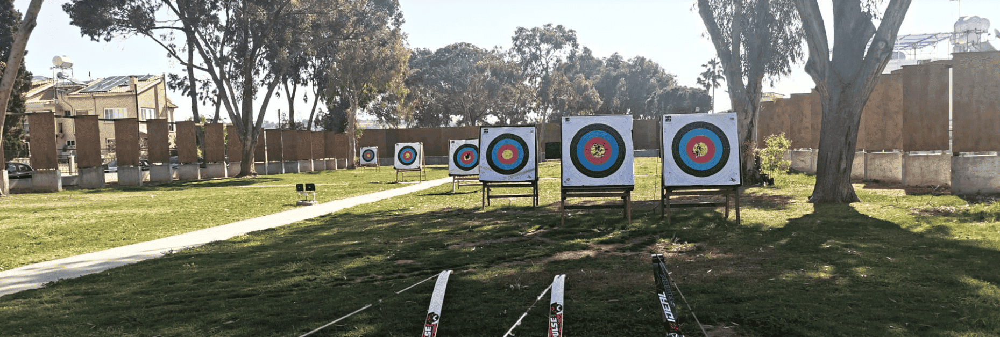

---
hide:
  - navigation
  - toc
---

# O projekcie

Po trzech latach starań [Uczniowski Klub Sportowy Luks Smolec](https://uksluks.pl) w październiku 2023 r. uzyskał prawo użytkowania terenu, który ma szansę stać się sercem działalności klubu. Został on użyczony do końca 2028 roku przez [Gminę Kąty Wrocławskie](https://www.katywroclawskie.pl), by służył zarówno nam, jak i mieszkańcom Smolca!

Teren o łącznej powierzchni 9065 m² został przeznaczony na realizację  biektu sportowo-rekreacyjnego o nazwie ***Smolecki Park Łuczniczy***. Składa się z większej działki *nr 481*, na której urządzamy tory łucznicze, oraz mniejszej działki *nr 480/4*, zabudowanej dawnymi budynkami folwarcznymi, które mają potencjał stać się w przyszłości siedzibą klubu. Teren bezpośrednio przylega do smoleckiego parku pałacowego, którego planowana rewitalizacja przez Gminę Kąty Wrocławskie w całości utworzy pierwszą na świecie arenę dedykowaną uprawianiu łucznictwa biegowego (ang. run-archery).

Wzorujemy się na [torach łuczniczych w Larnace na Cyprze](https://larnakaregion.com/pyla-hits-the-bullseye-with-archery-park) – ośrodku, z którego korzystają polscy kadrowicze. Chcemy stworzyć w Smolcu najnowocześniejszy obiekt w Polsce, w pełni dostosowany do potrzeb sportowców z niepełnosprawnościami, w tym poruszających się na wózku inwalidzkim.

<figure markdown="span">
  
  <figcaption>Pyla Archery Park, źródło: opracowanie własne</figcaption>
</figure>

