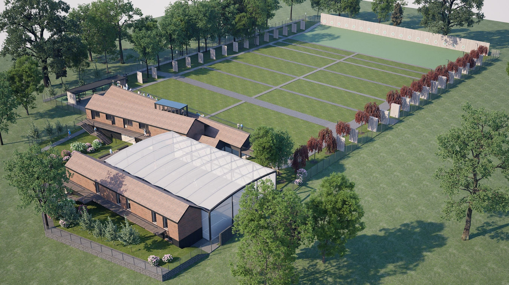

---
hide:
  - navigation
  - toc
---

# O projekcie

Po trzech latach starań [Uczniowski Klub Sportowy Luks Smolec](https://uksluks.pl) w październiku 2023 r. uzyskał prawo użytkowania terenu, który ma szansę stać się sercem działalności klubu. Został on użyczony do końca 2028 roku przez [Gminę Kąty Wrocławskie](https://www.katywroclawskie.pl), by służył zarówno nam, jak i mieszkańcom Smolca!

Teren o łącznej powierzchni 9065 m² został przeznaczony na realizację  biektu sportowo-rekreacyjnego o nazwie ***Smolecki Park Łuczniczy***. Składa się z większej działki *nr 481*, na której urządzamy tory łucznicze, oraz mniejszej działki *nr 480/4*, zabudowanej dawnymi budynkami folwarcznymi, które mają potencjał stać się w przyszłości siedzibą klubu. Teren bezpośrednio przylega do smoleckiego parku pałacowego, którego planowana rewitalizacja przez Gminę Kąty Wrocławskie w całości utworzy pierwszą na świecie arenę dedykowaną uprawianiu łucznictwa biegowego (ang. run-archery).

Wzorujemy się na [torach łuczniczych w Larnace na Cyprze](https://larnakaregion.com/pyla-hits-the-bullseye-with-archery-park) – ośrodku, z którego korzystają polscy kadrowicze. Chcemy stworzyć w Smolcu najnowocześniejszy obiekt w Polsce, w pełni dostosowany do potrzeb sportowców z niepełnosprawnościami, w tym poruszających się na wózku inwalidzkim.

<figure markdown="span">
  {width="600px"}
  <figcaption>Pyla Archery Park, miejce na któym się wzorujemy przy budowie parku
    źródło: opracowanie własne</figcaption>
</figure>

Zespoł architektow (Joanna Smoczynska-Bazan i Wojciech Bazan oraz dodatkowo zaproszony do zespołu Mikołaj Gomołka) w czerwcu 2024 roku rozpoczęli przygotowywanie szczegołowej koncepcji zagospodarowania obu działek wraz z koncepcją architektoniczną rewitalizacji i rozbudowy istniejących dawnych budynkow folwarcznych.

Po prawej stronie torów (od wschodu), widoczna [Alej Łuczników](avenue.md) z bukami czerwonolistnymi. Z lewej storny torów (na zachód), alejki z torów połączone zostaną z [Parkiem w Smolecu](https://www.google.com/maps/place/Park+w+Smolcu/@51.076453,16.8838042,355m/data=!3m1!1e3!4m10!1m2!2m1!1sParkiem+Smoleckim!3m6!1s0x470fc1bdb23323dd:0x1742ea66a9689723!8m2!3d51.0768577!4d16.8840676!15sChFQYXJraWVtIFNtb2xlY2tpbZIBBHBhcmvgAQA!16s%2Fg%2F11r1jk6f3d?entry=ttu), dzięki czemu możliwe jest trenowanie i organizowanie zawodów łucznictwa biegowego (run-archery). Od części południowej dostępne jest całe zaplecze torów, od magazynów i szatni po trybuny dla kibiców.

<figure markdown="span">
  {width=1200px"}
  <figcaption>Smolecki Park Łuczniczy, widok z lotu ptaka na podstawie wstępnego projektu
    opracowanie rzutow i wizualizacji: Wojciech Bazan, Mikołaj Gomołka, Joanna Smoczynska-Bazan</figcaption>
</figure>