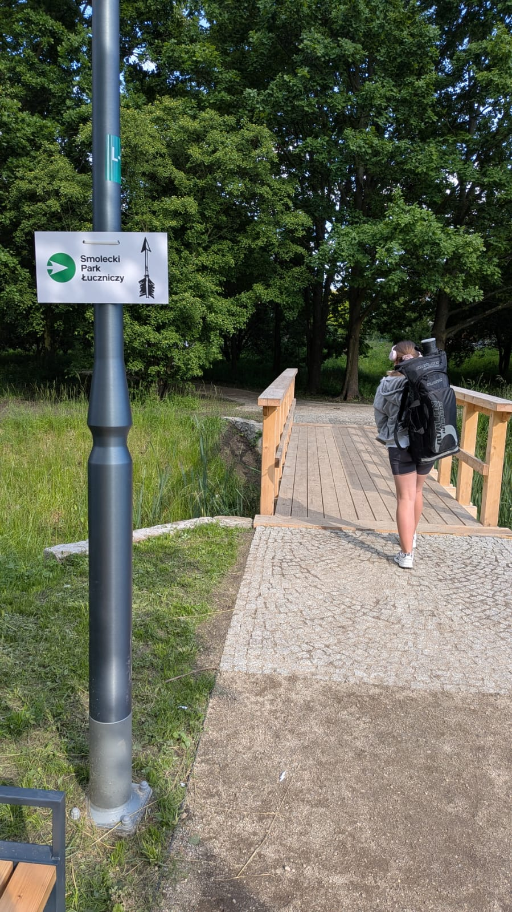

# Lokalizacja i dojazd

Aktualnie nie posiadamy jeszcze własnego parkingu. Prosimy o korzystanie z ogólnodostępnych
parkingów bezpłatnych i docieranie do Smoleckiego Parku Łuczniczego przez Park Smolecki pieszo
(lub rowerem) za strzałkami.

<figure markdown="span">
  {width="400px"}
  <figcaption>Droga do nas jest tak oznaczona.
    </figcaption>
</figure>

Wejście Główne do Parku: <a href='https://maps.app.goo.gl/wwSaAzDFzV9dbLfX7'>51°04'35.3"N 16°52'57.2"E (51.076483, 16.882554)</a>

Parkingi (odległość od Wejścia Głównego do Parku):

- ul. Wierzbowa - 200 metrów/3 minuty [mapa](https://maps.app.goo.gl/JDBaXuuxYoitEi2U7)
- ul. Kościelna (kościół) - 500 metrów/7 minuty [mapa](https://maps.app.goo.gl/CpBQXUWpqHvMsCcb7)
-  P+R przy stacji kolejowej Smolec - 700 metrów/10 minut [mapa](https://maps.app.goo.gl/sPFy1LZ8RKDg1nyy7)

<iframe src="https://www.google.com/maps/embed?pb=!1m18!1m12!1m3!1d2985.573977145107!2d16.88348878552787!3d51.07649489890036!2m3!1f0!2f0!3f0!3m2!1i1024!2i768!4f13.1!3m3!1m2!1s0x470fc1003c8c3d37%3A0xd18599e12ab32d9e!2sSmolecki%20Park%20%C5%81uczniczy%20(w%20budowie)!5e0!3m2!1spl!2spl!4v1719954405368!5m2!1spl!2spl" width="800" height="450" style="border:0;" allowfullscreen="" loading="lazy" referrerpolicy="no-referrer-when-downgrade"></iframe>

