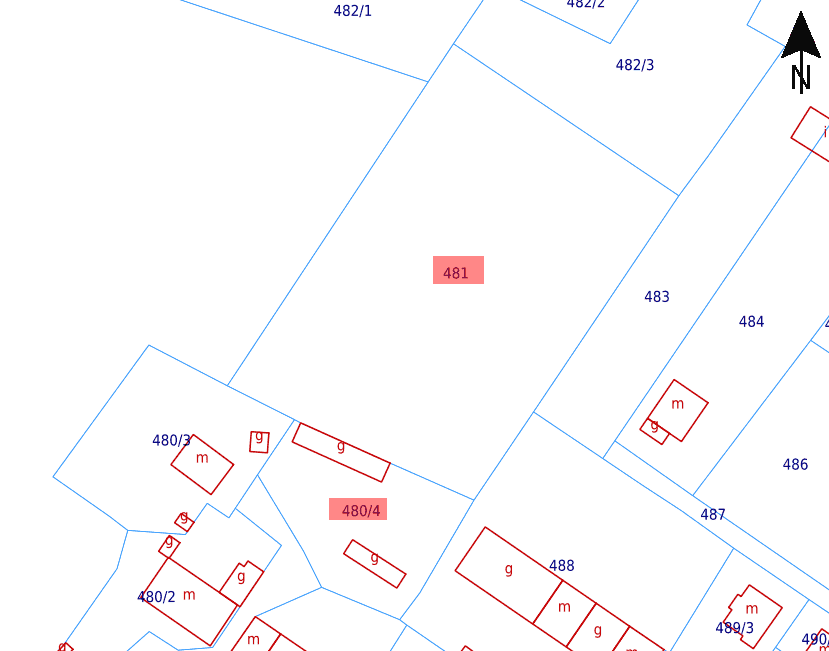

# Nowe tory łucznicze w Smolcu

__Dzięki pracy Przemysława Jastrzębia będziemy mogli przenieść nasze tory łucznicze. Wymaga to jednak ogromu zaangażowania, pracy i czasu aby móc ostatecznie rozpocząć treningi w nowym miejscu.__

Cytując prezesa smoleckiego oddziału, czeka Nas kilka procesów:

_Przede wszystkim, umowa musi zostać podpisana – w zasadzie nawet dwie umowy: pierwsza bezpośrednio z gminą na 7000 m² dawnych ogródków działkowych, druga zaś z Zakładem Gospodarki Mieszkaniowej w Kątach Wrocławskich na dojazdową działkę o powierzchni 1665 m², na której obecnie znajdują się komórki lokatorskie i kurnik. Według zapewnień, obie umowy mają horyzont czasowy sięgający końca 2028 roku, co powinno pozwolić nam na korzystanie z nowych torów przez co najmniej cztery pełne sezony!_

<figure markdown="span">
  {width="600px", loading=lazy}
  <figcaption>Omawiane działki w Smolcu, 
  źródło: <a href="https://mapy.geoportal.gov.pl/">https://mapy.geoportal.gov.pl</a></figcaption>
</figure>

<!-- more -->

_Gdy będziemy mieli w ręku podpisane umowy, musimy natychmiast wykupić polisę OC, która zabezpieczy nas od wszelkich ryzyk związanych z użytkowaniem tego terenu – zarówno na czas aranżacji torów, jak i potem podczas treningów czy w przypadku nieuprawnionego wtargnięcia osób trzecich. Następnie wspólnie z sołtysem Smolca Centrum odwiedzę mieszkańców ul. Lipowej, których budynki graniczą z podwórkiem, z którego docelowo zamierzamy zorganizować wjazd na teren torów. Mieszkańcy od lat użytkują bezpański teren, którym teraz zajmiemy się my, chciałbym więc w cywilizowany sposób się z nimi skomunikować i przedstawić im nasze plany._

_Gdy spadną liście, co z pewnością nastąpi w ciągu kilku tygodni, zorganizujemy spec-grupę z kosami spalinowymi, by wstępnie wykosić teren dawnych ogródków działkowych - jest to konieczne, by wspólnie z pracownikami Wydziału Ochrony Środowiska dokonać wizji lokalnej terenu i określić, które krzewy możemy wyciąć. Bez oczyszczenia terenu przygotowanie polany nie byłoby możliwe, wszystko jednak musi się odbyć w zgodzie z literą prawa. Gdy niezbędne zgody zostaną udzielone, przystąpimy do karczowania - być może część prac będziemy mogli wykonać samodzielnie w czynie społecznym członków w któryś z zimowych weekendów. Krzewy trzeba będzie powycinać, usunąć ich korzenie, a następnie zrębkować. Możliwe, że do niektórych prac związanych z wycinką będziemy musieli jednak wynająć specjalistyczną firmę. Gdy teren zostanie w ten sposób wstępnie oczyszczony, zobaczymy jakie jeszcze tajemnice kryją dawne ogródki działkowe. Jest niewykluczone, że znajdziemy jakieś śmieci i gruz, które trzeba będzie pozbierać i wywieźć._

_Następnie, miejmy nadzieję, że będzie to jeszcze końcówka zimy, na teren będą musiały wjechać maszyny rolnicze (mulczer, glebogryzarka, brony), aby przygotować teren pod wiosenny zasiew trawy. Pewnie mniej więcej w tym samym czasie trzeba będzie pomyśleć o ogrodzeniu terenu przyszłych torów łuczniczych od strony zachodniej, czyli reszty parku (teren od północy, wschodu i częściowo południa jest już ogrodzony). Mniejsza działka (ta w zarządzie ZGM) podobnie będzie wymagała uporządkowania – na niej w przyszłości będą miejsca postojowe dla osób przyjeżdżających na trening samochodami, zaś w komórkach zamierzamy urządzić magazynek sprzętu (co zapewne wiązać się będzie z częściową przekładką dachu ze starych dachówek ceramicznych, wstawieniem nowych drzwi, ułożeniem posadzki...). Być może uzyskamy zgodę na ustawienie klubowego kontenera, który da nam schronienie przed deszczem i chłodem._

_Wracając jednak do torów łuczniczych – maj powinien być najlepszym miesiącem na wysiew trawy (czeka nas zakup nasion). Po siewie konieczne będzie wałowanie, a potem czekamy na deszcze, zazielenienie się naszej klubowej łąki i... rozpoczniemy koszenie. Tu oczywiście pojawia się problem, kto i czym będzie kosił. Aktualnie korzystamy z uprzejmości moich sąsiadów z ul. Zielonej, którzy zgodzili się na użytkowanie traktorka-kosiarki do wykaszania torów przy ul. Zielonej. Traktorek jednak kończy już swój techniczny żywot (skutkiem tego była ostatnia dwumiesięczna przerwa w koszeniu) i nie będzie też raczej zgody na użytkowanie takiej wspólnej maszyny poza ul. Zieloną. A więc – zakup traktora-kosiarki albo współużytkowanie maszyny należącej np. do klubu piłkarskiego Sokół Smolec w zamian za możliwość użytkowania terenu torów do treningów piłkarskich w dniach, w których nie będziemy realizować treningów... No i oczywiście casting na operatora kosiarki._

_Gdy teren będzie już ogrodzony, wykaszany, a trawa wzmocni się na tyle, by można było na nią wejść bez ryzyka jej zadeptania i zniszczenia, trzeba będzie przystąpić do zabezpieczenia północnej granicy działki. Czeka nas "budowa wału ziemnego". Ponieważ teren jest pod opieką konserwatorską i archeologiczną, nie jest możliwe spiętrzenie klasycznego wału ziemnego, co byłoby rozwiązaniem najprostszym. Najprawdopodobniej będziemy musieli – tak jak siłami klubowiczów częściowo zostało to zrobione na torach przy ul. Zielonej – ułożyć ścianę z worków z piaskiem. Oczywiście konieczna będzie też konstrukcja (tymczasowa, ponieważ trwałych nam stawiać nie wolno!), która tę ścianę worków podtrzyma. Ponadto zapewne zamontujemy słupy z liną przed "wałem ziemnym", na której zawiśnie siatka strzałochwytu._

_Co najmniej do czasu obozu letniego będziemy trenować na Zielonej. Po obozie idealnie byłoby przeprowadzić się już do parku, ale będzie to możliwe dopiero wtedy, gdy wszystkie wymienione prace zostaną wykonane. Wówczas czeka nas rozbiórka aktualnych mat z torów na Zielonej – formatki płyty pilśniowej pewnie nie będą się już w większości nadawać do ponownego użycia. Drewniane skrzynie mat trzeba będzie przewieźć, ustawić we właściwych miejscach i wypełnić nowymi formatkami. Potem jeszcze tylko wytyczenie linii strzelań i będzie można zainaugurować treningi w nowym miejscu... Ufff!_

_Jak widzicie, pracy jest naprawdę dużo. Wymaga to ogromu czasu i zaangażowania całego zespołu osób, a także niemałych środków finansowych. Dzięki wsparciu przyjaciół otrzymaliśmy zapewnienie zabezpieczenia kwoty 9.000 zł na prace porządkowe w budżecie sołeckim sołectwa Smolec Osiedle na rok 2024. Zakup ogrodzenia, piasku i worków, strzałochwytu, formatek z płyty pilśniowej, prace przy aranżacji magazynku – na to wszystko będziemy musieli wygospodarować środki w przyszłorocznym budżecie Oddziału i Centrali..._

_Warto jeszcze wspomnieć, że nasz projekt popierają biegacze ze Smolca, licząc na to, że Gmina w końcu aktywniej zabierze się za wytyczenie ścieżek biegowych w sąsiadującym parku. Ścieżki te posłużą mieszkańcom do spacerów, biegaczom do biegania, nam zaś – do treningów łucznictwa biegowego (ang. Run-Archery, niem. Bogenlaufen). W ostatnich i w tym newsletterze znaleźliście już sporo informacji o sekcji łucznictwa biegowego, która zainaugurowała swoją działalność w naszym klubie. Nie ukrywajmy, że łatwiej nam będzie o międzynarodowy sukces w tej dyscyplinie niż w klasycznym łucznictwie, a sukcesy nowej sekcji to dla nas ważny argument w rozmowach z Gminą i darczyńcami o wsparciu naszej działalności. To także bardzo ważny element naszej potencjalnie wieloletniej obecności w smoleckim parku._

_W przyszłości chcielibyśmy organizować w Smolcu zawody zarówno w łucznictwie biegowym, jak i klasycznym. To oczywiście pieśń przyszłości, jednak nie jest niemożliwe, by już w 2025 roku dołączyć z naszymi zawodami w łucznictwie biegowym do Pucharu Czech i Niemiec jako polska część tego międzynarodowego cyklu. W tym kontekście warto też wspomnieć o trenerze Łukaszu – mieszkańcu Rościszowa w Górach Sowich, który rozpoczął właśnie treningi z grupą w Pieszycach. Ta nieformalna zamiejscowa placówka to kolejne miejsce, w którym wykazujemy się działalnością, a nowi członkowie oddziału (i całego klubu) z Pieszyc dokładają się do klubowego budżetu i już niedługo zapewne przystąpią do rywalizacji w zawodach._

