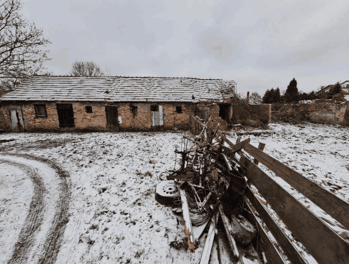
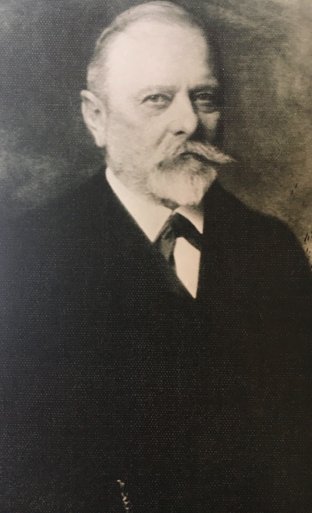
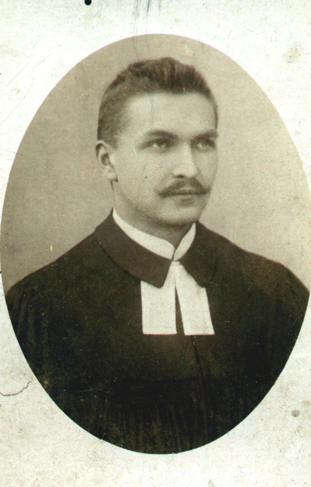
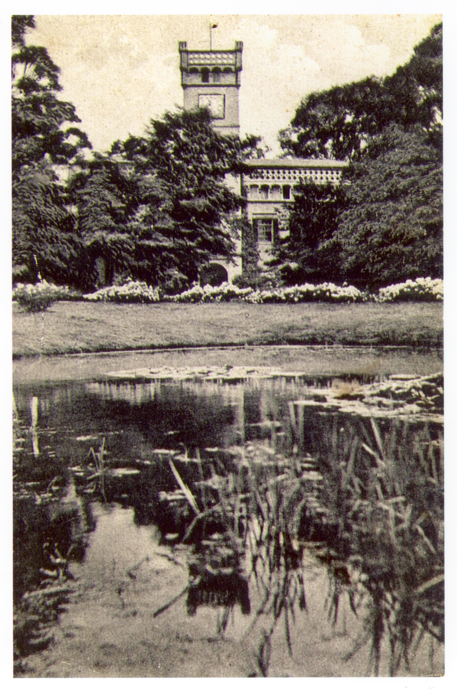
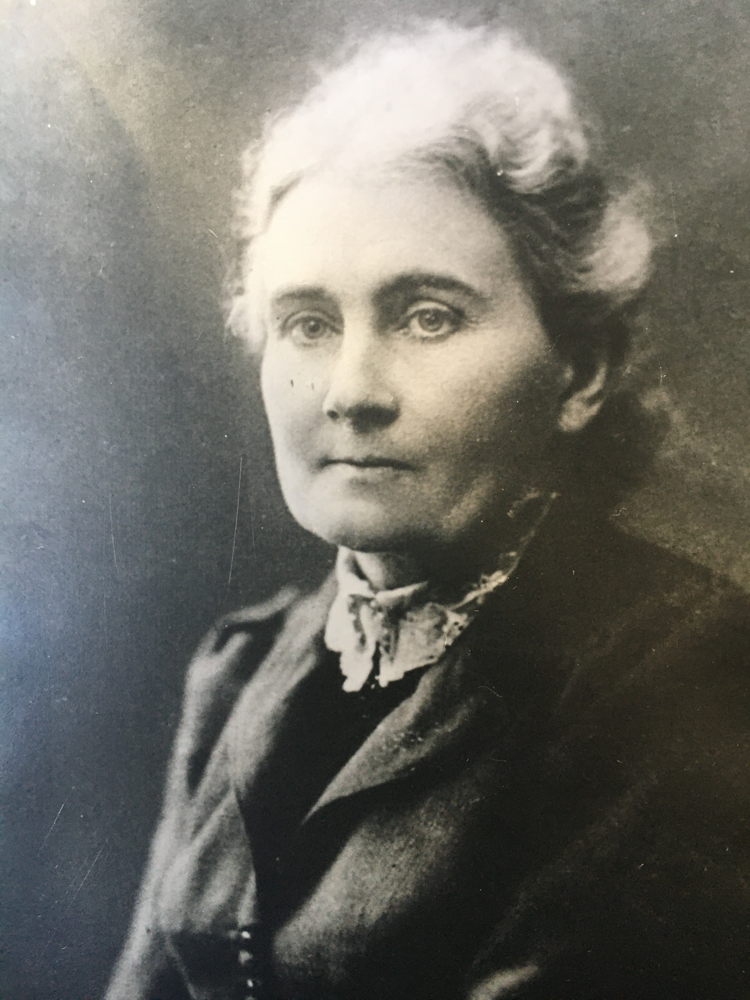
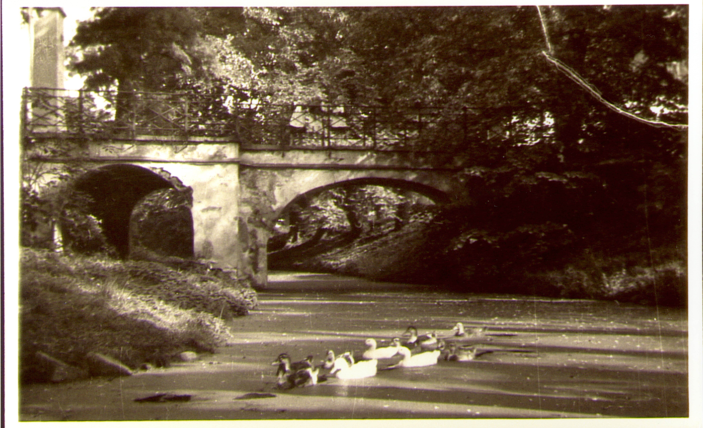
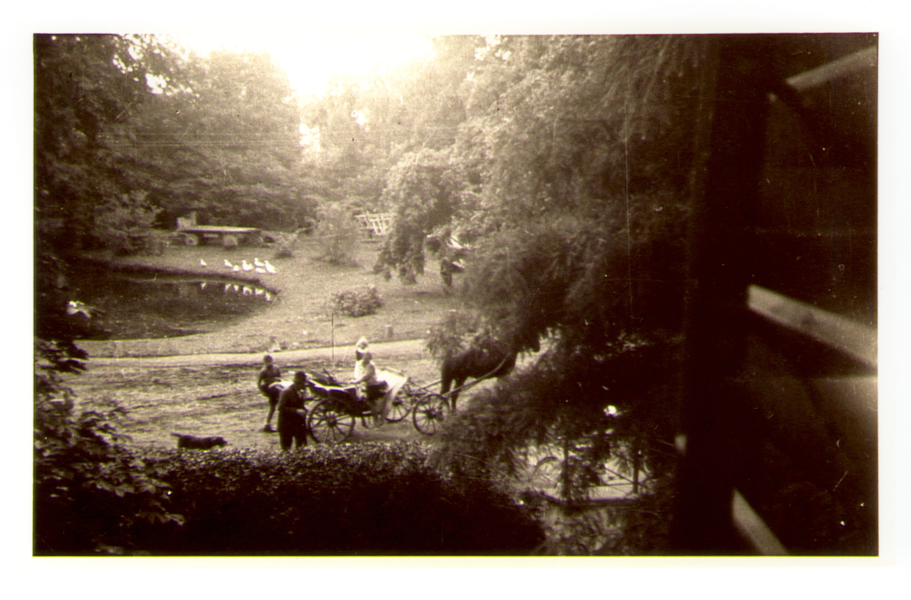

# Wieści z parku (odc. 4)

Sezon halowy w pełni, a w parku wciąż coś się dzieje...

Pan Sebastian Kotlarz przygotował do tego numeru naszego wpisu obszerne informacje o najwybitniejszym przedstawicielu ostatniego ze szlacheckich rodów, w których posiadaniu był Smolecki Zamek. Przedstawię zatem pokrótce, co wydarzyło się w styczniu, a na naszych łamach rozgości się już __Carl Gideon Gotthardt von Wallenberg-Pachaly__ (powoli uczcie się tych imion i nazwisk...).

<figure markdown="span">
  {width="600px", loading=lazy}
  <figcaption>Zima w parku. 
     źródło: opracowanie własne</figcaption>
</figure>

<!-- more -->

## Prace w parku

Przede wszystkim najważniejszą informacją stycznia jest fakt, że Smolecki Park Łuczniczy ma już swój adres – ul. Lipowa 2B. "B" jak barebow, bloczkowy łuk, button, błysk w oku łucznika... Dla ścisłości adres dotyczy jednej z naszych komórek, która ma potencjał, by stać się budynkiem biurowym z salką integracyjną i sanitariatami. Do tego jest oczywiście jeszcze bardzo, bardzo daleko, ale lepiej informować, że treningi odbywać się będą w Smolcu przy ul. Lipowej 2B, niż na działce nr 481 lub np. tak: "za przystankiem wchodzisz w podwórko pomiędzy odrapany budynek z adresem ul. Lipowa 2 a wielką szarą halę produkcyjną..." Sprawnie udało nam się uzyskać warunki na wykonanie przyłącza wodno-kanalizacyjnego do naszego budynku. Kątecki ZGK wykona również hydrant, który z pewnością nam się przyda w przyszłości na wypadek organizacji dużych zawodów i imprez.

Po konsultacjach w Wydziale Ochrony Środowiska dokonałem dokładnych pomiarów drzew. Dzięki temu powstała szczegółowa inwentaryzacja drzewostanu na naszej działce. Na nasz teren zawitał również geodeta, który dokładnie oznaczył przebieg granic obu działek i wyznaczył zarysy budynków (to nie żart! – ponieważ oba są w stanie znacznego rozkładu, musimy wiedzieć, jaka ich część może podlegać odtworzeniu). Dzięki jego pracy udało się również ustalić, w jakich odległościach od granic umiejscowione są drzewa i które z nich kolidują z planem zagospodarowania działki. Przy okazji okazało się również, że przebieg głównego kolektora sanitarnego jest inny w rzeczywistości niż na oficjalnych mapach geodezyjnych. Tę niezgodność wyprostujemy po wykonaniu przyłączy wodno-kanalizacyjnych.

W styczniu powołaliśmy nasz PARKOWY DREAM-TEAM, złożony z mojego przyjaciela Krzyśka (inżyniera, "złotej rączki", "żadnej pracy się nie boi") i wspominanego już wcześniej, dobrze Wam znanego Michała, który od stycznia jest trzecim trenerem w klubie. Nie bylibyśmy w stanie poradzić sobie z tak dużym terenem wyłącznie okazjonalnymi czynami społecznymi. Krzysiek i Michał przyjeżdżali w styczniu do parku na regularne 6-8 godzin dziennie, 3-4 razy w tygodniu. Prace rozpoczęli od dalszego usuwania wyjątkowo agresywnych kolczastych jeżyn i krzewów dzikiej róży, których skupiska były rozsiane po całej działce.

Dzięki ich pracy oraz przebrnięciu przez biurokratyczne schody związane z uruchomieniem funduszu sołeckiego, ponownie odwiedzili nas pilarze z firmy Alpin-Drzew, którzy dokończyli wycinkę krzewów i samosiejek. Po opuszczeniu działki przez pilarzy, zostaliśmy z ogromną stertą gałęzi, które nasz DREAM-TEAM, przy pewnej pomocy trenera Kaspra oraz naszego sąsiada zza płotu, ogrodnika Ryszarda, rozpoczął rozkładać na czynniki pierwsze. Wywózkę większych gałęzi zorganizowałem we własnym zakresie, i teren zaczyna się powoli odsłaniać. Postęp prac jest szybki i w lutym powinniśmy dokończyć usuwanie gałęzi.

Pod koniec miesiąca udałem się do siedziby Wojewódzkiego Urzędu Ochrony Zabytków, aby skonsultować z konserwatorem kilka spraw, m.in. usunięcie czterech drzew kolidujących z naszą koncepcją aranżacji torów, możliwość ustawienia płotu-strałochwytu i osłon bocznych, zakres możliwego remontu dwóch posiadanych przez nas budynków-ruinek, postawienie dodatkowych wiat oraz "hali zimowej", utwardzenie placu postojowego, a także ewentualną aranżację placu zabaw i siłowni zewnętrznej. Po tym spotkaniu mam bardzo dobre odczucia. Nasze działania będą wymagały konsultacji z tym urzędem, i pozostaje mi mieć nadzieję, że będziemy mogli liczyć na merytoryczną pomoc, a nie na utrudnianie naszych działań.

## Trochę historii

Pan Sebastian Kotlarz ze Smolca przygotował dla nas poniższy tekst. Przeczytajcie, go uważnie zwracając uwagę
na kolejność imion poszczególnych postaci i różnicę między imieniem Carl i Karl:

*__Carl Gideon Gotthardt von Wallenberg Pachaly__ urodził się 14 listopada 1844 r. we Wrocławiu jako syn __Karla Gotthardta Gideona von Wallenberg Pachaly__ (1817-1869) i jego żony __Klary von Scheliha__ (1820-1866).*

*Jego ojciec, __Karl Gotthardt Gideon__, był czeskim szlachcicem, szefem banku "G. v. Pachaly i wnuk", a potem właścicielem wrocławskiego banku "Bankhaus Pachaly". Karl w latach 1853-1858 zasiadał w Izbie Przemysłowo-Handlowej. Wraz z Bankiem E. Heimanna, Wrocławskim Bankiem Dyskontowym oraz Wrocławskim Bankiem Wekslowym utworzył konsorcjum, które zbudowało Kolej Poznańską. Współtworzył także Zrzeszenie Fabryk Zegarów w Świebodzicach.*

*Jako pierwszy, zgodnie z królewsko-pruskim dyplomem z 3 listopada 1841 r., otrzymał zgodę na dodanie nazwiska von Wallenberg (ojczystego) do nazwiska Pachaly (macierzystego) oraz na noszenie wspólnego herbu obu rodzin. W 1843 roku, wskutek interwencji matki, Juliany Florentine Elisabeth von Pachaly (1785-1841), jego ojciec (dziad Carla Gideona Gotthardta), Karl Anton Gotthard Ducius von Wallenberg (1773-1843), nabył dla niego dobra rycerskie w Smolcu (około 470 hektarów) za 116 500 talarów. On także doprowadził do powstania w Smolcu przystanku kolejowego, który otworzono 15 października 1843 r. [przy przejeździe przy ulicy Polnej - przyp. S.K.]. W 1862 r. podarował smoleckiej parafii ewangelickiej działkę na cmentarz przy ulicy Starowiejskiej, który otwarto 14 czerwca 1863 r.*

*Jego syn, __Carl__, 8 stycznia 1878 r. w kaszubskich Narkowach zawarł związek małżeński z Heleną Heine (1856-1943). Ich dziećmi byli: Robert Karl Gideon (1878-1945), Carl Gideon Gotthardt (1879-1960), Kurt Karl Gideon (1884-1909), Heinrich Karl Gideon (1885-1965), Helene Klara Adele (1889-1981), Adele Klara Marie (1893-1973, przyszła narzeczona asa lotnictwa, słynnego "Czerwonego Barona", czyli Manfreda von Richthofena) i Karl Anton Gotthardt Gideon (1895-1971, ostatni właściciel smoleckiego zamku).*

<figure markdown="span">
  { width="300", loading=lazy }
  <figcaption>Car von Wallenberg.
   
  źródło: archiwów rodzin Treblinów i Wallenberg Pachaly oraz Dietmara Nessa</figcaption>
</figure>

*W latach 1866-1874 Carl kierował okręgiem urzędowym Smolec, złożonym z miejscowości Smolec, Mokronos Górny i Krzeptów. Wraz z braćmi był współfundatorem smoleckiego kościoła, na budowę którego zebrali 45 000 marek. Pod budowę kościoła podarował 2 morgi gruntu i ufundował organy. Do dziś znajduje się w nim tablica upamiętniająca to wydarzenie, na której wyryto po łacinie następujące słowa: "Ten kościół został wzniesiony ku czci Boga Uwielbionego, którego majestat wielbimy. Roku Pańskiego 1908. Carl Gideon Wallenberg Pachaly wierny Bogu". Z okazji konsekracji świątyni otrzymał Order Orła Czerwonego III klasy.*

<figure markdown="span">
  {width="600px", loading=lazy}
  <figcaption>Poświęcenie kościoła w Smolcu. Od prawej: pastor Wilhelm Treblin, Carl Gideon Gotthardt von Wallenberg Pachaly.
   
  źródło: archiwów rodzin Treblinów i Wallenberg Pachaly oraz Dietmara Nessa</figcaption>
</figure>

*Dzięki jego funduszom w 1914 r. swoje podwoje otworzyła nowa szkoła ewangelicka przy ulicy Kościelnej w Smolcu, która służy nam do dziś. Jemu także zawdzięczamy budynek naszej stacji (działkę na budowę przekazał w 1892 r.), w którym działa dziś m.in. smolecka filia GOKiS. Z okazji 80-tych urodzin podarował działkę pod budowę świetlicy (niestety, nie znamy jej lokalizacji). Carl Gideon Gotthardt von Wallenberg-Pachaly zmarł 6 listopada 1929 r. Jest pochowany obok żony, ojca, matki i syna na starym cmentarzu w Smolcu.*

*Tak natomiast wspominał go pierwszy i jedyny ewangelicki proboszcz Smolca, Wilhelm Treblin (1880- 1969):*

*__O ich pierwszym spotkaniu:__ "Najpierw jednak złożyłem wizytę panu von Wallenbergowi. Szkoda, że stary zamek nawodny został przebudowany przez poprzedniego właściciela w stylu angielskiego gotyku. Mimo tego wywierał on bardzo przyjemne wrażenie ze swoją wieżyczką zegarową, która odbijała się w fosie, oraz ozdobnymi starymi pięknymi kasztanami i cyprysami błotnymi. Przyjął mnie w swoim pokoju w wieży, który oprócz biurka mieścił tylko stojaki wypełnione książkami. Siedziałem teraz naprzeciwko tego człowieka jako młodociany nowicjusz, serce bijące mi mocno. Nie był wysoki, ale trzymał się trochę nierówno i patrzył na mnie swoimi mądrymi oczami."*

<figure markdown="span">
  { width="300", loading=lazy}
  <figcaption>Pastor Wilhelm Treblin.
   
  źródło: archiwów rodzin Treblinów i Wallenberg Pachaly oraz Dietmara Nessa</figcaption>
</figure>

*__Tak opisano go po jego śmierci:__ "6 listopada [1929 r.], tuż przed swoimi 85 urodzinami, zmarł właściciel dóbr rycerskich, pan Carl Gideon Gotthardt von Wallenberg Pachaly ze Smolca, długoletni świecki przewodniczący Rady Kościelnej. Wraz z nim parafia utraciła najbardziej lojalnego wiernego. To, co mu zawdzięczała, bardzo skrótowo pokazano w tej kronice [chodzi o "Kronikę ewangelickiej parafii w Smolcu" - przyp. S.K.]. Był człowiekiem pełnym prostej i pokornej ufności Bogu, kochającym swój kościół, dla którego zawsze miał otwarte ręce, i do którego uczęszczał, dopóki pozwolił mu na to pogarszający się stan zdrowia. 9 listopada wyprowadzono z naszej świątyni jego kondukt pogrzebowy. Zawsze będziemy go błogosławić w naszej pamięci. [...] Zmarł nasz kochany stary pan von Wallenberg. Wraz z nim odeszły stare dobre czasy. Już wkrótce prawie wszystko miało się całkowicie zmienić. Pan von Wallenberg miał oczywiście swoje ludzkie słabostki. Był bardzo mądrym kupcem, który potrafił liczyć. Ale był także szczodrym człowiekiem, który nigdy nie był skąpy. A przede wszystkim był dla swoich ludzi z dominium panem, który czuł się odpowiedzialny za nich przed Panem Bogiem: w Smolcu oraz w dobrach w Mokronosie Górnym i Krzeptowie wszyscy robotnicy z dominium mieli zdrowe mieszkania. Mogli trzymać u siebie świnie i drób. Troszczono się o nich, gdy byli starzy. Pan Wallenberg był do tego naprawdę pobożnym człowiekiem, który pokochał swój kościół i jego pastora, i który ponosił ofiary na jego rzecz. Zażyczył sobie, aby napis na jego nagrobku (którym był głaz), nie zawierał nic więcej ponad te słowa: “Ojcze, w Twoje ręce"."*

<figure markdown="span">
  {width="600px", loading=lazy}
  <figcaption>Pałac.
   
  źródło: archiwów rodzin Treblinów i Wallenberg Pachaly oraz Dietmara Nessa</figcaption>
</figure>

*__Życzliwie wspomniano również jego żonę, Helenę:__ "Dnia 3 września 1943 roku, wyprowadzono z kościoła kondukt pogrzebowy 88-letniej pani Heleny von Wallenberg Pachaly, wdowy po "starym" panu von Wallenberg, któremu parafia tak wiele zawdzięcza. Była odważną kobietą o bardzo czułym sercu, ukrytym za surowym sposobem życia, co przejawiało się w jej miłości, zwłaszcza w miłości do dzieci. Parafii Smolec podarowała pierwsze przedszkole [dziś w tym miejscu stoi piekarnia "Harnaś" - przyp. S.K.], a do niedawna w jej domu mieszkało wiele obcych dzieci."*

<figure markdown="span">
  { width="300", loading=lazy }
  <figcaption>Helena von Wallenberg Pachaly.
   
  źródło: archiwów rodzin Treblinów i Wallenberg Pachaly oraz Dietmara Nessa</figcaption>
</figure>

*__O rozwoju Smolca pod panowaniem rodziny von Wallenberg Pachaly:__ Gmina uczyniła kolejny duży krok naprzód, gdy w 1843 r. zbudowano Kolej Świebodzicką. 15 października tego roku otworzono również przystanek w Smolcu. W tym samym roku dobra rycerskie w Smolcu zostały zakupione przez radcę handlowego Karla Gideona Gottharda von Wallenberg Pachaly za 116 500 talarów. Pod energicznym i dalekowzrocznym przywództwem jego i jego syna, społeczność doświadczyła widocznego wzrostu dobrobytu. Coraz więcej pracy i zarobku było nie tylko na terenie dominium, ale także dzięki cukrowni (wybudowanej w 1850 r.), co z kolei doprowadziło do zwiększenia się liczby mieszkańców. Smolec miał w 1835 r. zaledwie 432 mieszkańców i był wówczas mniejszy od Małkowic, w których mieszkało już 647 osób, ale w roku 1890 liczba jego mieszkańców wzrosła już do 1097 (1925 r. - 1327 mieszkańców).*

*17 stycznia 1933 r. wysadzono w powietrze wysoki komin smoleckiej cukrowni. Zebrał się przy tym bardzo duży tłum. Ludzie stali tam i patrzyli, jak wkłada się ładunki wybuchowe do otworów; potem naciśnięto dźwignię, tępy huk, wzniesienie szarej chmury i nastąpił upadek olbrzyma. No tak, ale właściwie dlaczego przyszło to obejrzeć tak wielu ludzi? Przed około 25 laty miało miejsce w Smolcu takie samo widowisko, ale wówczas obserwatorami było zaledwie 30-40 osób. Oczywiście w tym czasie zebrani wiedzieli, że burzą jeden komin, aby na jego miejscu mógł stanąć większy. Ale tym razem - i wiedzieli to wszyscy uczestnicy tego smutnego spektaklu - oznaczało to definitywny koniec. Nie ma już symbolu Smolca. Ileż to razy wychodziliśmy w teren, aby pokazać naszym dzieciom lub obcym ludziom, że “tam, gdzie jest wysoki komin, jest Smolec". Wraz z tym kominem Smolec traci coś więcej niż tylko charakterystyczny punkt orientacyjny. Wraz z nim znika ostatni element przemysłu, jaki istniał w naszej miejscowości, zapewniający miejsca pracy i możliwość zarobkowania dla wielu osób. Przed wojną Smolec był rozwijającą się miejscowością.*

*W roku 1835 miał zaledwie 432 mieszkańców. W owym czasie był mniejszy od Małkowic, w których mieszkało wtedy prawie 700 osób. Ale potem pan von Wallenberg zbudował cukrownię, pojawiły się inne zakłady przemysłowe, fabryka superfosfatu, fabryka porcelany, fabryka oksygonu, fabryka kleju, no i cegielnia - ilu ludzi miało dzięki temu chleb. A Smolec rósł i rósł. A teraz? Sterta gruzu na dziedzińcu fabryki przemawia gorzkim i bolesnym językiem. Ale czy ta sterta nie jest jeszcze czymś innym? Czyż nie jest to jak przypowieść o naszej niegdyś wielkiej, silnej, bogatej ojczyźnie? Co z niej zostało? Kupa gruzu...*

*Duże znaczenie dla życia kościelnego ma również sprzedaż majątku smoleckiego [w 1934 r. - przyp. S.K.], który ma być teraz zasiedlony wraz ze sprzedanym wcześniej majątkiem w Mokronosie Górnym. Nie możemy odnotować tej zmiany, nie wspominając z głęboką wdzięcznością dawnego właściciela Smolca, "starego" pana von Wallenberga. To głównie dzięki niemu Smolec, dość uboga wioska, stał się kwitnącą wspólnotą. Kiedy jego ojciec kupił Smolec w 1843 r., nasza wieś liczyła zaledwie 432 mieszkańców. Pod jego kierownictwem powstało Towarzystwo Melioracyjne, które w pierwszej kolejności zajęło się odwadnianiem bagnistych pól - a były to wówczas najlepsze z dzisiejszych pól! Jakże wielu ludzi znalazło pracę w majątku i cukrowni! Przytułek dla ubogich także jest jego darem [niestety, nie znamy lokalizacji tego budynku - przyp. S.K.]. Bez jego aktywnej pomocy prawdopodobnie nie udałoby się tak szybko wybudować szkoły i kościoła. Niech pamięć o tym wiernym człowieku nie zostanie zapomniana, gdy wielu innych żyje teraz na ziemi, którą on stworzył.*

<figure markdown="span">
  {width="600px", loading=lazy}
  <figcaption>Fosa zamku.
   
  źródło: archiwów rodzin Treblinów i Wallenberg Pachaly oraz Dietmara Nessa</figcaption>
</figure>

<figure markdown="span">
  {width="600px", loading=lazy}
  <figcaption>Park.
   
  źródło: archiwów rodzin Treblinów i Wallenberg Pachaly oraz Dietmara Nessa</figcaption>
</figure>

Autor tekstu o rodzinie von Wallenberg Pachaly to [Sebastian Kotlarz](https://patronite.pl/sebastiankotlarz/media), smolczanin "z dziada, pradziada", samorządowiec i regionalista zakochany w historii naszych ziem oraz ludziach żyjących na nich dziś i w przeszłości. Jest współautorem i tłumaczem trzech książek: ["Smolec wczoraj i dziś 1316-2016"](https://smolec24.pl/najlepszy-prezent-dla-mieszanca-smolca-oczywiscie-ksiazka-o-smolcu/), ["Mała baronówna. Dzieciństwo na smoleckim zamku"](https://lubimyczytac.pl/ksiazka/4998194/mala-baronowna-dziecinstwo-na-smoleckimm-zamku) oraz "Sadków był rajem. Wspomnienia rodziny von Rothkirch". Wszystkie zdjęcia pochodzą z archiwów rodzin Treblinów i Wallenberg Pachaly oraz Dietmara Nessa. Zawarte w tekście informacje pochodzą z książki "Mała baronówna. Dzieciństwo na smoleckim zamku" autorstwa pani Angeli von Wallenberg Pachaly oraz z pism pastora Wilhelma Treblina.

