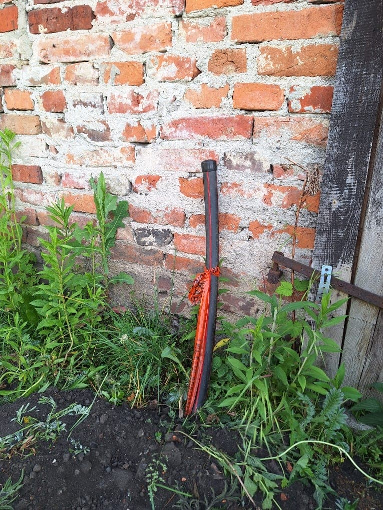
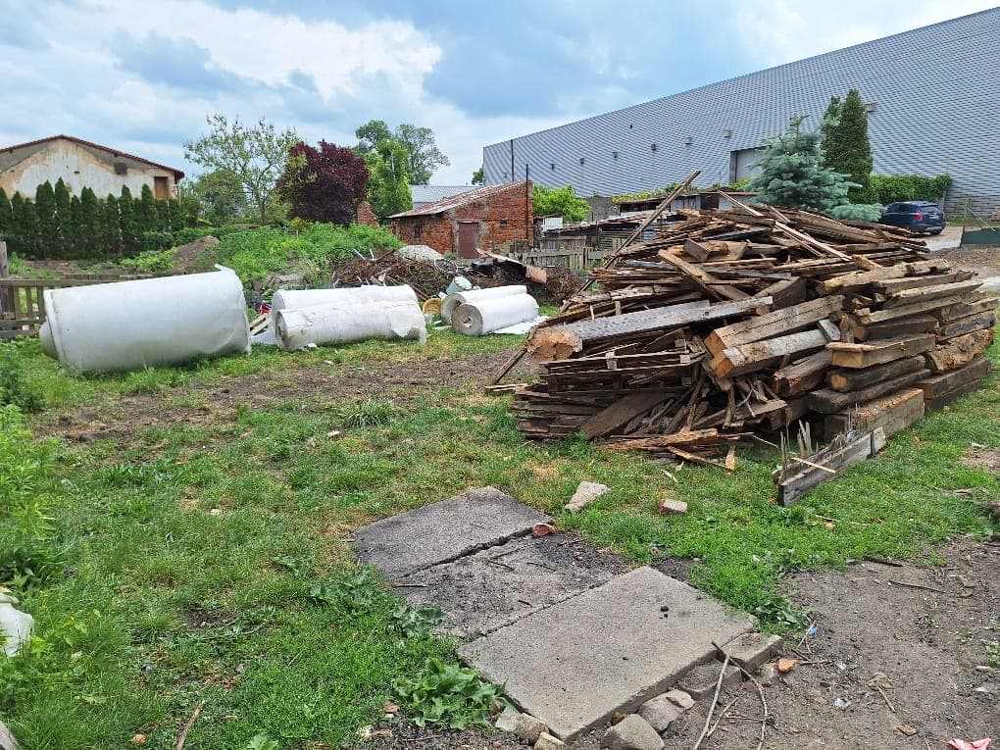
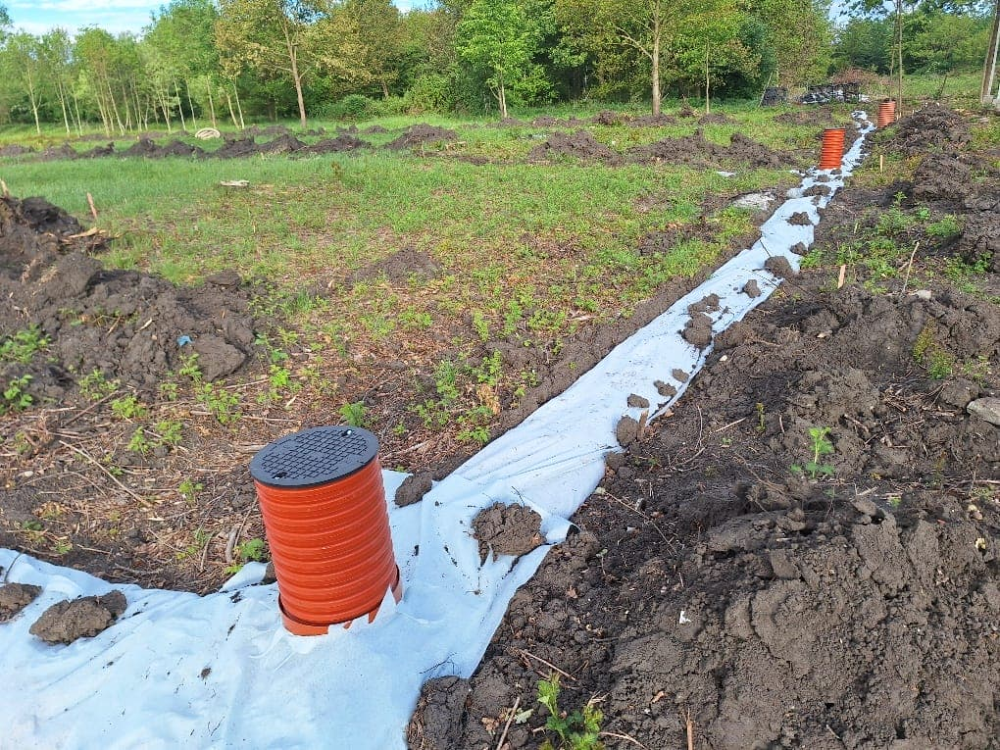
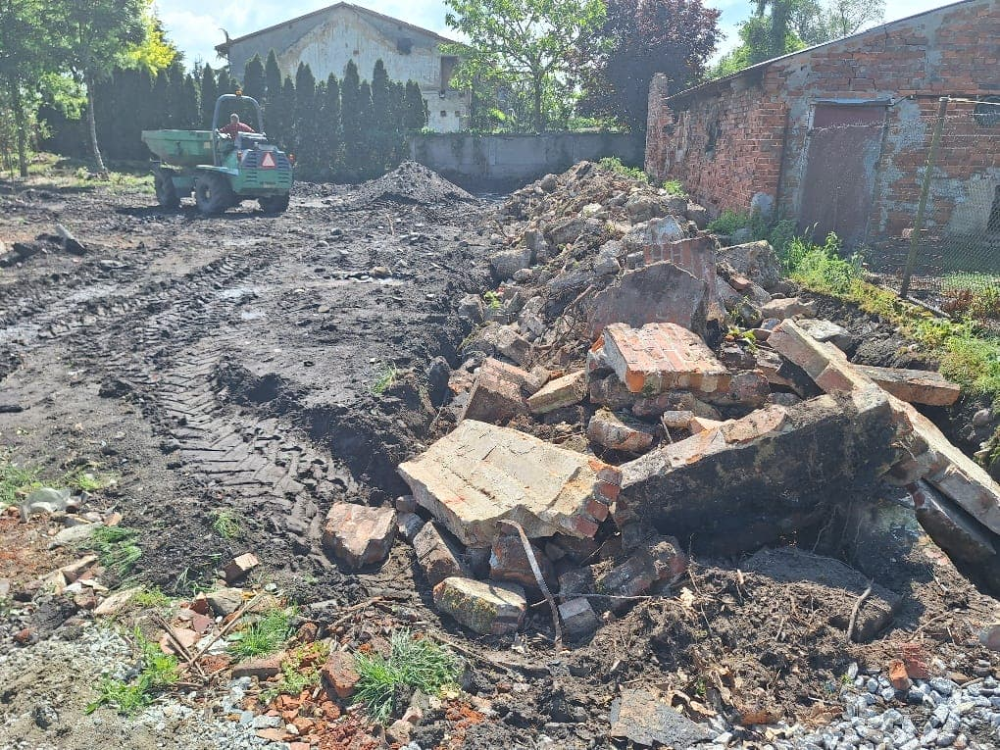

# Wieści z parku (odc. 8)

Sezon letni w pełni – treningi wciąż jeszcze odbywają się w Smolcu na Zielonej, a w parku wiele się dzieje...

Powiększenie naszych klubowych smoleckich włości stało się faktem – w dniu 22 maja 2024 r. podpisałem stosowny aneks do umowy użyczenia z Gminą Kąty Wrocławskie i w tej chwili cały obszar działki 481, wraz z dawnym ogródkiem działkowym, jest pod naszą opieką! Przy okazji, zupełnie niespodziewanie, do naszych budynków „przybył” światłowodowy internet – firma GreenLan, rozbudowując sieć na ul. Lipowej, uwzględniła nas w projekcie i bardzo sprawnie położone zostały aż do samego muru jednego z naszych budynków rury, w które – gdy tylko będziemy gotowi korzystać z internetu – zostanie wdmuchany kabel światłowodowy.

<figure markdown="span">
  {width="600px", loading=lazy}
  <figcaption>Z tej rury "przybędzie" internet. 
     źródło: opracowanie własne</figcaption>
</figure>

<!-- more -->

Placyk przed naszym „głównym budynkiem” (ul. Lipowa 2B) staje się ważnym miejscem rozmaitych operacji logistycznych. Tutaj krzyżują się wszystkie instalacje (wodna, kanalizacyjna i burzowa) oraz znajdują się miejsca obecnych i przyszłych przyłączy (mamy już wodne, hydrant i telekomunikacyjne, a wkrótce powinno pojawić się kanalizacyjne i energetyczne). Tu składujemy rozmaite materiały, które następnie wywieziemy lub jeszcze wykorzystamy (złom, drewno z rozbiórki, pozyskane z OLX włókniny do podbudowy ścieżek). Niemały udział w tych operacjach mają trener Michał i mój przyjaciel Krzysiek, co będę pewnie jeszcze wiele razy podkreślał.

<figure markdown="span">
  {width="600px", loading=lazy}
  <figcaption>Składowisko rzeczy (nie)potrzebnych. 
     źródło: opracowanie własne</figcaption>
</figure>

Maj upłynął na dalszych pracach przy wykonaniu drenażu. Już ponad połowa działki jest nim objęta. Przy okazji równamy powierzchnię, zasypując nierówności i przygotowując ją pod wysiew trawy. Niestety, ziemia na torach skrywa wiele różnych niepożądanych elementów (korzenie, kamienie, cegły, złom, butelki) – wszystkie one muszą być usunięte i wywiezione, zanim zaprosimy traktorzystę z glebogryzarką oraz bronami, aby móc wysiać trawę.

<figure markdown="span">
  {width="600px", loading=lazy}
  <figcaption>Drenaż części północnej działki jeszcze przed zasypaniem. 
     źródło: opracowanie własne</figcaption>
</figure>

Miejsce, gdzie trafia zbierany z powierzchni działki gruz, to placyk pomiędzy budynkami – nasz przyszły klubowy parking. Trafiło tu też nieco tłucznia, który – po wyrównaniu i ubiciu gruzu – posłuży do zasypania wierzchniej warstwy. Na razie jednak Smolecki Park Łuczniczy to bardziej plac budowy niż park, więc minie jeszcze kilka odcinków, nim zacznie przypominać obiekt sportowy...

Od czerwca uruchamiamy [zbiórki](../../../../crowdfunding.md), które są nam niezbędne do dokończenia prac – o nich poczytacie w osobnej części tego newslettera. Prześlijcie proszę te informacje do swoich znajomych. Może ktoś zechciałby nas wesprzeć, abyście jak najszybciej mogli rozpocząć treningi na nowym obiekcie?

<figure markdown="span">
  {width="600px", loading=lazy}
  <figcaption>Przyszły klubowy parking. 
     źródło: opracowanie własne</figcaption>
</figure>