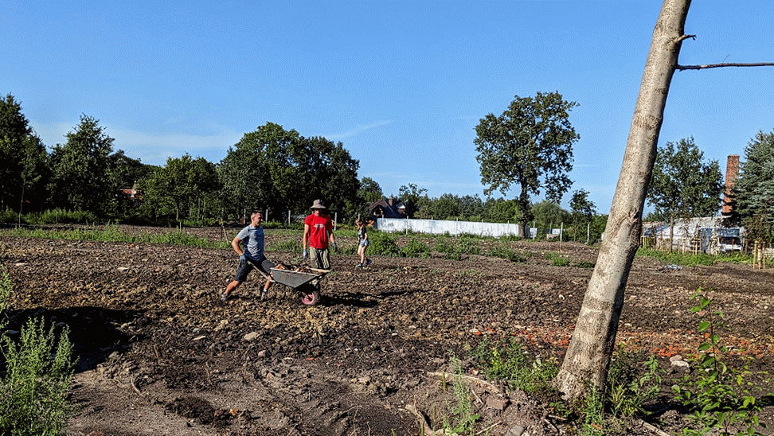
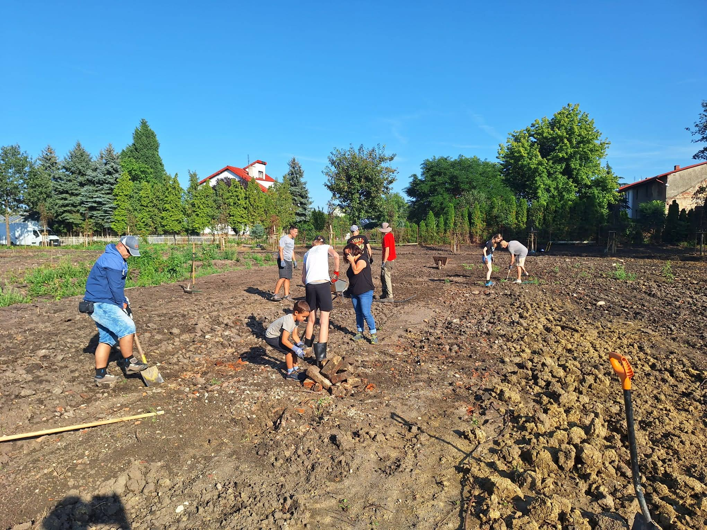
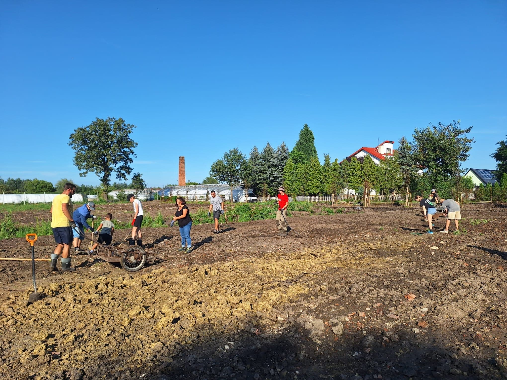
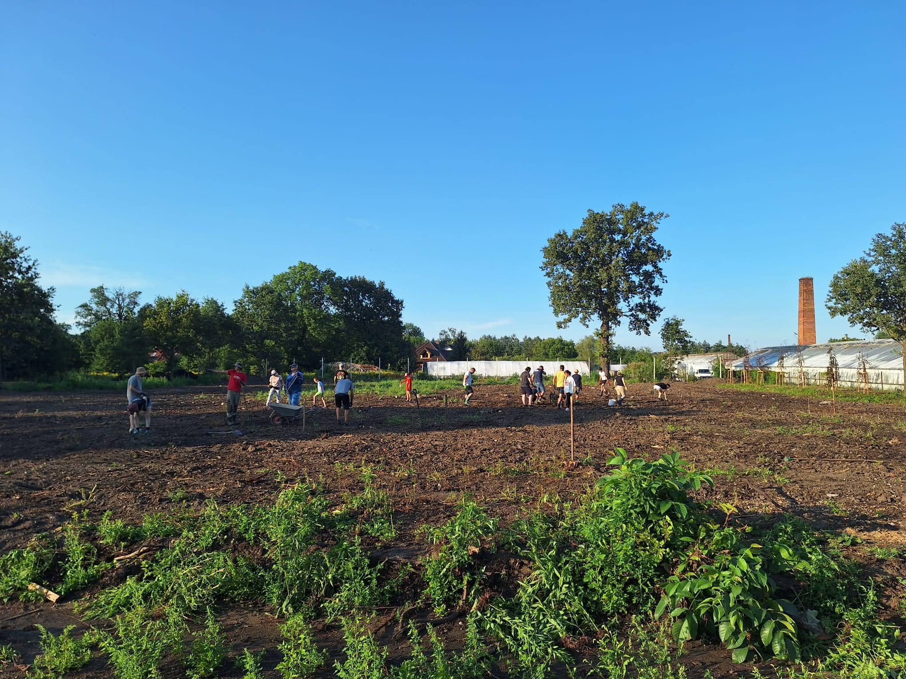
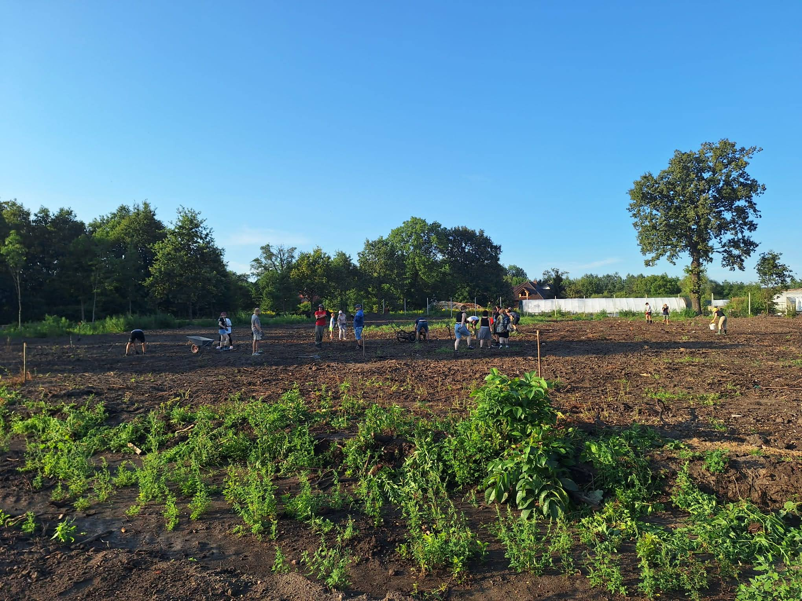

# Przygotowania terenu pod zasiew trawy 

Wczoraj, 20 sierpnia 2024 roku, udało nam się wykonać wiele dobrej pracy. Członkowie klubu wraz z rodzinami i sympatykami, w pocie czoła zebrali kamienie, resztki cegieł oraz luźne patyki i korzenie z całego parku. Teren został przygotowany do spulchnienia i zasiewu trawy. Dzięki Wam będzie można bezpiecznie wjechać traktorem bez ryzyka uszkodzenia sprzętu.

Nie było łatwo – po poniedziałkowej ulewie teren był grząski, co utrudniało poruszanie się z taczką.

<figure markdown="span">
  {width="600px", loading=lazy}
  <figcaption>źródło: opracowanie własne</figcaption>
</figure>

<!-- more -->

W środę wrócił deszcz, wiec we wtorek trafiliśmy w idealne okno pogodowe.

Wstępnie planowaliśmy prace również na czwartek, 22 sierpnia, ale udało nam się zrobić wszystko wcześniej, więc tego dnia będziemy mogli spokojnie wrócić do treningów na Zielonej w Smolcu.

Tak po skończonej pracy raagowali prezesi 👏:

Kasper (Prezes UKS Luks):
>Bardzo dziękuję (kolejność przypadkowa): Przemysławowi i Witowi, Michałowi, Kamilowi, Joannie z synem Tomkiem, Jędrzejowi, Zuzannie, Piotrkowi, Piotrowi, Markowi z synem Mateuszem, Wiktorowi z mamą i bratem, Tomaszowi, Krzysztofowi, Julii wraz z mamą, Martynie, Zuzannie wraz z 3 koleżankami, gościnnie Michałowi!

Przemek (Prezes UKS Luks Smolec):
>Byliście wspaniali! W 4 godziny, w 25 osób- zrobiliśmy to, co wydawało się nie do zrobienia. Pełen sukces! Prawdopodobnie w pierwszym tygodniu września spotkamy się jeszcze raz przed ostatecznym siewem trawy. 

Poniżej kilka fotek z całej akcji.

<figure markdown="span">
  {width="600px", loading=lazy}
  <figcaption>źródło: opracowanie własne</figcaption>
</figure>
<figure markdown="span">
  {width="600px", loading=lazy}
  <figcaption>źródło: opracowanie własne</figcaption>
</figure>
<figure markdown="span">
  {width="600px", loading=lazy}
  <figcaption>źródło: opracowanie własne</figcaption>
</figure>
<figure markdown="span">
  {width="600px", loading=lazy}
  <figcaption>źródło: opracowanie własne</figcaption>
</figure>