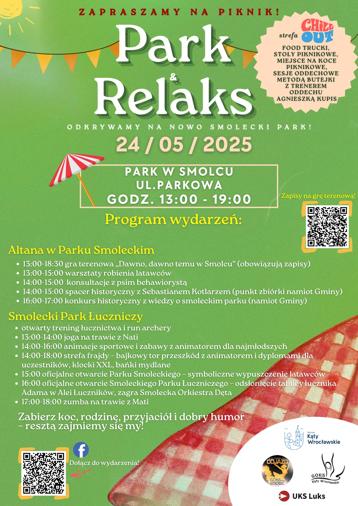

# Piknik w Parku

Nie było nas tu przez ponad pół roku! Nie znaczy to, że nie było nas w parku. Właściwie – byliśmy w parku, więc nie było nas tu! I to wszystko wyjaśnia, to znaczy może nie do końca wyjaśnia, ale częściowo usprawiedliwia. 1 kwietnia 2025 r. odbył się oficjalny pierwszy trening w Smoleckim Parku Łuczniczym, zaś 24 maja 2025 r. nastąpiło uroczyste otwarcie obu części parku - zarówno tej łuczniczej, jak i gminnej/pałacowej/spacerowej (można sobie wybrać właściwe określenie). 

<!-- more -->

Ponieważ naprawdę ciężko pracowaliśmy, by otwarcie było możliwe, jedynie dokumentowaliśmy postępy prac, a przygotowanie wpisów do niniejszego Bloga wciąż odkładaliśmy na później. To
"później" w końcu nastąpi – obiecujemy! Uzupełnimy wówczas wszystkie wpisy, póki jeszcze pamiętamy, jak to było, bo sami chcemy móc potem sobie co jakiś czas otworzyć tę stronę i powspominać.

Póki co – cieszmy się możliwością wspólnych treningów w Smoleckim Parku Łuczniczym!

<figure markdown="span">
  {width="600px", loading=lazy}
  <figcaption>źródło: <a href ="https://www.facebook.com/photo/?fbid=1277645611029930&set=a.503907835070382">https://www.facebook.com/GminaKatyWroclawskie</a></figcaption>
</figure>