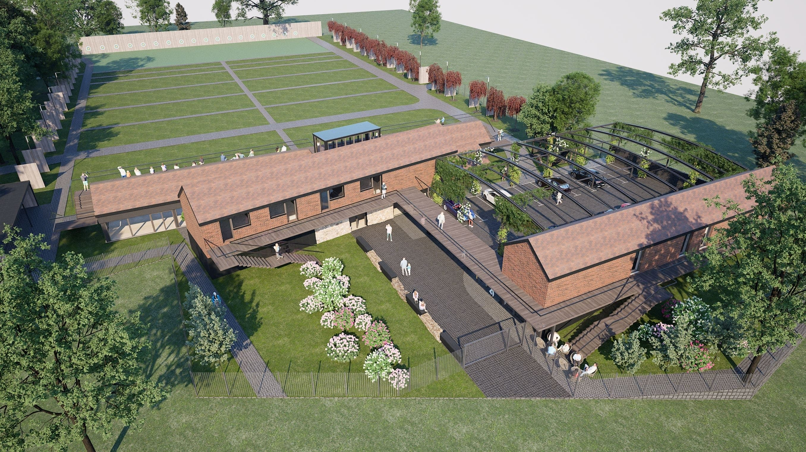
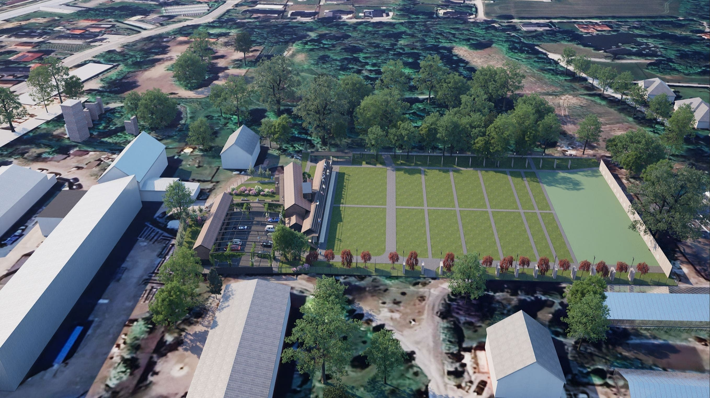
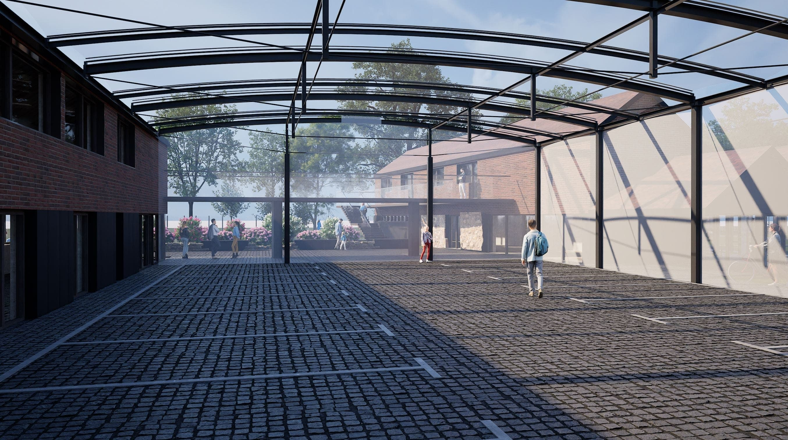
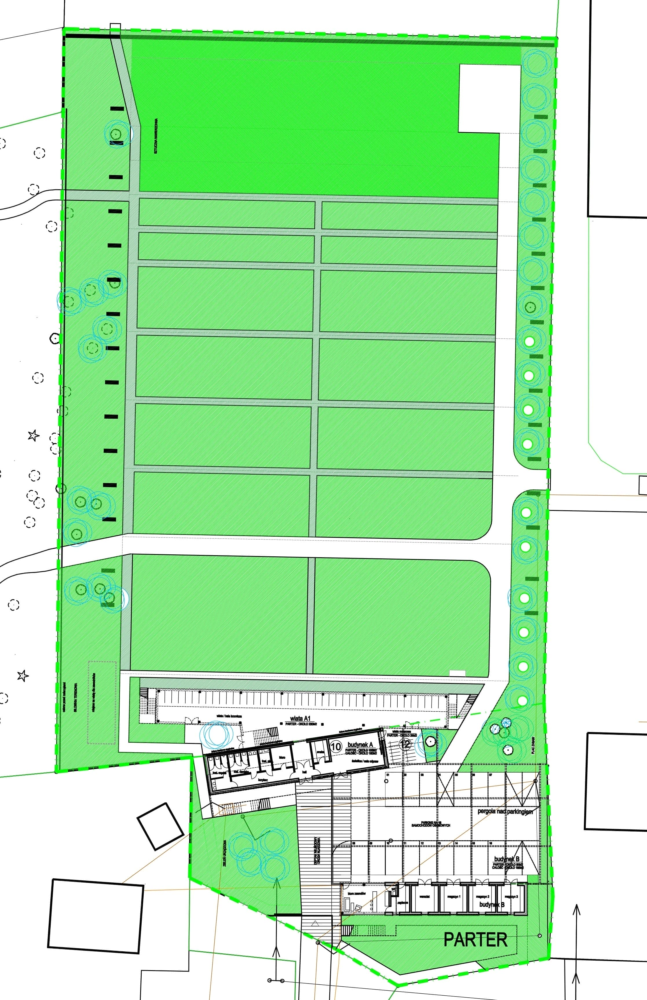

# Projekt

Zespół architektów (Joanna Smoczyńska-Bazan, Wojciech Bazan, Mikołaj Gomółka) w czerwcu 2024 roku rozpoczął przygotowywanie szczegółowej koncepcji zagospodarowania obu działek wraz z koncepcją architektoniczną rewitalizacji i rozbudowy istniejących dawnych budynków folwarcznych. Pierwsze efekty prac prezentują poniższe wizualizacje i rzuty poszczególnych kondygnacji obu budynków. Koncepcja zakłada odtworzenie zabudowy folwarcznej w pierwotnych proporcjach przestrzennych z zachowaniem dwuspadowych dachów oraz detali architektonicznych, np. fragmentów kamiennego muru w ścianie budynku przylegającego do działki 481 (ściana północna – w granicy działek – oraz wschodnia), oryginalnego pokrycia dachów i wykorzystania oryginalnej cegły. Planowane jest pełne udostępnienie budynków dla osób niepełnosprawnych ruchowo poprzez budowę rampy oraz galerii wzdłuż kondygnacji pierwszego piętra i łączącej oba budynki kładki. Na działce 481 planowana jest budowa sezonowej wiaty spacerowej w lekkiej konstrukcji, nie związanej stale z gruntem, która dzięki systemowi przeszkleń nawiązywać będzie do istniejącej przed wojną w kompleksie parkowo-pałacowym szklarni. Zakładamy możliwość urządzenia w niej „ogrodu zimowego” (rośliny wrażliwe będą mogły być przechowywane w wiacie w okresie zimowym, a następnie na sezon letni w donicach wywożone na teren torów łuczniczych) oraz „pawilonu zimowego” dla łuczników (możliwość treningów przez cały rok). Wyposażenie północnej połaci wiaty w trybunę z dwoma rzędami siedzeń na łącznie 120 miejsc umożliwi bezpieczne i komfortowe uczestnictwo w wydarzeniach sportowych i rekreacyjnych dla publiczności.

{width="300px, loading=lazy"}
{width="300px, loading=lazy"}

{width="300px, loading=lazy"}
{width="300px, loading=lazy"}

{width="300px, loading=lazy"}
{width="300px, loading=lazy"}

{width="300px, loading=lazy"}
{width="300px, loading=lazy"}

 Poniższa część wizualizacji prezentuje aktualny stan sąsiadującej zabudowy oraz wizualizacje obiektu z uwzględnieniem pozostałości kompleksu pałacowo-folwarcznego w Smolcu. Mamy nadzieję, że zrealizowana koncepcja Smoleckiego Parku Łuczniczego przyczyni się do podjęcia decyzji o kompleksowej rewitalizacji pozostałych obiektów kompleksu (ruin pałacu, budynków mieszkalnych przy ul. Lipowej 2 i 2A, stodół przebudowanych na hale produkcyjne).

{width="300px, loading=lazy"}
{width="300px, loading=lazy"}
{width="300px, loading=lazy"}

Widoki z perspektywy guntu.

{width="300px, loading=lazy"}

{width="300px, loading=lazy"}
{width="300px, loading=lazy"}
{width="300px, loading=lazy"}

{width="300px, loading=lazy"}
{width="300px, loading=lazy"}
{width="300px, loading=lazy"}

{width="300px, loading=lazy"}
{width="300px, loading=lazy"}

{width="300px, loading=lazy"}
{width="300px, loading=lazy"}
{width="300px, loading=lazy"}
{width="300px, loading=lazy"}
{width="300px, loading=lazy"}
{width="300px, loading=lazy"}

Plany rzutu wraz z parkiem w Smolcu, rzut torów i rzuty zabudowy.

{width="300px, loading=lazy"}
{width="300px, loading=lazy"}
{width="300px, loading=lazy"}
{width="300px, loading=lazy"}
{width="300px, loading=lazy"}

